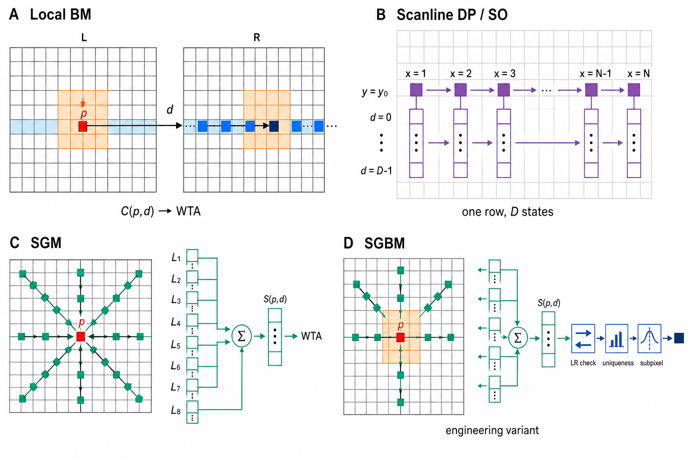

# 行匹配与半全局匹配的精度、效率和 FPGA 资源对比

## 目录

- [1. 目录中有哪些相关论文](#sec-1)
- [2. 概念界定与算法原理图示](#sec-2)
  - [2.1 四类算法的定义](#sec-2-1)
  - [2.2 像素级处理总图](#sec-2-2)
  - [2.3 单方向扫描线 DP/SO 原理](#sec-2-3)
  - [2.4 空间信息利用范围对比](#sec-2-4)
- [3. 总体工程对比](#sec-3)
- [4. 可直接比较的精度与时间数据](#sec-4)
  - [4.1 局部匹配与单扫描线优化](#sec-4-1)
  - [4.2 原始 SGM](#sec-4-2)
  - [4.3 同一低成本 FPGA 对比](#sec-4-3)
- [5. SGM 路径数、精度和硬件代价](#sec-5)
  - [5.1 四路径是否够用](#sec-5-1)
  - [5.2 FP-Stereo 精度-资源曲线](#sec-5-2)
  - [5.3 跨论文 FPGA 吞吐密度](#sec-5-3)
- [6. 为什么会出现这些差异](#sec-6)
- [7. 复杂度与 FPGA 存储](#sec-7)
- [8. 视差误差如何传播为深度误差](#sec-8)
- [9. 结论与 FPGA 方案建议](#sec-9)
- [10. 数据解释边界](#sec-10)
- [参考文献](#references)

> 文献核验日期：2026-07-22。本文只讨论非深度学习的稠密双目匹配。所有定量数据均保留原论文的数据集、误差阈值、分辨率、视差范围和硬件条件；不同论文的数据不直接合并排名。

## 1. 目录中有哪些相关论文

结论：`深度相机原理总结` 中确实有双目深度计算论文，但适合回答“非深度学习算法性能对比”的核心论文主要是两篇。

> 表格判读：本表用于定位文献，所有列均为说明项（`—`），不存在“越大越好”或“越小越好”。

| 文献 | 本地状态 | 与本问题的关系 |
| --- | --- | --- |
| Scharstein 与 Szeliski，2002 [[2]](#ref-2) | 本地有全文 | **最直接的传统算法横评**。在统一 Middlebury 数据、统一参数规则和统一 `bad pixel` 指标下比较局部 SSD、单扫描线 DP、扫描线优化、图割等 20 种方法。论文早于 SGM，因此不能给出 BM 对 SGM 的直接数字。 |
| Hirschmüller，2008 [[1]](#ref-1) | 本地有全文 | **SGM 原始期刊论文**。给出 SGM/C-SGM 在 Tsukuba、Venus、Teddy、Cones 上的 1 pixel 与 0.5 pixel 错误率、排行榜位次和运行时间。 |
| Mattoccia，2013 [[3]](#ref-3) | 目录外补充 | 在同一 Spartan-6 上实现固定窗口局部匹配、两路径优化和四路径 SGM；提供同平台的速度下界和定性视差图，但没有给出三者统一的数值误差表或资源表。 |
| Hofmann 等，2016 [[4]](#ref-4) | 目录外补充 | 给出四路径 SGM 的精度、分辨率/帧率和多款 FPGA 实测，适合分析路径数与硬件成本。 |
| Zhao 等，2020，FP-Stereo [[5]](#ref-5) | 目录外补充 | 给出 576 种传统立体配置及 C2-C4 的 KITTI D1、帧率、BRAM、DSP、LUT、FF、功耗和能耗，适合分析 SGM 内部的精度-资源折中。 |
| Shrivastava 等，2020 [[6]](#ref-6) | 目录外补充 | 汇总局部、SGM、全局和 ELAS 的 FPGA 吞吐密度，并给出 SGM 依赖松弛造成的精度-吞吐折中。 |

目录中的三篇 MC-CIM/CV-CIM 论文也属于双目计算硬件研究，但其对象是匹配代价或代价体构建，而不是完整的局部 BM、单行 DP 与 SGM 端到端横评 [[7]](#ref-7)[[8]](#ref-8)[[9]](#ref-9)。因此本文不把其中的 L0/L1/L2 “Accuracy”与 Middlebury/KITTI 的完整视差错误率混用。

此外，[`SGBM的C++仿真与FPGA硬件设计`](<../../深度相机原理总结/docs/01_被动双目/SGBM/SGBM硬件实现.pdf>) 是署名为 EscapeTHU 的工程项目报告，而非正式发表论文。它报告了 `200×400` 图像约 `0.042 s/帧`、18,970 LUT 和 194 片 32 Kbit RAM，但没有标准数据集上的误差对照，故只作为实现参考，不进入论文级精度结论 [[10]](#ref-10)。

## 2. 概念界定与算法原理图示

### 2.1 四类算法的定义

“按行匹配”不是严格的算法类别。双目图像经极线校正后，BM、SAD、Census、扫描线动态规划和 SGM 都会沿同一图像行搜索候选视差。应区分：

1. **逐像素/逐行局部匹配（BM）**：以 SAD、SSD、Census 等作为代价，在固定或自适应窗口内聚合，再用胜者全取（WTA）选择视差。
2. **单方向扫描线 DP/SO**：在每一行内增加视差平滑或遮挡约束，但相邻行之间没有同等级约束。
3. **SGM**：沿水平、垂直和对角线等多个方向分别进行一维动态规划，再聚合路径代价。
4. **SGBM**：通常指工程实现对 SGM 的修改版本，例如 OpenCV `StereoSGBM`。原始 SGM 论文中的数值不能不加说明地视为某个具体 SGBM 实现的数值。

### 2.2 像素级处理总图

*图 1　四类传统双目匹配算法在图像像素中的处理方式（Image 2 绘制）。A：局部 BM 在左图像素邻域和右图同一极线上的候选窗口之间计算代价；B：DP/SO 仅沿当前扫描线传播每个像素的 $D$ 个候选视差状态；C：SGM 将多个方向的路径代价汇聚到同一像素；D：SGBM 在多路径聚合基础上采用工程化的路径集合、块代价及一致性/唯一性/亚像素处理。该图用于解释信息传播范围，不代表某一软件库的固定路径数。*

- **BM**只在像素附近的二维小窗口内收集证据，流程最简单，但固定窗口容易跨越深度边界。
- **DP/SO**将一条扫描线看成一维序列，在水平方向传播累计代价；它比单点 WTA 多了连续性约束，但上下扫描线仍彼此独立。
- **SGM**把同一种一维递推从多个方向重复执行并聚合，以近似二维全局优化。
- **SGBM**不是唯一、固定的数学算法，而是 SGM 的工程实现族；路径数、块代价、唯一性检查和后处理可能因实现而异。

### 2.3 单方向扫描线 DP/SO 原理

DP 与 SO 都只沿一条极线优化，但两者的状态定义略有区别：

- **扫描线 DP（Dynamic Programming）**常把左右两条扫描线的位置组成状态 `(i,j)`。从当前状态可以执行“左右像素匹配”“左图像素被遮挡”或“右图像素被遮挡”三种转移，累加匹配代价与遮挡罚分，最后回溯总代价最小的路径。
- **扫描线 SO（Scanline Optimization）**通常直接以每个左图像素的候选视差为状态，在相邻像素之间加入视差变化罚分，用动态规划求一整行的最小能量。它不一定显式建立左右坐标的二维匹配网格。

图 1B 直接画出了这种算法在二维图像中的实际作用范围：只有第 $y$ 行被激活，每个位置 $x$ 下方保存 $d=0,\ldots,D-1$ 的候选状态，并由前一个像素向后递推；上下行没有连接。对显式遮挡 DP 而言，三类状态转移分别为：匹配 `(i,j)→(i+1,j+1)`、左图遮挡 `(i,j)→(i+1,j)`、右图遮挡 `(i,j)→(i,j+1)`。

SO 的典型一维能量和递推形式为：

$$
E_y(d_1,\ldots,d_W)=\sum_{x=1}^{W}C(x,y,d_x)
+\sum_{x=2}^{W}V(d_x,d_{x-1}),
$$

$$
F_x(d)=C(x,y,d)+\min_{d'}\left[F_{x-1}(d')+V(d,d')\right].
$$

其中，$C$ 是当前像素取视差 $d$ 的匹配代价，$V$ 对相邻像素的视差突变施加惩罚。每推进一个像素，都要为全部 $D$ 个候选视差保存或更新累计最优代价。

因此，DP/SO 能抑制一行内部的随机跳变，也可显式或隐式处理遮挡；但某处在弱纹理或重复纹理中选错后，错误可能沿整行传播。由于上下行没有共同约束，最终视差图容易出现水平条纹或行间跳变 [[1]](#ref-1)[[2]](#ref-2)。本文把 DP 与 SO 放在同一对比列，是因为二者共享这一“单扫描线约束”的关键局限，并不表示二者完全相同。

### 2.4 空间信息利用范围对比

结合图 1 可见，核心差别不是“是否沿行寻找对应点”，而是**决定一个视差时使用了多大范围、多少方向的信息**：

- 图 1A 的 BM 使用当前像素周围的局部窗口，并在右图同一水平行枚举视差候选。
- 图 1B 的 DP/SO 使用当前整条扫描线的历史状态，但不读取上下行的累计结果。
- 图 1C 的 SGM 从水平、垂直和对角等多个方向把路径代价汇聚到像素 $p$，然后对每个候选视差求和并执行 WTA。
- 图 1D 的 SGBM 保留多路径思想，但实际路径数、局部块代价、左右一致性、唯一性与亚像素步骤取决于具体实现。

## 3. 总体工程对比

> 表格判读：本表为定性比较，没有统一数值方向。准确性、稳定性和边界保持能力越强越好；在精度相当的前提下，计算量、控制复杂度和片上存储越低越好。

| 指标 | 局部 BM/SAD/Census | 单扫描线 DP/SO | SGM/SGBM |
| --- | --- | --- | --- |
| 高纹理、正视平面 | 通常较准确 | 较准确 | 较准确 |
| 弱纹理区域 | 易误匹配或产生孔洞 | 错误可沿整行传播 | 多方向支持通常更稳定 |
| 深度边界 | 固定窗口易混合前景/背景 | 仅有行内约束 | 通常更能保持二维连续性 |
| 倾斜平面 | 大窗口易过度平滑 | 易产生行间跳变 | 多路径小视差惩罚更适合连续斜面 |
| 重复纹理 | 易选错周期 | 错误可能扩散成条纹 | 有改善，但不能完全消除 |
| 遮挡 | 需左右一致性与填补 | 仍较困难 | 仍需一致性检查、遮挡分类和插值 |
| 计算/控制 | 最低 | 中等，有递归依赖 | 最高，多路径递归和归约 |
| 片上存储 | 最低 | 中等 | 较高，常含 `W×D` 路径状态 |
| FPGA 流水化 | 最容易 | 受前一像素状态限制 | 可实时，但路径并行、反馈与存储复杂 |
| 适用重点 | 极低资源、低延迟 | 教学或特定行结构问题 | 质量、实时性和成本的综合平衡 |

上表是由算法结构和下述文献结果归纳出的工程判断，不是某一个统一基准的测量表 [[1]](#ref-1)[[2]](#ref-2)[[3]](#ref-3)。

## 4. 可直接比较的精度与时间数据

### 4.1 同论文、同基准：局部匹配与单扫描线优化

Scharstein 与 Szeliski 使用旧版 Middlebury 四组数据，在非遮挡区域统计绝对视差误差大于 `1.0 pixel` 的像素比例 `B̄O`。各算法对四组图像使用固定参数。下表只摘录与本问题最相关的方法；时间为论文当时各作者/参考实现的秒数，不能代表现代优化代码 [[2]](#ref-2)。

> 表格判读：`↓` 越小越好；方法和类别为说明项（`—`）。

| 方法（—） | 类别（—） | Tsukuba `B̄O` ↓ | Sawtooth `B̄O` ↓ | Venus `B̄O` ↓ | Map `B̄O` ↓ | 对应四组运行时间（s）↓ |
| --- | --- | ---: | ---: | ---: | ---: | --- |
| Realtime：9×9 SAD、可移位窗口、一致性检查/插值 | 局部 | 4.25% | 1.32% | 1.53% | 0.81% | 0.1 / 0.2 / 0.2 / 0.1 |
| SSD+MF：21×21 可移位窗口 SSD | 局部 | 5.23% | 2.21% | 3.74% | 0.66% | 1.1 / 1.5 / 1.7 / 0.8 |
| Dynamic Programming | 单扫描线 DP | 4.12% | 4.84% | 10.10% | 3.33% | 1.0 / 1.8 / 1.9 / 0.8 |
| Scanline Optimization | 单扫描线 SO | 5.08% | 4.06% | 9.44% | 1.84% | 1.1 / 2.2 / 2.3 / 1.3 |
| Graph Cuts（论文作者的参考实现） | 二维全局 | 1.94% | 1.30% | 1.79% | 0.31% | 662 / 735 / 829 / 480 |

数据来源：Scharstein 与 Szeliski 表 5（误差）和表 7（时间）[[2]](#ref-2)。

可得出三点：

- 单扫描线 DP/SO **并不必然比局部窗口更准**。在 Venus 上，DP 和 SO 的非遮挡坏像素率为 10.10% 和 9.44%，而 SSD+MF 为 3.74%。论文将较大误差明确归因于缺乏行间一致性造成的 streaking。
- 二维全局图割在这组旧基准上明显更准，但论文作者的参考实现慢了数百至数千倍；这是算法/实现层面的历史结果，不应用来估计现代库的绝对速度。
- 加入一致性检查和插值的快速局部法可以取得很好的速度-精度折中，说明后处理是否相同会显著影响所谓“BM 对比 SGM”。

### 4.2 原始 SGM：Middlebury 误差和亚像素表现

Hirschmüller 在 Tsukuba、Venus、Teddy、Cones 上统计非遮挡区域错误像素率。`Rank` 是 2006 年 10 月 Middlebury 排行榜的平均位次，不是错误率 [[1]](#ref-1)。

> 表格判读：`↓` 越小越好；阈值和方法为说明项（`—`）。`Rank` 数值越小表示平均排名越靠前。

| 阈值（—） | 方法（—） | Rank ↓ | Tsukuba ↓ | Venus ↓ | Teddy ↓ | Cones ↓ |
| --- | --- | ---: | ---: | ---: | ---: | ---: |
| `>1 pixel` | SGM | 9.3 | 3.26% | 1.00% | 6.02% | 3.06% |
| `>1 pixel` | C-SGM | 6.2 | 2.61% | 0.25% | 5.14% | 2.77% |
| `>0.5 pixel` | SGM | 5.0 | 13.4% | 4.55% | 11.0% | 4.93% |
| `>0.5 pixel` | C-SGM | 3.6 | 13.9% | 3.30% | 9.82% | 5.37% |

数据来源：Hirschmüller 表 I；C-SGM 是在 SGM 基础上加入 intensity-consistent disparity selection 的配置 [[1]](#ref-1)。

同一论文还报告：Teddy（`450×375`，64 视差）在 2.2 GHz Opteron CPU 上，SGM 用时 `1.8 s`，C-SGM 用时 `2.7 s`。论文认为 C-SGM 对无纹理背景的恢复更好，但 Teddy 左侧的重复纹理错误仍未消除 [[1]](#ref-1)。

这些数字证明 SGM 在传统算法中具有较强的亚像素表现，但**不能据此计算“SGM 相对 BM 固定提升多少”**：2002 年表中没有 SGM，2008 年表中展示的排行榜上部没有与之同配置的固定窗口 BM。

### 4.3 同一低成本 FPGA：BM、两路径与四路径 SGM

Mattoccia 在 Spartan-6 Model 45 上实现三条完整流水线：固定窗口（FW）局部法、两路径优化和四路径 SGM。三者都包含校正、Sobel 预滤波与异常值后处理，在 WVGA `752×480` 下都超过 `30 fps`。KITTI 第 66 帧的定性结果显示，四路径 SGM 在图像右侧树木区域比局部法噪声更少 [[3]](#ref-3)。

必须保留的限制是：该论文只给出了这三种实现的定性视差图和共同速度下界，没有给出可抄录的统一误差百分比、LUT 或 BRAM 表。因此，它支持“同平台可实时、四路径更干净”的结论，但不支持“精度提高 X%”或“资源增加 Y%”的说法。

## 5. SGM 路径数、精度和硬件代价

### 5.1 四路径是否够用

Hofmann 等采用 `0°/45°/90°/135°` 四路径并行。论文转引 Banz 等的 Middlebury 结果：从八路径降到四路径，错误视差数量增加约 `1.7%`；其四路径核心本身在 Middlebury 上平均有 `8.4%` 的视差超过 `1 pixel` 阈值 [[4]](#ref-4)。前一个 `1.7%` 是“错误数量的相对增加”，不应误写成“坏像素率增加 1.7 个百分点”。

该四路径架构的部分 FPGA 实测如下 [[4]](#ref-4)：

> 表格判读：帧率 `↑` 越大越好；平台、分辨率、最大视差和时钟均为运行条件（`—`），不能脱离资源与精度单独判优。

| 平台（—） | 分辨率（—） | 最大视差（—） | 时钟（—） | 帧率 ↑ |
| --- | ---: | ---: | ---: | ---: |
| ZC706 | 1280×720 | 128 | 140 MHz | 32 fps |
| VC709 | 1280×720 | 128 | 130 MHz | 45 fps |
| ZC706 | 1920×1080 | 128 | 140 MHz | 12 fps |
| VC709 | 1920×1080 | 128 | 130 MHz | 30 fps |

这说明四路径是很有价值的单遍硬件折中，但 `4-path ≈ 8-path` 只在特定代价函数、后处理、数据集和参数下成立，不能当作普遍常数。

### 5.2 FP-Stereo：同平台、同数据集的精度-资源曲线

FP-Stereo 在 ZCU102 上使用 KITTI 2015 全分辨率 `1242×374`。C2、C3、C4 都采用 Census `7×7`、`D=128`、视差维展开因子 32 和中值滤波；区别依次为不做左右一致性（NLR）、复用聚合代价做左右检查（LR1）、从头计算右图视差（LR2）[[5]](#ref-5)。

> 表格判读：D1-all、资源占用、功耗和能耗 `↓` 越小越好，帧率 `↑` 越大越好；资源类指标只应在精度和吞吐目标相近时比较，配置名称为说明项（`—`）。

| 配置（—） | D1-all ↓ | 帧率 ↑ | BRAM ↓ | DSP ↓ | LUT ↓ | FF ↓ | 板级功耗 ↓ | 200 对图总能耗 ↓ |
| --- | ---: | ---: | ---: | ---: | ---: | ---: | ---: | ---: |
| C2 / NLR | 9.81% | 161 fps | 19.6% | 5.5% | 26.6% | 6.1% | 6.6 W | 8.2 J |
| C3 / LR1 | 9.57% | 147 fps | 19.9% | 5.6% | 52.8% | 7.7% | 6.7 W | 9.1 J |
| C4 / LR2 | 9.49% | 147 fps | 38.7% | 10.8% | 68.7% | 12.1% | 9.8 W | 13.3 J |

数据来源：FP-Stereo 表 I [[5]](#ref-5)。由表中数字计算，C2 到 C4 的 D1-all 只降低 `0.32` 个百分点（相对约 `3.3%`），但 BRAM、LUT 和功耗分别约变为 `1.97×`、`2.58×` 和 `1.48×`。这不是 SGM 对 BM 的差距，而是说明**同一 SGM 流水线内，完整左右检查也可能非常昂贵**。

该论文对 576 个配置的总体观察是：Census 与 ZSAD 精度较高，SAD 最差；Census/Rank 因代价位宽较小而比 SAD/ZSAD 更节省硬件。综合精度和资源，作者推荐 Census [[5]](#ref-5)。

### 5.3 跨论文 FPGA 吞吐密度：只能看趋势

Shrivastava 等在表 I 中统一换算了 MDE/s（每秒百万次视差评估）及 MDE/s/KLUT。下表摘录局部法和 SGM 代表项；这些实现的器件、分辨率、视差数、代价函数和后处理不同，不能据此判断谁的视差图更准 [[6]](#ref-6)。

> 表格判读：FPS、MDE/s 和 MDE/s/KLUT 均为 `↑` 越大越好；研究类别、图像/视差和平台是条件项（`—`）。由于跨论文配置不同，本表只能判断吞吐趋势，不能据此判断精度优劣。

| 研究/类别（—） | 图像与视差（—） | 平台（—） | FPS ↑ | MDE/s ↑ | MDE/s/KLUT ↑ |
| --- | --- | --- | ---: | ---: | ---: |
| Zhang / Local | 1920×1080，D=128 | Kintex-7 | 60 | 15,925 | 299.0 |
| Ttofis / Local | 1280×720，D=64 | Kintex-7 | 60 | 3,538 | 26.8 |
| Cambuim / SGM | 1024×768，D=128 | Cyclone-4 | 127 | 12,784 | 126.46 |
| Li / SGM | 1280×960，D=64 | Altera FPGA | 197 | 15,493 | 161.2 |
| Schumacher / SGM | 1242×375，D=160 | Virtex-5 | 199 | 14,830 | 135.96 |
| 本文 PU=4 / SGM | 1280×960，D=64 | Virtex-7 | 322 | 25,056 | 118.6 |

这组跨论文数据说明局部法通常更容易获得很高的单位 LUT 候选视差吞吐率，但实现质量造成的离散也很大：表中两个局部法的密度就相差约 `11.2×`。因此，不能简单写成“Local 一定比 SGM 高某个固定倍数”。

同一篇论文内部的依赖松弛实验更可比。随着 pixel relaxation 增大，吞吐提高但坏像素率恶化 [[6]](#ref-6)：

> 表格判读：两列 bad pixel 均为 `↓` 越小越好；Pixel relaxation 是控制变量（`—`），其增大不是单独意义上的“更好”，而是在吞吐与精度之间取舍。

| Pixel relaxation（—） | KITTI 2012 非遮挡 bad pixel ↓ | KITTI 2015 非遮挡 bad pixel ↓ |
| ---: | ---: | ---: |
| 1 | 14.6% | 11.6% |
| 4 | 15.0% | 12.5% |
| 8 | 16.3% | 14.18% |
| 16 | 18.7% | 20.8% |

在 `1226×960` 的资源实验中，PU 从 1 增至 4，帧率由 `80.7` 增至 `322.1 fps`（`3.99×`），KLUT 从 `56.008` 增至 `211.26`（`3.77×`），BRAM 从 `172` 增至 `641.5`（`3.72×`）[[6]](#ref-6)。这验证了高并行 SGM 的吞吐与资源近似线性增长，同时也显示破坏水平路径依赖会牺牲精度。

## 6. 为什么会出现这些差异

### 6.1 局部窗口的固有限制

局部 BM 可写为：

$$
C(p,d)=\sum_{q\in\mathcal{N}(p)}\left|I_L(q)-I_R(q-d)\right|,
\qquad d_p=\arg\min_d C(p,d).
$$

增大窗口能提高弱纹理区域稳定性，却会混合深度边界；减小窗口能保护细节，却更易受噪声影响。Scharstein 与 Szeliski 的分区指标也显示，简单局部法通常在无纹理区或深度不连续处失分 [[2]](#ref-2)。

### 6.2 单行 DP 的条纹问题

单方向 DP/SO 只在水平方向约束连续性。某一行在弱纹理或重复纹理处选错视差后，错误可沿该行传播，而上下行没有同等级信息纠正，形成水平条带、阶梯和行间跳变。2002 年的同基准数字以及两篇论文的文字分析都直接支持这一点 [[1]](#ref-1)[[2]](#ref-2)。

### 6.3 SGM 的多方向正则化

SGM 对每个方向 $r$ 递推：

$$
L_r(p,d)=C(p,d)+
\min
\begin{cases}
L_r(p-r,d),\\
L_r(p-r,d-1)+P_1,\\
L_r(p-r,d+1)+P_1,\\
\min_k L_r(p-r,k)+P_2
\end{cases}
-\min_k L_r(p-r,k),
$$

再聚合多个方向：

$$
S(p,d)=\sum_{r\in R}L_r(p,d),
\qquad d_p=\arg\min_d S(p,d).
$$

$P_1$ 容许小视差变化以适应倾斜表面，$P_2$ 抑制大跳变；多方向信息使单一路径错误不容易主导最终结果 [[1]](#ref-1)。代价是每条路径都要维护视差状态、全视差最小值和更宽的聚合值。

## 7. 复杂度与 FPGA 存储

设分辨率为 $W\times H$，视差数为 $D$，局部窗口为 $K\times K$，SGM 路径数为 $R$。

- 直接局部 BM 为 $O(WHDK^2)$；采用滑窗、列和复用或积分结构后可接近 $O(WHD)$。
- SGM 为 $O(RWHD)$。$R$ 虽为固定常数，但每路径每视差都包含多路比较、加法、最小值归约、反馈和状态存储。
- 流式 BM 通常只需图像行缓冲、视差移位缓存、代价单元和 WTA；流式四/五路径 SGM 还需保存前一行垂直/对角路径的约 `W×D` 状态。完整双遍八路径若保留聚合代价，存储和带宽会快速成为瓶颈 [[1]](#ref-1)[[3]](#ref-3)[[4]](#ref-4)。

## 8. 视差误差如何传播为深度误差

双目深度为：

$$
Z=\frac{fB}{d}.
$$

一阶误差传播为：

$$
|\Delta Z|\approx\frac{Z^2}{fB}|\Delta d|.
$$

因此，在 $f$、$B$ 和 $Z$ 相同的条件下，视差误差从 `1 pixel` 降到 `0.5 pixel`，一阶深度误差约减半；但深度误差仍随距离平方增长。这也是 0.5 pixel 阈值下的 SGM 结果对中远距离、小视差目标更有意义的原因。

## 9. 结论与 FPGA 方案建议

### 9.1 文献支持的结论

1. **不能把“按行搜索”与 SGM 对立起来**：SGM 也沿极线搜索候选视差；真正差别是局部 WTA、单路径 DP 与多路径聚合。
2. **单行 DP 不是稳妥的中间方案**：旧版 Middlebury 同基准数据中，DP/SO 在多组场景上甚至落后于局部窗口，主要问题是行间条纹 [[2]](#ref-2)。
3. **SGM 是传统算法中较均衡的选择**：它在 1 pixel 指标上有较低错误率，在 0.5 pixel 指标上位次更靠前，并保持与像素数、视差数近似线性的复杂度 [[1]](#ref-1)。
4. **路径数和后处理存在边际收益递减**：四路径能显著降低硬件难度；完整左右一致性检查或更高路径数可能只换来较小误差改善，却显著增加 LUT、BRAM、功耗或帧延迟 [[4]](#ref-4)[[5]](#ref-5)。
5. **Census 是 FPGA 上优先级较高的代价**：FP-Stereo 的大量配置表明其兼顾稳健性、精度和较小代价位宽 [[5]](#ref-5)。

### 9.2 推荐配置

- **极低资源/最低延迟**：`Census或SAD → 局部窗口聚合 → WTA → 左右一致性 → 中值/孔洞处理`。
- **综合推荐**：`Census → 4/5-path 流式 SGM → WTA → 亚像素拟合 → 轻量左右一致性 → 边缘保持后处理`。
- **质量优先**：8 路双遍 SGM，并增加梯度自适应 $P_2$、完整左右一致性、唯一性检查、亚像素拟合和遮挡分类；需要预留帧缓存或外部 DDR 带宽。

若目标是具身导航、点云或三维重建，建议以“正确深度像素数/瓦”或“正确深度像素数/BRAM”评价，而不只看 FPS/W。若场景有主动散斑且纹理充足，局部 Census BM 的系统性价比可能明显提高，仍应在自采数据上做消融。

## 10. 数据解释边界

- Scharstein 2002 的 `B̄O` 是旧版 Middlebury、非遮挡区域、`>1 pixel`；Hirschmüller 2008 的表 I 也是旧版 Middlebury，但测试对和流程不同；FP-Stereo 的 D1-all 来自 KITTI 2015。三者不能直接求相对提升。
- FPGA 跨论文表只适合观察吞吐和资源数量级。不同分辨率、视差数、代价函数、路径数、时钟、器件代际和后处理会共同改变结果。
- 本文没有发现本地论文给出“同一代码框架、同一预处理/后处理、同一数据集下的固定窗口 BM 对完整 SGM”的完整误差-资源联合表。因此，任何“SGM 比 BM 精确 X%”的固定数字都缺乏这里现有文献的直接支持。
- `SGBM硬件实现.pdf` 的工程数字可用于复现线索，但其“最大定位误差 2%-3%”没有可核验的标准测试定义，本文不采用该数字作为比较结论 [[10]](#ref-10)。

## 参考文献

**[1]** Heiko Hirschmüller. “Stereo Processing by Semiglobal Matching and Mutual Information.” *IEEE Transactions on Pattern Analysis and Machine Intelligence*, 30(2): 328-341, 2008. DOI: [10.1109/TPAMI.2007.1166](https://doi.org/10.1109/TPAMI.2007.1166). [本地 PDF](../../深度相机原理总结/docs/01_被动双目/2008_Hirschmuller_Semi_Global_Matching.pdf); [DLR 开放页面](https://elib.dlr.de/55367/).

**[2]** Daniel Scharstein and Richard Szeliski. “A Taxonomy and Evaluation of Dense Two-Frame Stereo Correspondence Algorithms.” *International Journal of Computer Vision*, 47(1-3): 7-42, 2002. DOI: [10.1023/A:1014573219977](https://doi.org/10.1023/A:1014573219977). [本地 PDF](../../深度相机原理总结/docs/01_被动双目/2002_Scharstein_Szeliski_Stereo_Taxonomy.pdf); [Middlebury PDF](https://vision.middlebury.edu/stereo/taxonomy-IJCV.pdf).

**[3]** Stefano Mattoccia. “Stereo Vision Algorithms for FPGAs.” In *2013 IEEE Conference on Computer Vision and Pattern Recognition Workshops (CVPRW)*, pp. 636-641, 2013. DOI: [10.1109/CVPRW.2013.96](https://doi.org/10.1109/CVPRW.2013.96). [CVF 页面与 PDF](https://openaccess.thecvf.com/content_cvpr_workshops_2013/W10/html/Mattoccia_Stereo_Vision_Algorithms_2013_CVPR_paper.html).

**[4]** Jaco Hofmann, Jens Korinth, and Andreas Koch. “A Scalable High-Performance Hardware Architecture for Real-Time Stereo Vision by Semi-Global Matching.” In *2016 IEEE Conference on Computer Vision and Pattern Recognition Workshops (CVPRW)*, pp. 845-853, 2016. DOI: [10.1109/CVPRW.2016.110](https://doi.org/10.1109/CVPRW.2016.110). [CVF 页面与 PDF](https://openaccess.thecvf.com/content_cvpr_2016_workshops/w14/html/Hofmann_A_Scalable_High-Performance_CVPR_2016_paper.html).

**[5]** Jieru Zhao, Tingyuan Liang, Liang Feng, Wenchao Ding, Sharad Sinha, Wei Zhang, and Shaojie Shen. “FP-Stereo: Hardware-Efficient Stereo Vision for Embedded Applications.” In *2020 30th International Conference on Field-Programmable Logic and Applications (FPL)*, pp. 269-276, 2020. DOI: [10.1109/FPL50879.2020.00052](https://doi.org/10.1109/FPL50879.2020.00052). [arXiv:2006.03250](https://arxiv.org/abs/2006.03250).

**[6]** Shashwat Shrivastava, Ziaul Choudhury, Shashwat Khandelwal, and Suresh Purini. “FPGA Accelerator for Stereo Vision Using Semi-Global Matching Through Dependency Relaxation.” In *2020 30th International Conference on Field-Programmable Logic and Applications (FPL)*, pp. 304-309, 2020. DOI: [10.1109/FPL50879.2020.00057](https://doi.org/10.1109/FPL50879.2020.00057). [作者 PDF](https://www.shashwatshrivastava.com/documents/FPL2020_Stereo_Vision.pdf).

**[7]** Zhiheng Yue, Yabing Wang, Leibo Liu, Shaojun Wei, and Shouyi Yin. “MC-CIM: A Reconfigurable Computation-in-Memory for Efficient Stereo Matching Cost Computation.” In *Proceedings of the 59th ACM/IEEE Design Automation Conference (DAC)*, pp. 457-462, 2022. DOI: [10.1145/3489517.3530477](https://doi.org/10.1145/3489517.3530477). [本地 PDF](<../../深度相机原理总结/docs/存内计算相关/MC-CIM- A Reconfigurable Computation-In-Memory For Efficient Stereo Matching Cost Computation.pdf>).

**[8]** Zhiheng Yue, Yang Wang, Huizheng Wang, Yabing Wang, Ruiqi Guo, Limei Tang, Leibo Liu, Shaojun Wei, Yang Hu, and Shouyi Yin. “CV-CIM: A 28nm XOR-Derived Similarity-Aware Computation-in-Memory for Cost-Volume Construction.” In *2023 IEEE International Solid-State Circuits Conference (ISSCC)*, pp. 138-139, 2023. DOI: [10.1109/ISSCC42615.2023.10067720](https://doi.org/10.1109/ISSCC42615.2023.10067720). [本地 PDF](../../深度相机原理总结/docs/存内计算相关/7.7_CV-CIM_A_28nm_XOR-Derived_Similarity-Aware_Computation-in-Memory_for_Cost-Volume_Construction.pdf).

**[9]** Zhiheng Yue, Yang Wang, Huizheng Wang, Ruiqi Guo, Fengbin Tu, Jianxun Yang, Shaojun Wei, Yang Hu, and Shouyi Yin. “CV-CIM: A Hybrid Domain XOR-Derived Similarity-Aware Computation-in-Memory Supporting Cost-Volume Construction.” *IEEE Journal of Solid-State Circuits*, 60(2): 719-733, 2025. DOI: [10.1109/JSSC.2024.3421589](https://doi.org/10.1109/JSSC.2024.3421589). [本地 PDF](../../深度相机原理总结/docs/存内计算相关/CV-CIM_A_Hybrid_Domain_Xor-Derived_Similarity-Aware_Computation-in-Memory_Supporting_Cost-Volume_Construction.pdf).

**[10]** EscapeTHU. *SGBM 的 C++ 仿真与 FPGA 硬件设计*. 未正式出版的 GitHub 工程报告；文档未注明年份、出版机构或 DOI. [本地 PDF](../../深度相机原理总结/docs/01_被动双目/SGBM/SGBM硬件实现.pdf).
