# 深度相机（三维传感器）原理、算法与系统瓶颈

## 目录

- [深度相机（三维传感器）原理、算法与系统瓶颈](#深度相机三维传感器原理算法与系统瓶颈)
  - [目录](#目录)
  - [1. 方法总览](#1-方法总览)
  - [2. 双目相机](#2-双目相机)
    - [2.1 基本探测原理](#21-基本探测原理)
    - [2.2 传统深度计算算法](#22-传统深度计算算法)
    - [2.3 深度学习算法](#23-深度学习算法)
    - [2.4 计算与数据传输瓶颈](#24-计算与数据传输瓶颈)
    - [2.5 双目算法路线总结对比](#25-双目算法路线总结对比)
  - [3. 结构光相机](#3-结构光相机)
    - [3.1 单目结构光相机](#31-单目结构光相机)
      - [3.1.1 基本探测原理](#311-基本探测原理)
      - [3.1.2 传统深度计算算法](#312-传统深度计算算法)
      - [3.1.3 深度学习算法](#313-深度学习算法)
      - [3.1.4 计算与数据传输瓶颈](#314-计算与数据传输瓶颈)
    - [3.2 双目结构光相机（主动双目）](#32-双目结构光相机主动双目)
      - [3.2.1 基本探测原理](#321-基本探测原理)
      - [3.2.2 按投影纹理分类](#322-按投影纹理分类)
      - [3.2.3 常用算法](#323-常用算法)
      - [3.2.4 计算与数据传输瓶颈](#324-计算与数据传输瓶颈)
    - [3.3 结构光与主动双目方案总结对比](#33-结构光与主动双目方案总结对比)
  - [4. ToF 相机](#4-tof-相机)
    - [4.1 dToF 相机](#41-dtof-相机)
      - [4.1.1 基本探测原理](#411-基本探测原理)
      - [4.1.2 传统深度计算算法](#412-传统深度计算算法)
      - [4.1.3 深度学习算法](#413-深度学习算法)
      - [4.1.4 计算与数据传输瓶颈](#414-计算与数据传输瓶颈)
    - [4.2 iToF 相机](#42-itof-相机)
      - [4.2.1 基本探测原理](#421-基本探测原理)
      - [4.2.2 传统深度计算算法](#422-传统深度计算算法)
      - [4.2.3 深度学习算法](#423-深度学习算法)
      - [4.2.4 计算与数据传输瓶颈](#424-计算与数据传输瓶颈)
    - [4.3 dToF 与 iToF 总结对比](#43-dtof-与-itof-总结对比)
  - [5. 方案应用对比](#5-方案应用对比)
  - [6. 跨方案的计算与传输瓶颈对比](#6-跨方案的计算与传输瓶颈对比)
    - [5.1 数据率估算](#51-数据率估算)
    - [5.2 主要瓶颈归纳](#52-主要瓶颈归纳)
    - [5.3 面向感算协同的优化方向](#53-面向感算协同的优化方向)
  - [6. 选型建议](#6-选型建议)

---

深度相机的输出通常是一幅与图像像素对齐或可配准的深度图（depth map），其中每个有效像素记录场景点到相机的距离。按信息获取方式，可将常用方案概括为：

- **被动三角测量**：双目/多目相机利用不同视点之间的视差恢复深度；
- **主动三角测量**：结构光投影器向场景发射已知图案，再由相机观测图案形变；
- **飞行时间测量**：ToF 相机通过光的往返时间或相位延迟直接估计距离。

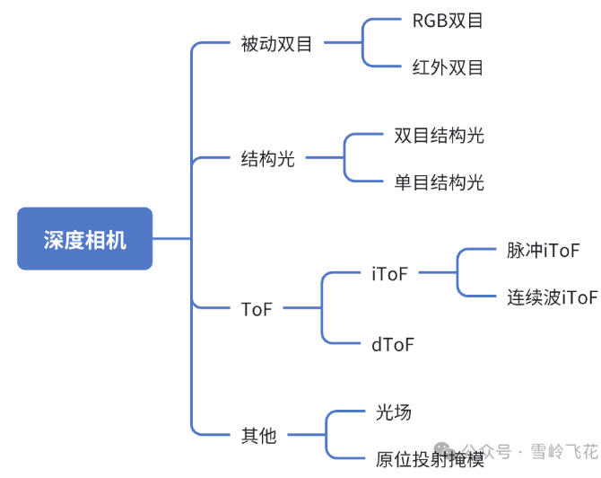

> 本文中的“深度”默认指沿相机光轴方向的坐标 $Z$。部分 ToF 芯片原始输出的是像素到传感器的径向距离 $R$，生成点云时需要结合内参和光线方向换算，不能直接把 $R$ 当作 $Z$。

## 1. 方法总览

| 类别 | 主动光源 | 直接观测量 | 核心深度关系 | 典型优势 | 主要局限 |
|---|---|---|---|---|---|
| 被动双目 | 否 | 左右图像视差 | $Z=fB/d$ | 量程灵活、硬件通用、室外适应性较好 | 弱纹理、重复纹理、遮挡区域难匹配 |
| 单目结构光 | 是 | 编码图案的像素位置/形变 | 投影器—相机三角测量 | 近距离精度高，弱纹理表面也可测 | 强环境光、反光/透明物体、多设备串扰 |
| 双目结构光（主动双目） | 是 | 投影纹理增强后的左右视差，或编码辅助的左右对应 | $Z=fB/d$ | 可沿用双目算法；固定随机纹理可单帧工作 | 功耗与标定负担更高；编码条纹常需多帧；仍有双目遮挡问题 |
| dToF | 是 | 单光子到达时间或时间直方图 | $R=c\Delta t/2$ | 可远距离工作，时间门控有利于抑制背景光 | SPAD/TCSPC 数据量大，散粒噪声和堆积效应明显 |
| iToF | 是 | 调制光与回波的相位差 | $R=c\phi/(4\pi f_m)$ | 面阵成熟、帧率高、深度计算规整 | 相位缠绕、多径干扰、强环境光和运动伪影 |

其中，$f$ 为焦距（以像素为单位时与视差单位一致），$B$ 为基线长度，$d$ 为视差，$c$ 为光速，$\Delta t$ 为光的往返时间，$f_m$ 为调制频率，$\phi$ 为回波相位延迟。

---

## 2. 双目相机

  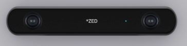

<em>代表产品：Stereolabs ZED 2i。左右相机构成固定基线，通过双目视差恢复深度，不依赖主动红外投影。图片与产品资料来源：<a href="https://www.stereolabs.com/products/zed-2">Stereolabs 官方产品页</a>。</em>

### 2.1 基本探测原理

双目系统由具有已知相对位姿的左、右相机组成。同一空间点 $P$ 在两幅图像中的投影位置不同；在完成双目标定和极线校正后，对应点通常位于同一图像行，水平坐标差即为视差：

$$
d=x_L-x_R, \qquad Z=\frac{fB}{d}.
$$

  

视差与深度成反比，因此远处物体的视差很小。由误差传播可得：

$$
\left|\delta Z\right|\approx\frac{Z^2}{fB}\left|\delta d\right|.
$$

这说明深度误差会近似随距离平方增长。增大焦距、增大基线或提高亚像素视差精度能改善远距离精度，但也会缩小视场、加重遮挡或增加硬件尺寸。
- 注意：双目相机的深度图FOV要小于单个相机
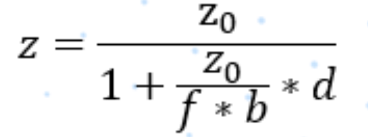
### 2.2 传统深度计算算法

典型流水线为：

1. **标定与极线校正**：估计相机内参、畸变参数和左右外参，将对应点约束到同一行；
2. **匹配代价计算**：使用 SAD/SSD、NCC、Census/Rank transform、互信息或梯度特征衡量候选像素的相似度；
3. **代价聚合与优化**：局部窗口/引导滤波，或使用动态规划、SGM（半全局匹配）、图割、置信传播等方法加入平滑与边缘约束；
4. **视差选择**：常用 winner-takes-all 选择最小代价，并通过抛物线拟合等方式获得亚像素视差；
5. **后处理**：左右一致性检查、遮挡填补、斑点去除、边缘保持滤波和时域滤波；
6. **三角化与点云生成**：由视差恢复 $Z$，再结合内参将像素反投影到三维空间。

工程中最常见的传统方案是 **Census + SGM**：Census 对光照差异较稳健，SGM 在效果、规则性和可实现性之间具有较好平衡，适合 FPGA/ASIC 加速。

### 2.3 深度学习算法

深度学习双目方法通常可分为三类：

- **二维相关/迭代更新类**：提取左右特征，构建相关性表示并迭代更新视差，如 RAFT-Stereo 类方法。内存通常低于完整 3D 代价体，但迭代次数会影响延迟；
- **三维代价体类**：在视差维上拼接或相关左右特征，使用 3D CNN/Transformer 聚合，如 GC-Net、PSMNet、GwcNet 类方法。精度较高，但显存、带宽和 3D 卷积计算量大；
- **轻量化/级联类**：先在低分辨率或小视差范围内粗估，再逐级细化，或使用可分离卷积、稀疏/自适应代价体，以适配嵌入式平台。

监督训练通常需要稠密真值视差；真实场景真值昂贵，因此还常使用合成数据预训练、域自适应、自监督重投影损失和左右一致性约束。网络的主要失败模式包括域偏移、反射/透明表面、细小结构、遮挡边界以及超出训练视差范围。

### 2.4 计算与数据传输瓶颈

- **搜索空间大**：若图像尺寸为 $H\times W$、最大视差为 $D$，稠密代价体的元素数为 $O(HWD)$；若保存 $C$ 通道特征，则存储量为 $O(HWDC)$。3D 代价体往往是深度网络的主要显存和访存瓶颈。
- **高分辨率双路输入**：双目至少传输两路图像。例如两路 $1920\times1080$、60 fps、RAW10 数据的理论有效载荷约为 $2\times1920\times1080\times60\times10\approx2.49$ Gbit/s，尚未计入协议开销和元数据。
- **片外存储访问**：匹配代价、特征图和中间视差需要反复读写；在嵌入式系统中，DRAM 带宽与功耗常比乘加次数更先成为限制。
- **标定和同步敏感**：微小外参漂移、滚动快门、曝光差异或左右不同步都会破坏极线约束。动态场景中，同步误差会直接转化为错误视差。
- **不可观测区域**：弱纹理、重复纹理、遮挡、镜面和透明区域没有可靠对应关系，仅提高算力不能从根本上消除信息缺失。

### 2.5 双目算法路线总结对比

以下比较针对本章列举的主要稠密双目路线。“精度高低”依赖数据集、标定、最大视差、图像质量、参数和训练域，不能只根据算法类别作绝对排序。

| 算法路线 | 核心方法 | 主要优势 | 主要局限 | 计算与存储特征 | 典型应用场景 |
|---|---|---|---|---|---|
| 局部块匹配（BM、SAD/SSD、NCC） | 在局部窗口内逐视差计算相似度并 WTA 选取最优视差 | 流程简单、延迟低、行为可解释，适合定点化和流式硬件 | 弱纹理、重复纹理和遮挡区域易误匹配；窗口跨越深度边界时容易前景/背景混合 | 计算量约随 $HWD$ 增长，可用行缓存实现，资源需求相对较低 | 低成本机器人、FPGA/ASIC 实时处理、纹理和光照受控的工业场景 |
| 半全局匹配（SGM） | 沿多个一维路径聚合匹配代价，以较低成本近似二维全局平滑 | 在精度、边缘保持、实时性和工程实现之间平衡较好；Census + SGM 对一定程度的亮度差异较稳健 | 多路径聚合增加带宽和缓存；惩罚参数需要调节；仍不能消除遮挡、反射和无纹理区域的不可观测性 | 中等至较高计算量，需要保存路径代价或采用分块/流水结构 | 车载立体视觉、移动机器人、无人机测绘、工业测量和嵌入式高质量双目 |
| 全局能量优化（图割、置信传播等） | 对整幅视差场联合优化数据项与平滑项 | 可施加强空间一致性，在部分困难区域得到连续视差 | 计算量、内存和延迟较高；强平滑可能损伤细杆、薄片和深度突变；实时硬件实现复杂 | 通常需要多轮全图迭代和较大的中间状态 | 离线三维重建、研究验证、对延迟不敏感的小规模或受控场景 |
| 深度网络：3D 代价体 | 构建 $H\times W\times D$ 特征/相关体，用 3D CNN 或 Transformer 学习聚合与正则化 | 能学习复杂匹配先验，在训练分布内通常具有较高精度和较强上下文推断能力 | 代价体显存、访存和 3D 运算开销大；依赖训练数据，存在域偏移和置信度失真风险 | 常为本章内资源开销最高的路线，计算与存储还随特征通道数增长 | GPU 平台、自动驾驶感知、离线重建及精度优先的机器人系统 |
| 深度网络：二维相关/迭代更新 | 构建相关表示并由循环单元或迭代模块逐步细化视差 | 通常避免大规模 3D 卷积，可在精度与内存之间取得较好折中 | 相关体仍占资源；迭代次数直接影响延迟；同样受训练域和困难材料影响 | 内存通常低于完整 3D 代价体网络，但多次迭代增加计算时延 | 有 GPU/NPU 的机器人、实时三维感知和内存相对受限的平台 |
| 轻量化/级联网络 | 低分辨率粗估、逐级缩小视差范围并细化，或采用稀疏/低比特特征 | 显著降低代价体和运算量，便于端侧部署 | 粗阶段错误可能逐级传播；细小结构、超大视差或域外场景精度可能下降 | 资源需求低于大型深度网络，可结合量化、裁剪和 ROI | 移动端、边缘 NPU、功耗受限机器人及固定视差范围的专用系统 |

所有路线都受同一双目几何约束：遮挡区域没有左右共同视点，镜面/透明表面不满足稳定的外观一致性，远距离视差又趋近于零。深度学习可以利用先验补全，但补全值不等同于直接观测值，安全或计量应用应保留置信度和无效像素标记。

依据资料：[Scharstein 与 Szeliski 双目算法分类](docs/01_被动双目/2002_Scharstein_Szeliski_Stereo_Taxonomy.pdf)；[Hirschmüller SGM](docs/01_被动双目/2008_Hirschmuller_Semi_Global_Matching.pdf)。

---

## 3. 结构光相机

结构光系统由投影器和一个或多个相机组成。投影器通常发射红外散斑、条纹、格雷码或相移图案，使原本缺少纹理的表面获得可识别的空间编码。

### 3.1 单目结构光相机

  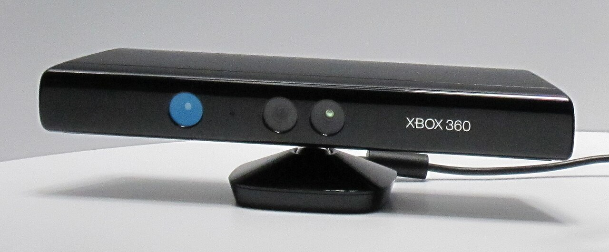

<em>代表产品：Xbox 360 Kinect（第一代）。其深度通道由一个红外散斑投影器和一个红外相机构成，是典型的单目结构光方案。图片：James Pfaff / Dancter，<a href="https://creativecommons.org/licenses/by/2.0/">CC BY 2.0</a>，来源：<a href="https://commons.wikimedia.org/wiki/File:Kinect_Sensor_at_E3_2010_(front).jpg">Wikimedia Commons</a>。</em>

#### 3.1.1 基本探测原理

单目结构光可把投影器视作一台“反向相机”。系统预先标定投影器与相机的内外参；相机识别某个投影编码后，就获得“相机像素—投影器像素”的对应关系，再用三角测量求交得到三维点。

  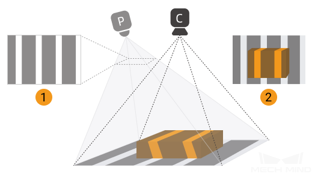

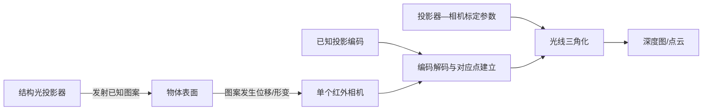

常见编码方式如下：

- **时间编码**：依次投射多幅二进制码、格雷码或相移条纹。对应关系准确、深度分辨率高，但需要多帧，运动会导致编码错位；
- **空间编码**：单帧图案的局部邻域具有唯一结构，可单帧解码，但空间分辨率和抗噪性受限；
- **随机散斑**：投射伪随机红外纹理，将当前散斑与参考图或投影模型匹配，适合实时工作；
- **混合编码**：结合格雷码确定条纹级次、相移法获得亚周期相位，兼顾量程和精度。

#### 3.1.2 传统深度计算算法

- **格雷码/二进制编码解码**：对多帧亮暗状态进行阈值判决，确定投影器列或像素编号，再做三角化；
- **相移法**：由多幅相位偏移条纹计算包裹相位，再进行空间或时间相位展开，获得高精度连续对应坐标；
- **散斑匹配**：使用块匹配、NCC、Census、相位相关或局部特征将观测散斑与参考散斑对齐；
- **后处理**：调制度/对比度阈值、置信度筛选、相位跳变修复、边缘保持滤波和时域融合。

#### 3.1.3 深度学习算法

- **学习式图案解码/匹配**：CNN 或 Transformer 从畸变条纹、散斑图直接回归对应坐标、相位或视差；
- **相位展开与误差修复**：网络预测条纹级次、展开相位或错误区域，对低反射、阴影和局部断裂进行补偿；
- **端到端深度恢复**：从一幅或多幅结构光图直接估计深度，并可联合预测置信度；
- **深度补全/去噪**：融合 RGB、红外强度和稀疏/低质量深度，修复孔洞与飞点。

深度学习能利用数据先验改善缺失区域，但“补全结果”不等同于直接测量；在尺寸检测、安全控制等应用中，应同时输出置信度并保留无效像素标记。

#### 3.1.4 计算与数据传输瓶颈

- 多帧格雷码/相移法需要传输和缓存 $N$ 幅原始图，数据率与存储量随投影帧数线性增长；动态物体还会产生帧间错位。
- 高精度相位计算涉及逐像素三角函数、相位展开和异常检测；高分辨率高速测量时，实时处理压力较大。
- 散斑匹配仍包含二维或一维搜索，本质上存在与双目相似的代价计算和访存开销。
- 环境红外光会降低调制度；深色、镜面、半透明表面会造成低信噪比、饱和或次表面散射。
- 投影器散热、激光安全、相机—投影器标定稳定性和多设备互相干扰是重要系统约束。

### 3.2 双目结构光相机（主动双目）

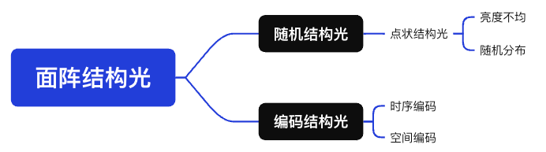

<em>代表产品：Intel RealSense D435。两个红外相机负责视差测量，红外投影器用于给弱纹理表面增加散斑纹理。产品资料：<a href="https://www.realsenseai.com/products/stereo-depth-camera-d435/">RealSense 官方产品页</a>；图片：Marc Auledas，<a href="https://creativecommons.org/licenses/by-sa/4.0/">CC BY-SA 4.0</a>，来源：<a href="https://commons.wikimedia.org/wiki/File:Intel_Realsense_depth_camera_D435.jpg">Wikimedia Commons</a>。</em>

#### 3.2.1 基本探测原理

主动双目是在普通双目系统中加入主动投影器。投影器可以发射伪随机点阵、散斑状纹理、条纹、格雷码或其他编码图案，为白墙等弱纹理表面制造可匹配特征。

判断它是不是“主动双目”的关键不在于图案长什么样，而在于最终深度是否主要由左右相机的对应点与视差 $d$ 计算。

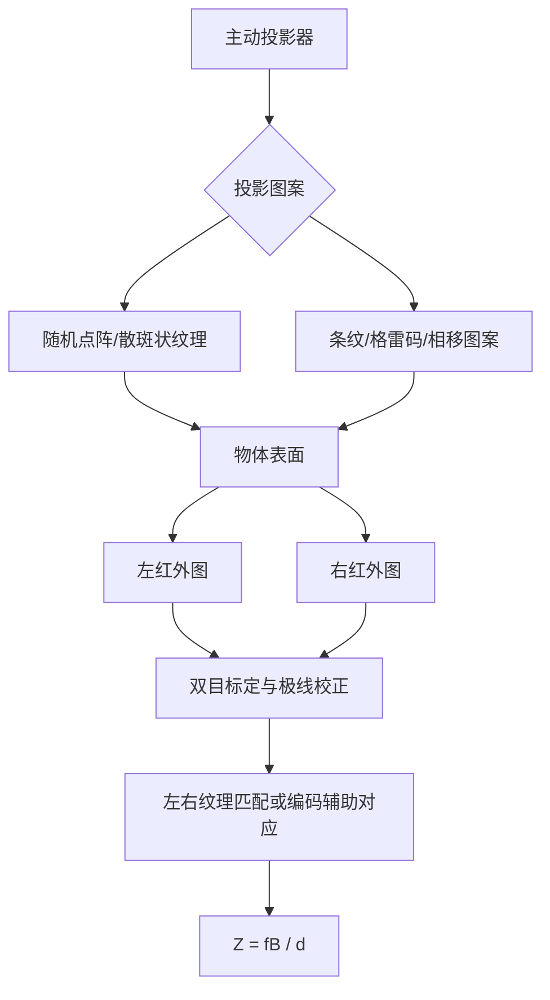

对于固定随机纹理方案，关闭投影器后系统可以退化为被动双目；在室外阳光下，投影纹理被淹没时也会近似退化为被动模式。对于格雷码、相移条纹等依赖投影编码的方案，关闭投影器则会失去编码提供的对应关系。

还要区分三种容易混用的系统：

- **主动双目**：投影器主要负责增加或标记纹理，核心几何基线是“左相机—右相机”；
- **单目结构光**：把投影器视作“反向相机”，解码相机像素与投影器像素的对应关系，核心基线是“相机—投影器”；
- **混合系统**：既解码相机—投影器对应，又融合左右相机视差。仅凭“有两个相机”不能断定其深度算法一定是主动双目。

#### 3.2.2 按投影纹理分类

**可以从图案形态上把主动双目粗分为“散斑/随机纹理投影”和“条纹/编码纹理投影”，但这不是严格且完备的二分法。** 更准确的说法是：它们是主动双目可采用的两类代表性投影纹理，此外还有网格、彩色编码、优化二值纹理和学习式图案等。

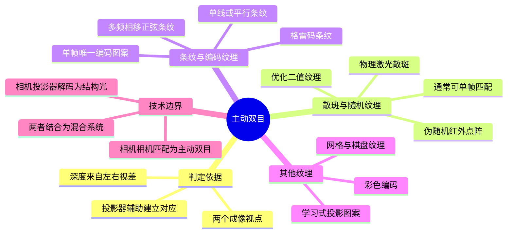

| 投影纹理 | 典型形式 | 建立对应的方法 | 常见帧数 | 优点 | 主要限制 |
|---|---|---|---:|---|---|
| 散斑/随机纹理 | 伪随机红外点阵、激光散斑、优化黑白块 | 在左右图的局部窗口内直接相关或计算匹配代价，不必知道每个投影点的绝对编号 | 1 | 适合动态场景，可直接复用块匹配、SGM 或学习式双目 | 图案过稀、重复、自相似、离焦或被环境光淹没时会产生歧义 |
| 条纹/编码纹理 | 单线、平行条纹、格雷码、相移正弦条纹、旋转条纹 | 提取条纹中心或解码条纹编号/相位，再在左右视图间建立对应；也可与普通双目匹配融合 | 1 或多帧 | 编码后对应关系清晰，多帧方案可获得较高空间精度 | 未编码的周期条纹容易“错一周期”；多帧编码对运动、同步和投影帧率敏感 |
| 其他设计纹理 | 网格、彩色 De Bruijn 编码、学习式投影图案 | 通过局部唯一编码、特征描述或端到端网络匹配 | 1 或多帧 | 可针对视差范围、光学模糊和算法联合优化 | 颜色串扰、训练域偏移、投影器复杂度和可解释性问题 |

这里把“伪随机点阵”和“激光散斑”放在同一资料目录，是按工程外观与匹配用途归档；两者的物理成因并不相同：前者通常由 DOE/掩模生成设计好的点阵，后者是相干光干涉形成的颗粒纹理。

代表资料：

- [Keselman 等：Intel RealSense Stereoscopic Depth Cameras](docs/03_主动双目/散斑与随机纹理/2017_Keselman_RealSense_Stereoscopic_Depth_Cameras.pdf)：固定红外图案、双目相关、误差与产品系统实现；
- [Scharstein 与 Szeliski：High-Accuracy Stereo Depth Maps Using Structured Light](docs/03_主动双目/条纹与编码纹理/2003_Scharstein_Szeliski_High_Accuracy_Stereo_Structured_Light.pdf)：双视图下的格雷码与正弦条纹解码、视图视差和照明视差融合。该论文主要面向高精度立体数据真值采集，不应直接等同于量产实时相机架构。

#### 3.2.3 常用算法

- **随机纹理路径**：局部块匹配、Census + SGM、左右一致性检查、斑点/孔洞滤除；可以根据主动红外强度与投影图案统计设计专用匹配代价。
- **条纹与编码路径**：条纹中心提取、格雷码阈值解码、相移与相位展开、编码一致性匹配，再通过双目三角化生成深度；周期条纹通常需要多频率、多相位或其他唯一编码来消除周期歧义。
- **深度学习算法**：与被动双目基本一致，可使用 2D 相关、3D 代价体和迭代细化网络；训练时可额外输入红外强度、投影开/关帧或置信图。
- **融合策略**：在自然纹理充分时使用可见光/被动双目，在弱纹理时启用主动投影；也可融合 RGB、左右视差、条纹编码结果与相机—投影器三角测量结果。

#### 3.2.4 计算与数据传输瓶颈

双目结构光同时承担双目系统的双路图像带宽、视差搜索和标定同步成本，以及主动投影系统的功耗、散热、环境光和串扰问题。格雷码、相移或旋转条纹还会把每次深度重建的数据量扩大为多幅左右图像，并引入运动错码；随机纹理虽可单帧工作，但仍需要较大的视差搜索和访存带宽。若同时采集 RGB、左右 IR、深度和置信度，传感器内部与主机接口会出现多流并发；此时在传感器端完成匹配，仅传输深度/置信度，往往能显著降低主机链路带宽，但会牺牲算法可重配置性和原始数据可追溯性。

### 3.3 结构光与主动双目方案总结对比

本章方案既可以按“一个还是两个成像相机”区分，也可以按“单帧还是多帧编码”区分。最可靠的判据仍是建立哪一对对应关系：相机—投影器对应属于结构光三角测量，左—右相机对应属于主动双目，两者都使用则属于混合系统。

| 方案 | 核心对应关系 | 常见采集帧数 | 主要优势 | 主要局限 | 典型应用场景 |
|---|---|---:|---|---|---|
| 单目多帧编码结构光（格雷码、相移、混合编码） | 相机像素—投影器像素/条纹相位 | 多帧 | 编码唯一性强；格雷码可确定绝对条纹级次，相移可获得亚周期精度；适合稠密、高精度测量 | 对物体运动和相机/投影时序敏感；采集时间、缓存和投影帧数较多；强环境光及镜面、透明、深色材料会降低可靠性 | 工业尺寸检测、逆向工程、文物/零件扫描、牙科与静态人体表面测量 |
| 单目单帧结构光（空间编码、伪随机散斑） | 相机图案—参考图案或局部唯一编码 | 1 | 可测动态场景；只需一个成像相机，系统体积可较小；弱自然纹理表面仍可工作 | 单帧需要在空间邻域中编码，空间分辨率与唯一性存在权衡；相机—投影器遮挡、环境红外和多设备串扰仍会造成孔洞 | 室内人机交互、面部/人体捕捉、消费级近距离深度、室内机器人感知 |
| 主动双目固定随机纹理 | 左相机—右相机的投影纹理视差 | 1 | 可直接复用双目匹配；自然纹理与投影纹理可共同提供信息；关闭或失去投影后仍可退化为被动双目 | 需要两路图像和视差搜索；仍存在双目遮挡；图案过稀、自相似或被阳光淹没时增益下降 | 移动机器人避障、抓取、室内/半室外三维感知、实时 RGB-D 相机 |
| 主动双目条纹/编码纹理或混合系统 | 左—右相机编码对应，并可融合相机—投影器对应 | 单帧或多帧 | 编码条纹可减少左右匹配歧义；融合多个几何基线可提高覆盖率或测量可靠性 | 未编码周期条纹存在周期歧义；多频/多相/旋转条纹增加运动错码、同步和计算复杂度；系统标定更复杂 | 高精度实验测量、工业三维扫描、双目数据真值采集及对遮挡覆盖要求较高的系统 |

选择时不应简单认为“相机越多越准”或“多帧一定更好”。静态受控场景通常更能发挥多帧编码的精度优势；动态场景优先考虑单帧空间编码或固定随机纹理；室外性能则取决于投影功率、波段、带通滤光、曝光和眼安全限制，主动投影失效时只有能退化为被动双目的系统仍可能依靠自然纹理工作。

依据资料：[Geng 结构光教程](docs/02_单目结构光/2011_Geng_Structured_Light_3D_Imaging_Tutorial.pdf)；[Keselman 等 RealSense 主动双目论文](docs/03_主动双目/散斑与随机纹理/2017_Keselman_RealSense_Stereoscopic_Depth_Cameras.pdf)；[Scharstein 与 Szeliski 编码结构光双视图论文](docs/03_主动双目/条纹与编码纹理/2003_Scharstein_Szeliski_High_Accuracy_Stereo_Structured_Light.pdf)。

---

## 4. ToF 相机

ToF（Time of Flight）相机主动发射调制光或短脉冲，并估计光从发射端到目标再返回接收端的往返传播时间。
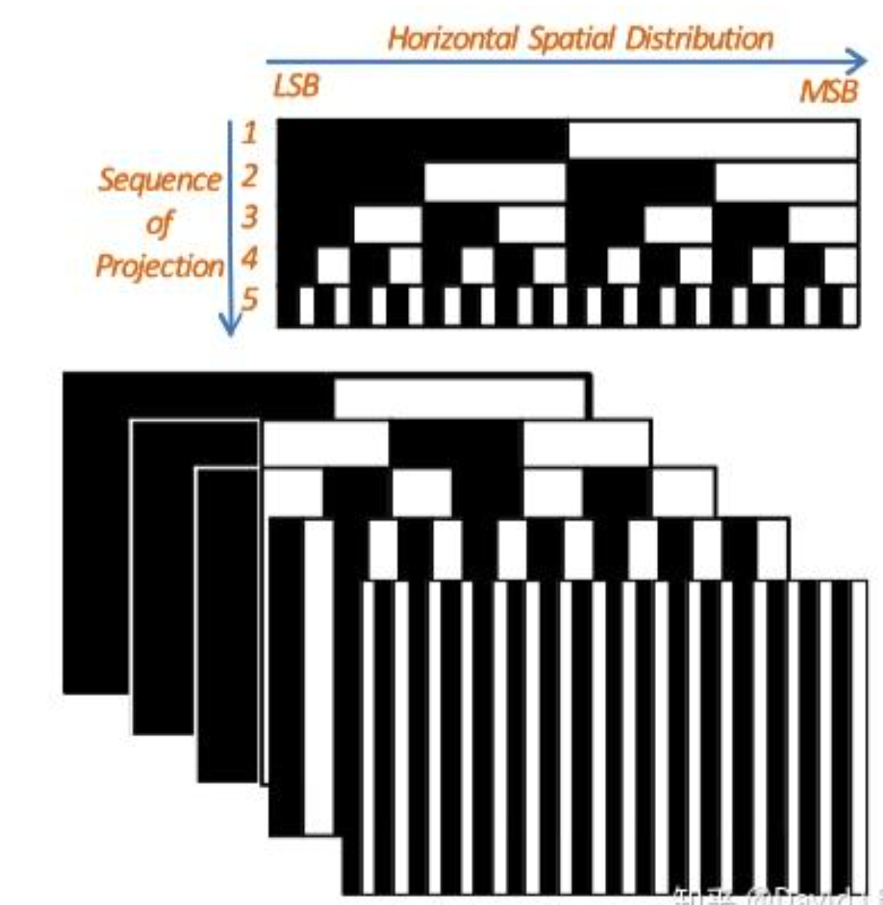

### 4.1 dToF 相机

  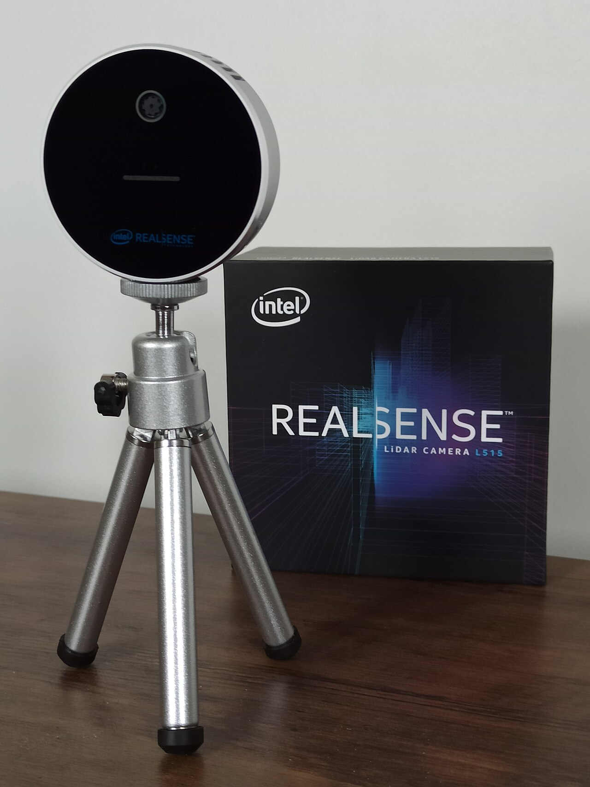

<em>代表产品：Intel RealSense L515。该产品属于 MEMS 扫描式固态 LiDAR，通过直接测量激光回波的飞行时间获得深度，是 dToF 产品形态之一。产品资料：<a href="https://dev.realsenseai.com/docs/lidar-camera-l515-datasheet/">L515 数据手册</a>；图片：Marc Auledas，<a href="https://creativecommons.org/licenses/by-sa/4.0/">CC BY-SA 4.0</a>，来源：<a href="https://commons.wikimedia.org/wiki/File:Intel_Realsense_lidar_camera_L515.jpg">Wikimedia Commons</a>。</em>

#### 4.1.1 基本探测原理

dToF（direct ToF）直接估计光子的往返时间。常见系统用脉冲激光/VCSEL 发射极短光脉冲，用 SPAD（单光子雪崩二极管）检测回波，再由 TDC（时间数字转换器）或 TCSPC（时间相关单光子计数）记录光子到达时间。

单次检测的随机性很强，因此通常对多次脉冲累积，形成时间直方图：

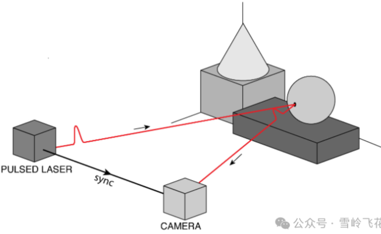

每个时间 bin 对应的单程距离分辨率近似为 $\Delta R=c\Delta t_{bin}/2$。例如 1 ns 对应约 15 cm，100 ps 对应约 1.5 cm；实际精度还取决于脉冲宽度、抖动、光子数、背景光和估计算法，不能只由 bin 宽度决定。

#### 4.1.2 传统深度计算算法

- **首光子/阈值检测**：选择第一个显著到达事件或首个超过阈值的时间 bin，延迟低但对噪声敏感；
- **直方图峰值检测**：背景估计后寻找最大峰，可配合质心、抛物线或高斯拟合提高亚 bin 精度；
- **匹配滤波/相关法**：用已知系统脉冲响应与直方图相关，在低信噪比下估计回波位置；
- **最大似然与贝叶斯估计**：建立泊松光子计数模型，同时估计深度、反射率和背景光；
- **多回波分解**：从多个峰中分离前景、背景或半透明介质回波；
- **系统校正**：暗计数、固定模式噪声、通道延迟、温漂、距离偏置、pile-up（堆积）和串扰校正。

#### 4.1.3 深度学习算法

- **直方图去噪与峰值定位**：1D CNN/Transformer 在每像素时间直方图上抑制背景并回归峰位置；
- **时空联合恢复**：3D CNN 或时空注意力同时利用相邻像素/帧，提高低光子计数下的深度稳定性；
- **多回波与多径分离**：网络估计多个回波分量或直接恢复无多径深度；
- **稀疏 dToF 补全**：将少量 SPAD 测距点与 RGB 图像融合，生成稠密深度；
- **端到端点云/任务推理**：直接从事件流或直方图提取检测、分割所需特征，减少完整深度重建和中间数据搬运。

#### 4.1.4 计算与数据传输瓶颈

- **直方图维度高**：若阵列为 $H\times W$、每像素 $T$ 个时间 bin、每 bin 为 $b$ bit，则单帧原始直方图为 $HWTb$ bit。例如 $640\times480\times1024\times16$ bit 约为 629 MB/帧；30 fps 时理论数据率约 151 Gbit/s，通常无法直接片外传输。
- **片上聚合是必需的**：实际芯片常输出峰值深度、强度和置信度，或只传非零事件/ROI，而不是完整直方图。这样能大幅压缩数据，但会丢失多回波与后处理信息。
- **光子统计带来的积分时间**：远距离、低反射率或强背景光场景需要积累更多脉冲，量程、精度、帧率和激光功率之间存在直接权衡。
- **SPAD 阵列读出压力**：事件时间戳、TDC 数量、仲裁冲突、像素死时间和片上 SRAM 容量会限制有效吞吐。
- **算法访存**：对完整直方图执行卷积、匹配滤波或贝叶斯推断时，数据搬运成本通常远高于简单峰值搜索。
- **pile-up 与背景光**：SPAD 在一个周期内优先记录较早光子，强背景或近距离回波会扭曲直方图；高光子率并不总等于更准确。

### 4.2 iToF 相机

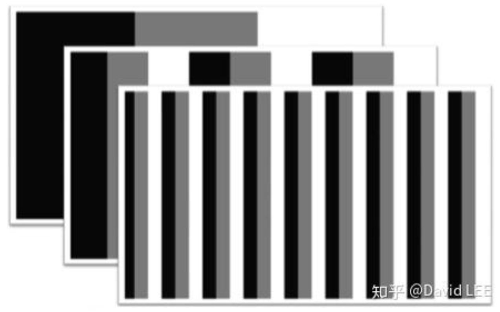

<em>代表产品：Microsoft Azure Kinect DK。其 1 Mpixel 解调型 ToF 深度传感器通过调制与解调回波获得距离，属于 iToF 路线。产品资料：<a href="https://learn.microsoft.com/en-us/azure/kinect-dk/hardware-specification">Microsoft 硬件规格</a>与<a href="https://learn.microsoft.com/en-us/windows/mixed-reality/ISSCC-2018">解调型 ToF 传感器说明</a>；图片：Profkipp，<a href="https://creativecommons.org/licenses/by-sa/4.0/">CC BY-SA 4.0</a>，来源：<a href="https://commons.wikimedia.org/wiki/File:Azure_kinect.jpg">Wikimedia Commons</a>。</em>

#### 4.2.1 基本探测原理

iToF（indirect ToF）通常发射连续波或脉冲调制光，不直接解析单个光子的绝对到达时间，而是测量回波相对于发射参考的相位延迟。对正弦调制，理想条件下：

$$
\phi=2\pi f_m\Delta t, \qquad R=\frac{c\phi}{4\pi f_m}.
$$

常见四相采样在 $0^\circ$、$90^\circ$、$180^\circ$、$270^\circ$ 获得相关值 $C_0,C_1,C_2,C_3$：

$$
\phi=\operatorname{atan2}(C_3-C_1,\ C_0-C_2),
$$

$$
A=\frac{1}{2}\sqrt{(C_3-C_1)^2+(C_0-C_2)^2},
$$

其中 $A$ 表示回波调制度，可用于构造置信度。由于相位按 $2\pi$ 周期重复，单频不模糊距离为：

$$
R_{amb}=\frac{c}{2f_m}.
$$

调制频率越高，相同相位误差对应的距离误差越小，但不模糊量程越短；工程上常用多频测量进行相位展开。

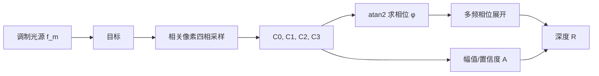

#### 4.2.2 传统深度计算算法

- **相关采样与相位求解**：暗电流/环境光扣除、四相或多相相关、`atan2` 相位计算和幅值估计；
- **相位展开**：使用双频/多频拍频、查表、中国剩余定理式组合或时空连续性恢复绝对距离；
- **系统标定**：像素固定模式偏置、温度漂移、调制频率偏差、镜头和照明不均匀校正；
- **多径干扰（MPI）抑制**：多频估计、稀疏回波分解、几何先验、直接/全局光分离；
- **飞点与运动伪影处理**：利用幅值、相位一致性、边缘检测和时域滤波剔除混合像素。

#### 4.2.3 深度学习算法

- **深度去噪与超分辨率**：融合原始相位、幅值、环境光图和 RGB，提高空间分辨率并修复无效区域；
- **MPI 校正**：利用多频原始相关帧预测直接路径深度、全局光分量或深度残差；
- **运动伪影校正**：估计多相采样之间的光流/场景运动，对相关帧对齐后再计算相位；
- **联合重建**：网络同时输出深度、反射率、法向和置信度，以多任务约束提高稳定性。

训练数据必须覆盖真实材料、曝光、温度、镜头和多径几何；仅在仿真数据上训练的模型容易产生域偏移。对网络补出的边界和孔洞，同样需要置信度与安全约束。

#### 4.2.4 计算与数据传输瓶颈

- **多相、多频原始帧**：一个深度帧通常由多个相关子帧组成。若使用 4 相位、3 频率，内部至少处理 12 个相关图；外部若只看到最终深度帧，容易低估传感器内部带宽与功耗。
- **逐像素非线性计算**：`atan2`、平方根、多频相位展开和标定查表适合流水线化，但在高分辨率、高帧率下仍需要大量算力和片上缓存。
- **运动与子帧时序冲突**：多相采样并非严格同一时刻，快速运动会破坏相位关系；提高采样速度又会降低单次曝光的信噪比。
- **MPI 是结构性误差**：墙角、凹槽和高反射物体会使多个传播路径在同一像素叠加。简单滤波只能缓解，可靠分离通常需要多频原始数据和更高计算量。
- **链路取舍**：输出最终 16-bit 深度图的带宽较低；输出所有相位/频率相关图可支持高级校正，却会使链路数据率成倍增加。

### 4.3 dToF 与 iToF 总结对比

| 对比维度 | dToF（直接飞行时间） | iToF（间接飞行时间） |
|---|---|---|
| 直接观测量 | 脉冲回波中光子的到达时间、事件时间戳或时间直方图 | 调制光与回波之间的相关值和相位延迟 |
| 典型接收与计时结构 | SPAD + TDC/TCSPC，或 APD/SiPM + 高速计时/波形采样；可做单点、扫描、线阵或面阵 Flash，dToF 不等同于“必须扫描” | 解调/锁相像素 + 多相相关采样；通常以面阵形式输出稠密深度 |
| 典型原始数据 | 每像素时间 bin 直方图或稀疏光子事件；片上常压缩成峰值深度、强度和置信度 | 四相或多相、多频相关图；片上完成相位计算后可只输出深度、幅值和置信度 |
| 主要优势 | 时间门控能力强；在光子预算和光学设计允许时适合较长距离；直方图可保留多个分离回波，有利于多目标/多回波分析 | 面阵稠密成像成熟，计算结构规则、帧率较高；深度与强度天然配准；片上输出最终深度时外部带宽较低 |
| 主要局限 | 光子散粒噪声、暗计数、时间抖动、SPAD 死时间和 pile-up 会改变峰形；TDC、仲裁和直方图 SRAM 带来面积、功耗与片上带宽压力 | 单频存在相位缠绕和周期性距离歧义；多径反射会使相位成为多个路径的混合；多相/多频子帧间运动会产生伪影 |
| 不模糊量程 | 主要受脉冲重复周期、时间窗和计时范围限制；延长时间窗可扩大范围，但会影响帧率、存储或背景光累积 | 单频不模糊距离为 $R_{amb}=c/(2f_m)$；提高调制频率可改善相位对距离的灵敏度，但会缩短不模糊距离，通常需多频展开 |
| 精度特性 | 可通过亚 bin 峰值估计达到优于时间 bin 对应距离的精度；最终精度取决于脉冲宽度、系统抖动、光子数、背景和标定 | 可通过高调制频率和高信噪比获得较高相位精度；最终精度取决于调制度、积分时间、频率、MPI、温漂和标定 |
| 强环境光/室外 | 窄脉冲、窄带滤光和时间门控具有潜在优势，但强阳光仍会增加背景计数、降低有效信噪比；不能笼统认为 dToF 不受环境光影响 | 可用窄带滤光、背景扣除和较高调制频率改善，但强环境光会占用像素动态范围并降低调制度；典型消费级 iToF 更常用于室内或受控距离 |
| 多径与多回波 | 若不同回波在时间上可分辨且光子数足够，直方图可检测多个峰；回波重叠、散射或 pile-up 时仍会产生偏差 | 多条传播路径在相关采样中叠加，MPI 是典型结构性误差；通常需要多频、场景先验或回波分解抑制 |
| 动态场景 | 单个光子事件快，但深度常需跨多次脉冲积分；目标在积分期间运动会造成直方图展宽、混峰或点云畸变 | 一个深度帧由多个相位/频率子帧组成，快速运动会破坏子帧之间的相位一致性并产生边缘飞点 |
| 功耗与算力 | 发射端常有较高脉冲峰值功率；接收端的 TDC、事件读出和直方图处理复杂。片上只输出峰值可大幅降带宽 | 发射端需要持续或高占空比调制；接收端需相关积分、`atan2`、相位展开和 MPI 校正。功耗高低取决于具体器件，不能仅凭 dToF/iToF 名称判断 |
| 更适合的应用 | 中远距离 LiDAR、车载/机器人测距、无人机与测绘、需要时间门控或多回波信息的场景、稀疏或扫描式高动态范围测量 | 室内稠密深度、人机交互、手势/人体跟踪、前景分割、近中距离机器人导航、室内三维扫描和 AR/VR |

**结论：两者没有脱离器件与场景的绝对优劣。** dToF 的长距离和多回波潜力依赖发射功率、接收口径、SPAD/TDC 性能、积分时间和眼安全约束；iToF 的稠密高帧率优势依赖调制度、频率组合、原始相关数据和 MPI/运动校正。进行选型时应使用同一目标反射率、环境照度、距离、视场、分辨率和帧率条件下的实测数据，而不能只比较数据手册中的单一“最大量程”或“精度”数字。

依据资料：[Sarbolandi 等脉冲 ToF 综述](docs/04_ToF/dToF/2018_Sarbolandi_Pulse_Based_ToF_Range_Sensing.pdf)；[Tontini 等 SPAD dToF 系统模型](docs/04_ToF/dToF/2020_Tontini_SPAD_dToF_Flash_LiDAR_Model.pdf)；[Foix 等锁相 iToF 综述](docs/04_ToF/iToF/2011_Foix_Lock_in_ToF_Cameras_Survey.pdf)。

---

## 5. 方案应用对比

## 6. 跨方案的计算与传输瓶颈对比

### 5.1 数据率估算

未压缩数据率可粗略估算为：

$$
\text{Rate}=W\times H\times FPS\times \sum_i(n_i b_i),
$$

其中 $n_i$ 是第 $i$ 类图像/子帧的通道或帧数，$b_i$ 是每像素位宽。实际接口还需考虑行/帧消隐、包头、时间戳、校验和编码开销，因此应预留余量。

| 输出模式（示例） | 理论有效载荷 | 说明 |
|---|---:|---|
| $1280\times720$，30 fps，16-bit 深度 | 0.442 Gbit/s | 仅最终深度，不含置信度/RGB |
| $1280\times720$，30 fps，16-bit 深度 + 8-bit 置信度 | 0.664 Gbit/s | 适合传感器端已完成深度计算 |
| 双路 $1920\times1080$，60 fps，RAW10 | 2.488 Gbit/s | 双目原始输入，不含协议开销 |
| iToF：$640\times480$，30 fps，12 个 16-bit 相关图 | 1.770 Gbit/s | 4 相位 × 3 频率的外传估算 |
| dToF：$640\times480$，30 fps，1024 bin × 16-bit | 150.995 Gbit/s | 完整稠密直方图，通常只能片上压缩 |

### 5.2 主要瓶颈归纳

| 瓶颈 | 双目 | 结构光 | dToF | iToF |
|---|---|---|---|---|
| 最重的中间数据 | 视差代价体/特征图 | 多帧编码图或匹配代价 | 时间直方图/事件时间戳 | 多相、多频相关图 |
| 主要计算 | 匹配与代价聚合 | 编码解码、匹配、相位展开 | 峰值/回波统计估计 | 相位计算、展开与 MPI 校正 |
| 主要物理误差 | 遮挡、弱纹理、远距视差小 | 环境光、反射、运动错码 | 散粒噪声、pile-up、串扰 | 相位缠绕、MPI、运动伪影 |
| 片上处理收益 | 避免外传双路原图/代价体 | 避免外传多幅编码图 | 避免外传完整直方图，收益最大 | 避免外传多相/多频子帧 |
| 片上处理代价 | 算法固化、SRAM/DRAM 压力 | 标定与解码逻辑复杂 | TDC/直方图 SRAM 面积和功耗高 | 多频缓存、非线性运算和校正逻辑 |

### 5.3 面向感算协同的优化方向

1. **靠近传感器做数据约简**：在像素阵列或读出芯片附近完成背景扣除、置信度筛选、直方图峰值提取、稀疏化或 ROI 选择，减少无效数据搬运；
2. **流式与分块处理**：双目匹配、相位计算和滤波尽量采用行缓存/片上 SRAM 流水线，避免完整帧和完整代价体反复访问 DRAM；
3. **自适应采样**：依据纹理、幅值、光子数和运动状态动态调整视差范围、积分时间、时间 bin、调制频率或投影帧数；
4. **压缩中间表示**：使用低比特特征、稀疏代价体、峰值列表、事件流或深度 + 置信度代替完整原始张量；
5. **任务驱动输出**：若下游只需要避障、检测或姿态估计，可在传感器端直接生成稀疏几何特征或任务特征，避免“原始数据 → 稠密深度 → 点云 → 任务网络”的多次搬运；
6. **保留可验证性**：感知端压缩或神经网络补全应同步输出置信度、饱和/遮挡/多径标志，并为关键场景保留触发式原始数据回读能力。

---

## 6. 选型建议

- **室外、中远距离、自然纹理较丰富**：优先考虑被动双目；若算力受限，可采用 Census + SGM 或轻量级级联网络。
- **室内近距离、高精度测量、目标相对静止**：单目多帧结构光具有较高精度；动态场景更适合单帧散斑或主动双目。
- **弱纹理室内实时感知**：双目结构光兼顾稠密度与实时性，但应评估阳光、投影器串扰和功耗。
- **远距离、低照度、稀疏或扫描式测距**：dToF 更合适，关键在于片上光子统计和直方图压缩。
- **室内面阵高速深度**：iToF 具有成熟的面阵读出和规整计算，但应重点验证 MPI、相位缠绕和运动伪影。

最终选型不能只比较“标称精度”，还应同时考察量程、视场、最小工作距离、环境光、目标反射率、运动速度、激光安全、功耗、标定稳定性、原始数据可访问性，以及主机接口和下游算法能够承受的持续数据率。
