# 深度相机（三维传感器）原理、算法与系统瓶颈

## 目录

- [深度相机（三维传感器）原理、算法与系统瓶颈](#深度相机三维传感器原理算法与系统瓶颈)
  - [目录](#目录)
    - [三维相机的本质](#三维相机的本质)
  - [0. 2D 数据与 3D 数据的异同](#0-2d-数据与-3d-数据的异同)
  - [1. 方法总览](#1-方法总览)
  - [2. 双目相机](#2-双目相机)
    - [2.1 基本探测原理](#21-基本探测原理)
    - [2.2 方法分类](#22-方法分类)
    - [2.3 传统深度计算算法](#23-传统深度计算算法)
      - [SGBM算法流程：](#sgbm算法流程)
    - [2.3 深度学习算法](#23-深度学习算法)
    - [2.4 双目深度计算瓶颈](#24-双目深度计算瓶颈)
  - [3. 结构光相机](#3-结构光相机)
    - [3.0 结构光投影分类](#30-结构光投影分类)
      - [3.0.1 随机结构光](#301-随机结构光)
      - [3.0.2 编码结构光](#302-编码结构光)
    - [3.1 单目结构光相机](#31-单目结构光相机)
      - [3.1.1 基本探测原理](#311-基本探测原理)
      - [3.1.3 标定方法](#313-标定方法)
      - [3.1.3 深度学习算法](#313-深度学习算法)
    - [3.2 双目结构光相机（主动双目）](#32-双目结构光相机主动双目)
      - [3.2.1 基本探测原理](#321-基本探测原理)
      - [3.2.3 常用算法](#323-常用算法)
      - [3.2.4 计算与数据传输瓶颈](#324-计算与数据传输瓶颈)
    - [3.3 结构光与主动双目方案总结对比](#33-结构光与主动双目方案总结对比)
  - [4. ToF 相机](#4-tof-相机)
    - [4.1 dToF 相机](#41-dtof-相机)
      - [4.1.1 基本探测原理](#411-基本探测原理)
      - [测距公式：](#测距公式)
        - [系统组成：](#系统组成)
      - [4.1.2 传统深度计算算法](#412-传统深度计算算法)
      - [4.1.3 深度学习算法](#413-深度学习算法)
      - [4.1.4 计算与数据传输瓶颈](#414-计算与数据传输瓶颈)
    - [4.2 iToF 相机](#42-itof-相机)
      - [4.2.1 基本探测原理](#421-基本探测原理)
        - [相位差计算公式：](#相位差计算公式)
      - [4.2.2 iToF相机分类：](#422-itof相机分类)
        - [（1）发射连续（正弦）波存在的问题：](#1发射连续正弦波存在的问题)
        - [（2）发射方波（脉冲波）双频测量技术：](#2发射方波脉冲波双频测量技术)
      - [（3）cw-iToF与p-iToF方案对比](#3cw-itof与p-itof方案对比)
    - [4.3 dToF 与 iToF 总结对比](#43-dtof-与-itof-总结对比)
    - [4.4 激光雷达及其与 ToF 相机的关系](#44-激光雷达及其与-tof-相机的关系)
      - [4.4.1 基本原理与组成](#441-基本原理与组成)
      - [4.4.2 机械式、半固态与固态激光雷达](#442-机械式半固态与固态激光雷达)
      - [4.4.3 ToF 相机与激光雷达对比](#443-tof-相机与激光雷达对比)
  - [5. 方案应用对比](#5-方案应用对比)
  - [6. 选型建议](#6-选型建议)
  - [7. 存内计算实现双目深度估计](#7-存内计算实现双目深度估计)
    - [7.1 加速边界：代价体构建而非完整 SGBM](#71-加速边界代价体构建而非完整-sgbm)
    - [7.2 代表论文与实现算子](#72-代表论文与实现算子)
    - [7.3 不同场景下的算子优势与选择](#73-不同场景下的算子优势与选择)
    - [7.4 MC-CIM：可重构双目匹配代价计算](#74-mc-cim可重构双目匹配代价计算)
    - [7.5 CV-CIM：相似性感知的混合域代价体构建](#75-cv-cim相似性感知的混合域代价体构建)
    - [7.6 技术演进与对 FPGA/SGBM 的启示](#76-技术演进与对-fpgasgbm-的启示)

---

<!-- 三维相机（雷达）的输出通常是一幅与图像像素对齐或可配准的深度图（depth map），其中每个有效像素记录场景点到相机的距离。 -->
### 三维相机的本质
获得被测物体与测量装置也就是三维相机的相对位置关系；如果被测物体上每一个点和三维相机的关系都确定了，就可以得到被测物体的三维结构信息。
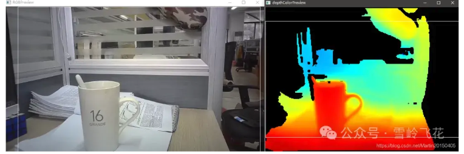
按信息获取方式，可将常用方案概括为：

- **被动三角测量**：双目/多目相机利用不同视点之间的视差恢复深度；
- **主动三角测量**：结构光投影器向场景发射已知图案，再由相机观测图案形变；
- **飞行时间测量**：ToF 相机通过光的往返时间或相位延迟直接估计距离。

> 本文中的“深度”默认指沿相机光轴方向的坐标 $Z$。部分 ToF 芯片原始输出的是像素到传感器的径向距离 $R$，生成点云时需要结合内参和光线方向换算，不能直接把 $R$ 当作 $Z$。

## 0. 2D 数据与 3D 数据的异同

- 如果要实现三维测量本质就是追加对 Z 轴空间的测量，与二维相机相比较就是增加了相机到被测物的距离测量。
  
二维图像通常表示为规则像素网格 $I(u,v)$，每个像素保存灰度、颜色、红外强度或其他外观信息，但单幅普通图像不直接给出具有公制尺度的距离。三维数据显式描述空间位置或表面几何，常见形式包括点云 $(X,Y,Z)$、三角网格、体素和隐式表面。

深度相机输出的深度图 $D(u,v)$ 介于二者之间：它在存储结构上仍是二维网格，但每个有效像素增加一个可反投影到三维空间的深度值。由于一个像素通常只记录沿该视线看到的第一层表面，单视角深度图更准确地说属于 **2.5D 数据**，并不包含被遮挡物体背面或场景内部的完整三维结构。

| 对比维度 | 2D 数据 | 3D/2.5D 数据 |
|---|---|---|
| 基本坐标 | 图像平面坐标 $(u,v)$ | 相机或世界坐标 $(X,Y,Z)$；深度图先以 $(u,v,Z)$ 保存 |
| 典型表示 | RGB/灰度图、红外图、语义掩码 | 深度图、视差图、点云、网格、体素、隐式场 |
| 主要信息 | 颜色、纹理、边缘和二维轮廓 | 距离、尺度、表面形状、法向和空间关系，可同时附带颜色/强度 |
| 数据组织 | 通常为规则稠密矩阵，适合卷积和图像编码 | 深度图是规则网格；点云常为无序或非均匀采样；网格还包含拓扑关系 |
| 几何能力 | 单幅普通图像存在尺度与深度歧义，不能直接完成可靠公制测量 | 在标定和尺度已知时可测距离、尺寸、姿态、碰撞关系并构建地图 |
| 遮挡问题 | 被遮挡区域不可见，透视投影会丢失深度 | 单视角 3D 同样存在遮挡和孔洞；需要多视角扫描或先验才能补全 |
| 常见任务 | 分类、二维检测、分割、OCR、外观识别 | 三维检测、定位、抓取、避障、SLAM、测量、重建和数字孪生 |
| 数据与计算 | 单张 RGB 图通常较紧凑，成熟编解码器多 | 不一定总比 2D 大，但高密度点云、体素和多帧地图通常带来更高存储、邻域搜索与坐标变换开销 |

已知针孔相机内参 $(f_x,f_y,c_x,c_y)$ 和像素的轴向深度 $Z$ 时，可将深度图反投影为点云：

$$
X=\frac{(u-c_x)Z}{f_x},\qquad
Y=\frac{(v-c_y)Z}{f_y},\qquad
Z=Z.
$$

反过来，三维点投影到二维图像会发生遮挡和信息合并，通常不能仅凭投影结果无损恢复原始三维场景。2D 与 3D 数据都来源于对真实场景的离散采样，都受噪声、动态范围、遮挡、标定和时间同步影响；二者融合时还必须保证内外参、坐标系和时间戳一致。

## 1. 方法总览

**观测量与测距关系**

| 类别 | 主动光源 | 直接观测量与核心关系 |
|---|---|---|
| 被动双目 | 否 | 左右图像视差，$Z=fB/d$ |
| 单目结构光 | 是 | 编码图案的像素位置/形变，采用投影器-相机三角测量 |
| 双目结构光（主动双目） | 是 | 投影纹理增强后的左右视差，$Z=fB/d$ |
| dToF | 是 | 单光子到达时间或时间直方图，$R=c\Delta t/2$ |
| iToF | 是 | 调制光与回波的相位差，$R=c\phi/(4\pi f_m)$ |

**主要优劣势**

| 类别 | 典型优势 | 主要局限 |
|---|---|---|
| 被动双目 | 量程灵活、硬件通用、室外适应性较好 | 弱纹理、重复纹理、遮挡区域难匹配 |
| 单目结构光 | 近距离精度高，弱纹理表面也可测 | 强环境光、反光/透明物体、多设备串扰 |
| 双目结构光（主动双目） | 可沿用双目算法；固定随机纹理可单帧工作 | 功耗与标定负担更高；编码条纹常需多帧；仍有双目遮挡问题 |
| dToF | 可远距离工作，时间门控有利于抑制背景光 | SPAD/TCSPC 数据量大，散粒噪声和堆积效应明显 |
| iToF | 面阵成熟、帧率高、深度计算规整 | 相位缠绕、多径干扰、强环境光和运动伪影 |

其中，$f$ 为焦距（以像素为单位时与视差单位一致），$B$ 为基线长度，$d$ 为视差，$c$ 为光速，$\Delta t$ 为光的往返时间，$f_m$ 为调制频率，$\phi$ 为回波相位延迟。

---

## 2. 双目相机

  

<em>代表产品：Stereolabs ZED 2i。左右相机构成固定基线，通过双目视差恢复深度，不依赖主动红外投影。图片与产品资料来源：<a href="https://www.stereolabs.com/products/zed-2">Stereolabs 官方产品页</a>。</em>

### 2.1 基本探测原理

- 通过寻找两个图像中的相同的特征点(匹配点)，从而得到深度值 Z 

双目系统由具有已知相对位姿的左、右相机组成。同一空间点 $P$ 在两幅图像中的投影位置不同；在完成双目标定和极线校正后，对应点通常位于同一图像行，水平坐标差即为视差：

$$
d=x_L-x_R, \qquad Z=\frac{fB}{d}.
$$

  

视差与深度成反比，因此远处物体的视差很小。由误差传播可得：

$$
\left|\delta Z\right|\approx\frac{Z^2}{fB}\left|\delta d\right|.
$$

这说明深度误差会近似随距离<mark>平方</mark>增长。增大焦距、增大基线或提高亚像素视差精度能改善远距离精度，但也会缩小视场、加重遮挡或增加硬件尺寸。
- 注意：双目相机的深度图FOV要小于单个相机
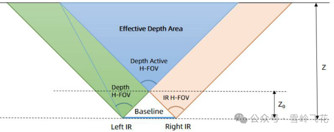
### 2.2 方法分类
- 传统立体匹配方法
  <!-- - 基于全局约束的方法
  - 基于半全局约束方法
  - 基于局部约束 -->
  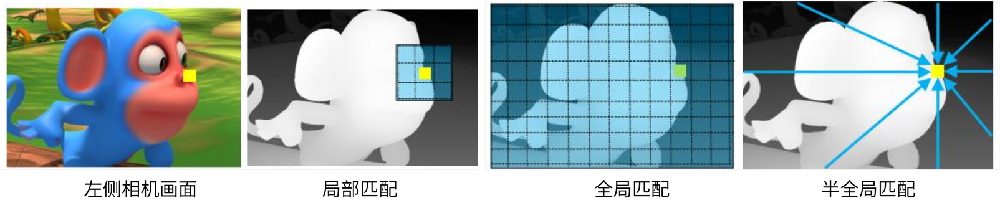
  - 局部匹配方法：
  主要看像素附近的小窗口，计算量较低，速度快，适合实时系统；缺点是在物体边缘、弱纹理、重复纹理和遮挡区域容易出错。
  - 全局匹配方法：
  把整幅图像作为一个整体来优化，希望在“匹配准确”和“视差平滑”之间取得平衡；通常精度较好，但计算复杂度高。
  - 半全局方法：
  典型代表是 SGM/SGBM。它不是做真正的全图优化，而是沿多个方向做路径聚合，用较低的计算代价近似引入全局约束，因此在工程中非常常用。
  
  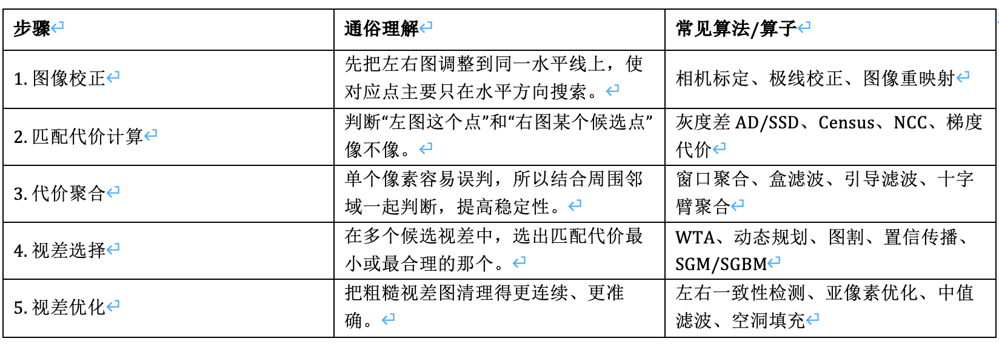
- 基于深度学习的立体匹配方法
  - 混合方法：
    - MC-CNN（2015年）：只在==代价计算==的时候用到卷积网络，在代价聚合和视差后处理步骤中仍然采用传统方法
  - 端到端方法：

### 2.3 传统深度计算算法

典型流水线为：

1. **标定与极线校正**：估计相机内参、畸变参数和左右外参，将对应点约束到同一行；
2. **匹配代价计算**：使用 SAD/SSD、NCC、Census/Rank transform、互信息或梯度特征衡量候选像素的相似度；
3. **代价聚合与优化**：局部窗口/引导滤波，或使用动态规划、SGM（半全局匹配）、图割、置信传播等方法加入平滑与边缘约束；
4. **视差选择**：常用 winner-takes-all 选择最小代价，并通过抛物线拟合等方式获得亚像素视差；
5. **后处理**：左右一致性检查、遮挡填补、斑点去除、边缘保持滤波和时域滤波；
6. **三角化与点云生成**：由视差恢复 $Z$，再结合内参将像素反投影到三维空间。

工程中最常见的传统方案是 **Census + SGM**：Census 对光照差异较稳健，SGM 在效果、规则性和可实现性之间具有较好平衡，适合 FPGA/ASIC 加速。

#### SGBM算法流程：

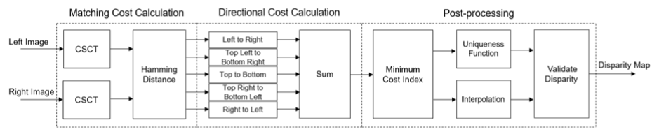
<!-- - Sobel 梯度与 BT 匹配代价：
  - 先利用 Sobel 算子提取水平方向灰度梯度，再使用 BT 代价衡量左右像素或图像块的差异。 -->
- （1）匹配损失计算：
  - CSCT（中心对称Census变换）：通过比较图像局部窗口内对称像素的大小生成一段==二进制特征序列==；
    - 对于给定的像素，在其周围设置一个9×7像素的窗口
    - 将窗口内每个像素的值与其对应的中心对称像素值进行比较
    - 如果像素值大于其对应的中心对称像素值，则结果为1，否则结果为0
    - 依此类推，生成31个结果。每个结果都是一个单比特输出，整个窗口的结果被表示为一个31位数字，即两幅图像中每个像素的CSCT输出
  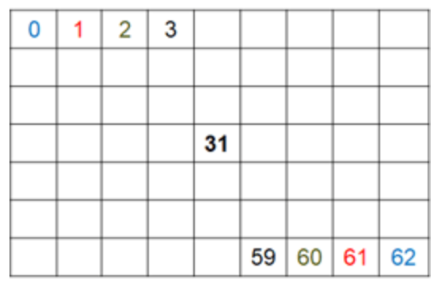
  - Hamming距离计算：比对左右图像对应像素的CSCT二进制==特征差异==，从而计算出不同视差级别下的匹配代价（Matching Cost）。 
    - 对左右图像的CSCT输出进行逐像素==异或运算==
    - 统计==置位比特数==以生成每个视差级别的==匹配代价==
- （2）多方向代价计算
  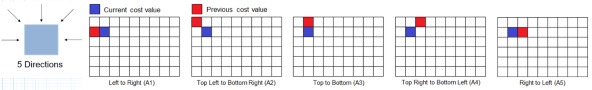
  - 目的：消除噪声带来的模糊性，从而提高视差图的==平滑度==和匹配准确率
  - 单方向路径代价计算：
  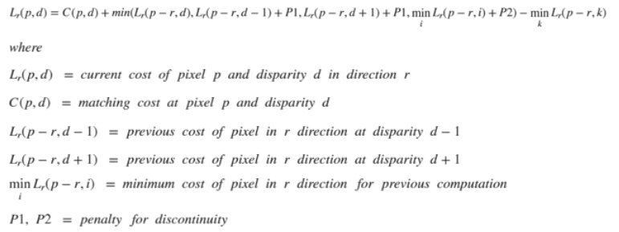
    - 并行度：由于每个像素在每个方向上的代价聚合彼此独立，因此所有五个方向都是同时实现的。
  - 代价聚合（sum）：
  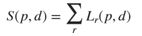
- （3）后处理：
  - WTA（Winner Takes All）：对每个像素，在所有候选视差中选择聚合代价最小的视差，得到初始整数视差。
  - Uniqueness check（唯一性检查）：比较最优代价与次优代价。如果两者过于接近，说明可能存在重复纹理、弱纹理等匹配歧义，该像素的视差会被判为无效。
  - Subpixel intepolation（亚像素插值）：在最优整数视差附近对代价曲线进行二次插值，得到带小数的视差，例如从 12 像素细化为 12.35 像素，从而提高深度精度。

### 2.3 深度学习算法
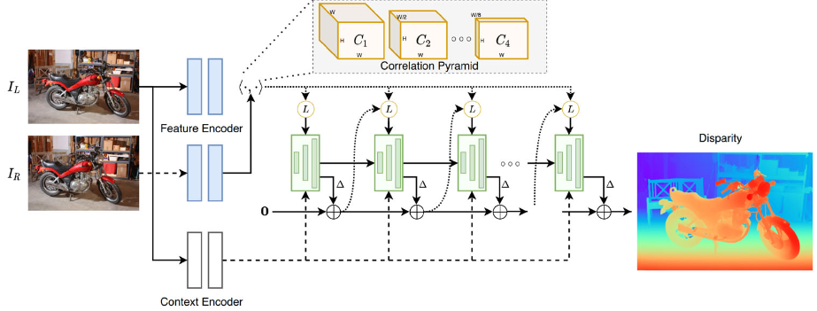

<!-- 深度学习双目方法通常可分为三类： -->

<!-- - **二维相关/迭代更新类**：提取左右特征，构建相关性表示并迭代更新视差，如 RAFT-Stereo 类方法。内存通常低于完整 3D 代价体，但迭代次数会影响延迟；
- **三维代价体类**：在视差维上拼接或相关左右特征，使用 3D CNN/Transformer 聚合，如 GC-Net、PSMNet、GwcNet 类方法。精度较高，但显存、带宽和 3D 卷积计算量大；
- **轻量化/级联类**：先在低分辨率或小视差范围内粗估，再逐级细化，或使用可分离卷积、稀疏/自适应代价体，以适配嵌入式平台。 -->

根据 Tosi 等的 2020 年代深度双目综述 [Fig. 1](<docs/01_被动双目/综述/A Survey on Deep Stereo Matching in the Twenties.pdf#page=3>)，相关框架可归纳为两条主线：**基础架构演进**与**效率优化**。

<table>
  <thead>
    <tr>
      <th>主线</th>
      <th>分类</th>
      <th>图中代表方法</th>
      <th>核心重点</th>
    </tr>
  </thead>
  <tbody>
    <tr>
      <td rowspan="5"><strong>基础架构 （Foundational）</strong></td>
      <td>CNN 代价体聚合</td>
      <td>AANet、WaveletStereo、CFNet、UASNet、PCW-Net、SEDNet</td>
      <td>用 2D/3D CNN 构建并聚合代价体，是深度双目的基础范式</td>
    </tr>
    <tr>
      <td>神经架构搜索（NAS）</td>
      <td>LEAStereo、EASNet</td>
      <td>自动搜索特征提取与匹配网络，减少人工设计</td>
    </tr>
    <tr>
      <td>迭代优化</td>
      <td>RAFT-Stereo、ORStereo、ICGNet、DLNR、EAI-Stereo、IGEV-Stereo、CREStereo、CREStereo++、Selective-Stereo、Any-Stereo、MC-Stereo、XR-Stereo、MoCha-Stereo</td>
      <td>以循环单元反复细化视差，可用迭代次数权衡精度与速度</td>
    </tr>
    <tr>
      <td>Vision Transformer</td>
      <td>STTR、CEST、ChiTransformer、GMStereo、CroCo-Stereo、ELFNet、GOAT</td>
      <td>用注意力建立长程对应关系，增强全局上下文建模</td>
    </tr>
    <tr>
      <td>马尔可夫随机场（MRF）</td>
      <td>LBPS、NMRF</td>
      <td>将学习式匹配与图模型的空间一致性约束结合</td>
    </tr>
    <tr>
      <td rowspan="3"><strong>效率导向 （Efficiency-oriented）</strong></td>
      <td>紧凑代价体表示</td>
      <td>Fast DS-CS、DecNet、ACVNet、PCVNet、Bi3D、IINet</td>
      <td>从源头压缩、稀疏化或参数化代价体，降低显存与计算量</td>
    </tr>
    <tr>
      <td>高效代价体处理</td>
      <td>CasStereo、BGNet、MABNet、TemporalStereo</td>
      <td>通过级联、低分辨率处理、轻量卷积或时序复用降低聚合开销</td>
    </tr>
    <tr>
      <td>紧凑网络架构</td>
      <td>StereoVAE、MADNet 2、CoEX、FADNet、HITNet、PBCStereo、AAFS、MobileStereoNet</td>
      <td>采用轻量骨干、二维运算或二值化，面向实时和端侧部署</td>
    </tr>
  </tbody>
</table>

监督训练通常需要稠密真值视差；
真实场景深度真值难以获取，因此还常使用合成数据预训练、域自适应、自监督重投影损失和左右一致性约束。
深度估计的难点包括域偏移、反射/透明表面、细小结构、遮挡边界以及超出训练视差范围。

### 2.4 双目深度计算瓶颈

- **搜索空间大**：若图像尺寸为 $H\times W$、最大视差为 $D$，稠密代价体的元素数为 $O(HWD)$；若保存 $C$ 通道特征，则存储量为 $O(H\times W\times D\times C)$。3D 代价体往往是深度网络的主要显存和访存瓶颈。
- **高分辨率双路输入**：双目至少传输两路图像。例如两路 $1920\times1080$、60 fps、8bit灰度画面的理论有效载荷约为 $2\times1920\times1080\times60\times8\approx1.99$ Gbit/s，尚未计入协议开销和元数据。
- **片外存储访问**：匹配代价、特征图和中间视差需要反复读写；在嵌入式系统中，DRAM 带宽与功耗常比乘加次数更先成为限制。
- **标定和同步敏感**：微小外参漂移、滚动快门、曝光差异或左右不同步都会破坏极线约束。动态场景中，同步误差会直接转化为错误视差。
- **不可观测区域**：弱纹理、重复纹理、遮挡、镜面和透明区域没有可靠对应关系，仅提高算力不能从根本上消除信息缺失。

<!-- ### 2.5 双目算法路线总结对比

以下比较针对本章列举的主要稠密双目路线。“精度高低”依赖数据集、标定、最大视差、图像质量、参数和训练域，不能只根据算法类别作绝对排序。

| 算法路线 | 核心方法 | 主要优势 | 主要局限 | 计算与存储特征 | 典型应用场景 |
|---|---|---|---|---|---|
| 局部块匹配（BM、SAD/SSD、NCC） | 在局部窗口内逐视差计算相似度并 WTA 选取最优视差 | 流程简单、延迟低、行为可解释，适合定点化和流式硬件 | 弱纹理、重复纹理和遮挡区域易误匹配；窗口跨越深度边界时容易前景/背景混合 | 计算量约随 $HWD$ 增长，可用行缓存实现，资源需求相对较低 | 低成本机器人、FPGA/ASIC 实时处理、纹理和光照受控的工业场景 |
| 半全局匹配（SGM） | 沿多个一维路径聚合匹配代价，以较低成本近似二维全局平滑 | 在精度、边缘保持、实时性和工程实现之间平衡较好；Census + SGM 对一定程度的亮度差异较稳健 | 多路径聚合增加带宽和缓存；惩罚参数需要调节；仍不能消除遮挡、反射和无纹理区域的不可观测性 | 中等至较高计算量，需要保存路径代价或采用分块/流水结构 | 车载立体视觉、移动机器人、无人机测绘、工业测量和嵌入式高质量双目 |
| 全局能量优化（图割、置信传播等） | 对整幅视差场联合优化数据项与平滑项 | 可施加强空间一致性，在部分困难区域得到连续视差 | 计算量、内存和延迟较高；强平滑可能损伤细杆、薄片和深度突变；实时硬件实现复杂 | 通常需要多轮全图迭代和较大的中间状态 | 离线三维重建、研究验证、对延迟不敏感的小规模或受控场景 |
| 深度网络：3D 代价体 | 构建 $H\times W\times D$ 特征/相关体，用 3D CNN 或 Transformer 学习聚合与正则化 | 能学习复杂匹配先验，在训练分布内通常具有较高精度和较强上下文推断能力 | 代价体显存、访存和 3D 运算开销大；依赖训练数据，存在域偏移和置信度失真风险 | 常为本章内资源开销最高的路线，计算与存储还随特征通道数增长 | GPU 平台、自动驾驶感知、离线重建及精度优先的机器人系统 |
| 深度网络：二维相关/迭代更新 | 构建相关表示并由循环单元或迭代模块逐步细化视差 | 通常避免大规模 3D 卷积，可在精度与内存之间取得较好折中 | 相关体仍占资源；迭代次数直接影响延迟；同样受训练域和困难材料影响 | 内存通常低于完整 3D 代价体网络，但多次迭代增加计算时延 | 有 GPU/NPU 的机器人、实时三维感知和内存相对受限的平台 |
| 轻量化/级联网络 | 低分辨率粗估、逐级缩小视差范围并细化，或采用稀疏/低比特特征 | 显著降低代价体和运算量，便于端侧部署 | 粗阶段错误可能逐级传播；细小结构、超大视差或域外场景精度可能下降 | 资源需求低于大型深度网络，可结合量化、裁剪和 ROI | 移动端、边缘 NPU、功耗受限机器人及固定视差范围的专用系统 |

所有路线都受同一双目几何约束：遮挡区域没有左右共同视点，镜面/透明表面不满足稳定的外观一致性，远距离视差又趋近于零。深度学习可以利用先验补全，但补全值不等同于直接观测值，安全或计量应用应保留置信度和无效像素标记。

依据资料：[Scharstein 与 Szeliski 双目算法分类](docs/01_被动双目/2002_Scharstein_Szeliski_Stereo_Taxonomy.pdf)；[Hirschmüller SGM](docs/01_被动双目/2008_Hirschmuller_Semi_Global_Matching.pdf)。 -->

---

## 3. 结构光相机

结构光系统由投影器和一个或多个相机组成。投影器通常发射红外散斑、条纹、格雷码或相移图案，使原本缺少纹理的表面获得可识别的空间编码。

### 3.0 结构光投影分类
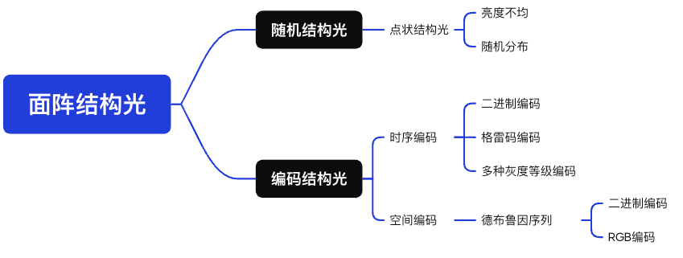

#### 3.0.1 随机结构光

#### 3.0.2 编码结构光
- 时序编码（针对静态场景）
  - 时序编码结构光即为在一定时间范围内，通过投影器向被测空间投射一系列明暗不同的结构光，每次投影都通过相机进行成像
  - ==每个像素==都对应唯一一个长度为==n的二进制编码==，双目影像搜索匹配像素的问题就变成了==查找具有相同编码值的像素==
  - 对于宽度为1024的图像，最少需要10张影像来进行编码
  - 二进制编码案例： 
  - 多阶灰度编码案例：
- 空间编码（针对动态场景）：
  - 德布鲁因序列：一个首尾相接的循环字符串，任意截取一段固定长度的子串，都是独一无二的
  - 二维空间编码：基于德布鲁因序列，使得对于一个x * y大小的二维空间，其中一个w * h大小的子窗口所包含的编码值在这整个二维编码序列中==只出现一次==。
  - 

### 3.1 单目结构光相机
- 奥比中光Astra 2
  - 深度画面分辨率：1600x1200@30fps、640x480 @30fps
  - 工作范围：0.6m - 5m
  - RMSE相对精度：≤0.15%(800 x 600 @ 1m & 81% ROI)

#### 3.1.1 基本探测原理

单目结构光可把投影器视作一台“反向相机”。系统预先标定投影器与相机的内外参；相机识别某个投影编码后，就获得“相机像素—投影器像素”的对应关系，再用三角测量求交得到三维点。

  

- 根据相似三角形原理，深度计算公式：
  
  - b：基线长度，设备的激光模组和ir模组之间的距离。
  - f: 焦距
  - z0: 参考平面的距离
  - d: 视差

<!-- 常见编码方式如下：

- **时间编码**：依次投射多幅二进制码、格雷码或相移条纹。对应关系准确、深度分辨率高，但需要多帧，运动会导致编码错位；
- **空间编码**：单帧图案的局部邻域具有唯一结构，可单帧解码，但空间分辨率和抗噪性受限；
- **随机散斑**：投射伪随机红外纹理，将当前散斑与参考图或投影模型匹配，适合实时工作；
- **混合编码**：结合格雷码确定条纹级次、相移法获得亚周期相位，兼顾量程和精度。 -->

<!-- #### 3.1.2 传统深度计算算法

- **格雷码/二进制编码解码**：对多帧亮暗状态进行阈值判决，确定投影器列或像素编号，再做三角化；
- **相移法**：由多幅相位偏移条纹计算包裹相位，再进行空间或时间相位展开，获得高精度连续对应坐标；
- **散斑匹配**：使用块匹配、NCC、Census、相位相关或局部特征将观测散斑与参考散斑对齐；
- **后处理**：调制度/对比度阈值、置信度筛选、相位跳变修复、边缘保持滤波和时域融合。 -->

#### 3.1.3 标定方法
- 参考资料：https://zhuanlan.zhihu.com/p/691144464

#### 3.1.3 深度学习算法

- **学习式图案解码/匹配**：CNN 或 Transformer 从畸变条纹、散斑图直接回归对应坐标、相位或视差；
- **相位展开与误差修复**：网络预测条纹级次、展开相位或错误区域，对低反射、阴影和局部断裂进行补偿；
- **端到端深度恢复**：从一幅或多幅结构光图直接估计深度，并可联合预测置信度；
- **深度补全/去噪**：融合 RGB、红外强度和稀疏/低质量深度，修复孔洞与飞点。

深度学习能利用数据先验改善缺失区域，但“补全结果”不等同于直接测量；在尺寸检测、安全控制等应用中，应同时输出置信度并保留无效像素标记。

<!-- #### 3.1.4 计算与数据传输瓶颈

- 多帧格雷码/相移法需要传输和缓存 $N$ 幅原始图，数据率与存储量随投影帧数线性增长；==动态物体==还会产生帧间==错位==。
- 高精度相位计算涉及逐像素三角函数、相位展开和异常检测；高分辨率高速测量时，实时处理压力较大。
- 散斑匹配仍包含二维或一维搜索，本质上存在与双目相似的代价计算和访存开销。
- 环境红外光会降低调制度；深色、镜面、半透明表面会造成低信噪比、饱和或次表面散射。
- 投影器散热、激光安全、相机—投影器标定稳定性和多设备互相干扰是重要系统约束。 -->

### 3.2 双目结构光相机（主动双目）
- 奥比中光Gemini 335
  - 推荐工作范围：0.26 - 3m
  - 分辨率：1920 x 1080 @30fps
  - 空间相对精度：≤1.5%(1280x800@2m&90%x90%ROI)
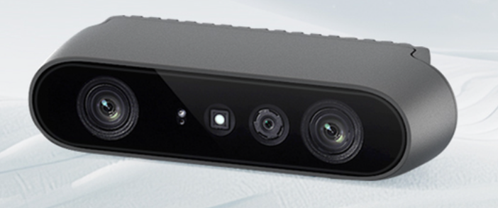
#### 3.2.1 基本探测原理

主动双目是在普通双目系统中加入主动投影器。投影器可以发射伪随机点阵、散斑状纹理、条纹、格雷码或其他编码图案，为==白墙等弱纹理表面==制造可匹配特征。
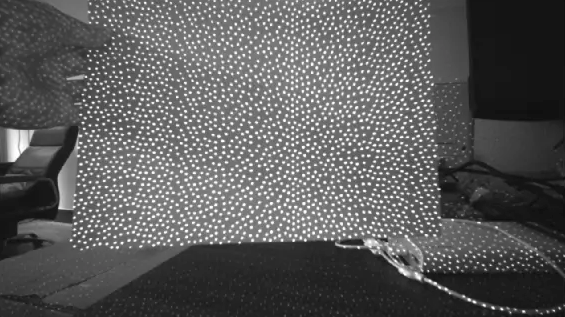
判断它是不是“主动双目”的关键不在于图案长什么样，而在于最终深度是否主要由左右相机的对应点与视差 $d$ 计算。
- 投影点数与深度估计误差的关系：

对于固定随机纹理方案，关闭投影器后系统可以退化为被动双目；在室外阳光下，投影纹理被淹没时也会近似退化为被动模式。对于格雷码、相移条纹等依赖投影编码的方案，关闭投影器则会失去编码提供的对应关系。

<!-- 还要区分三种容易混用的系统：

- **主动双目**：投影器主要负责增加或标记纹理，核心几何基线是“左相机—右相机”；
- **单目结构光**：把投影器视作“反向相机”，解码相机像素与投影器像素的对应关系，核心基线是“相机—投影器”；
- **混合系统**：既解码相机—投影器对应，又融合左右相机视差。仅凭“有两个相机”不能断定其深度算法一定是主动双目。 -->

<!-- #### 3.2.2 按投影纹理分类

**可以从图案形态上把主动双目粗分为“散斑/随机纹理投影”和“条纹/编码纹理投影”，但这不是严格且完备的二分法。** 更准确的说法是：它们是主动双目可采用的两类代表性投影纹理，此外还有网格、彩色编码、优化二值纹理和学习式图案等。

**纹理形式与对应方法**

| 投影纹理 | 典型形式 | 建立对应的方法 |
|---|---|---|
| 散斑/随机纹理 | 伪随机红外点阵、激光散斑、优化黑白块 | 左右图局部相关或匹配代价计算，无需识别每个投影点的绝对编号 |
| 条纹/编码纹理 | 单线、平行条纹、格雷码、相移正弦条纹、旋转条纹 | 提取条纹中心或解码条纹编号/相位，再建立左右对应或与普通双目融合 |
| 其他设计纹理 | 网格、彩色 De Bruijn 编码、学习式投影图案 | 通过局部唯一编码、特征描述或端到端网络匹配 |

**应用与取舍**

| 投影纹理 | 适用场景与成熟度 | 主要优势 | 主要局限 |
|---|---|---|---|
| 散斑/随机纹理 | 成熟度高；消费级 RGB-D、机器人、室内近中距离感知；静态和动态均可 | 单帧实时，可复用双目算法 | 重复/稀疏纹理、离焦或强环境光会引起匹配歧义；快速运动受曝光模糊和同步影响 |
| 条纹/编码纹理 | 静态多帧成熟；高速动态为中等至高；常用于工业测量和高精度扫描 | 对应清晰，多帧精度高；单帧编码可测动态 | 周期条纹有级次歧义，多帧易受运动和同步误差影响 |
| 其他设计纹理 | 经典编码已有应用，学习式方案多处于研究阶段；用于定制检测和光学-算法联合优化 | 可针对视差、模糊和算法定制 | 可能存在颜色串扰、域偏移、复杂度高和可解释性不足 |

这里把“伪随机点阵”和“激光散斑”放在同一资料目录，是按工程外观与匹配用途归档；两者的物理成因并不相同：前者通常由 DOE/掩模生成设计好的点阵，后者是相干光干涉形成的颗粒纹理。 -->

代表资料：

- [Keselman 等：Intel RealSense Stereoscopic Depth Cameras](docs/03_主动双目/散斑与随机纹理/2017_Keselman_RealSense_Stereoscopic_Depth_Cameras.pdf)：固定红外图案、双目相关、误差与产品系统实现；
- [Scharstein 与 Szeliski：High-Accuracy Stereo Depth Maps Using Structured Light](docs/03_主动双目/条纹与编码纹理/2003_Scharstein_Szeliski_High_Accuracy_Stereo_Structured_Light.pdf)：双视图下的格雷码与正弦条纹解码、视图视差和照明视差融合。该论文主要面向高精度立体数据真值采集，不应直接等同于量产实时相机架构。

#### 3.2.3 常用算法

- **随机散斑（纹理）**：局部块匹配、Census + SGM、左右一致性检查、斑点/孔洞滤除；可以根据主动红外强度与投影图案统计设计专用匹配代价。
- **条纹与编码路径**：条纹中心提取、格雷码阈值解码、相移与相位展开、编码一致性匹配，再通过双目三角化生成深度；周期条纹通常需要多频率、多相位或其他唯一编码来消除周期歧义。
- **深度学习算法**：与被动双目基本一致，可使用 2D 相关、3D 代价体和迭代细化网络；训练时可额外输入红外强度、投影开/关帧或置信图。
- **融合策略**：在自然纹理充分时使用可见光/被动双目，在弱纹理时启用主动投影；也可融合 RGB、左右视差、条纹编码结果与相机—投影器三角测量结果。

#### 3.2.4 计算与数据传输瓶颈

- 双目结构光同时承担双目系统的双路图像带宽、视差搜索和标定同步成本，以及主动投影系统的功耗、散热、环境光和串扰问题。
- 格雷码、相移或旋转条纹还会把每次深度重建的数据量扩大为==多幅==左右图像，并引入运动错码；
<!-- 若同时采集 RGB、左右 IR、深度和置信度，传感器内部与主机接口会出现多流并发；若在传感器端完成匹配，仅传输深度/置信度，往往能显著降低主机链路带宽，但会牺牲算法可重配置性和原始数据可追溯性。 -->

### 3.3 结构光与主动双目方案总结对比

本章方案既可以按“一个还是两个成像相机”区分，也可以按“单帧还是多帧编码”区分。最可靠的判据仍是建立哪一对对应关系：相机—投影器对应属于结构光三角测量，左—右相机对应属于主动双目，两者都使用则属于混合系统。

**对应关系与采集方式**

| 方案 | 核心对应关系 | 常见采集帧数 |
|---|---|---:|
| 单目多帧编码结构光（格雷码、相移、混合编码） | 相机像素-投影器像素/条纹相位 | 多帧 |
| 单目单帧结构光（空间编码、伪随机散斑） | 相机图案-参考图案或局部唯一编码 | 1 |
| 主动双目固定随机纹理 | 左相机-右相机的投影纹理视差 | 1 |
| 主动双目条纹/编码纹理或混合系统 | 左-右相机编码对应，并可融合相机-投影器对应 | 单帧或多帧 |

**应用与取舍**

| 方案 | 主要优势 | 主要局限 | 典型应用场景 |
|---|---|---|---|
| 单目多帧编码结构光 | 编码唯一性强；格雷码确定绝对条纹级次，相移可获得亚周期精度 | 对运动和相机/投影==时序敏感==；采集、缓存和投影帧数较多；困难材料会降低可靠性 | 工业尺寸检测、逆向工程、文物/零件扫描、牙科与==静态==人体测量 |
| 单目单帧结构光 | 可测动态场景；只需一个成像相机；弱自然纹理表面仍可工作 | ==空间分辨率==有限；遮挡、环境红外和多设备串扰会造成孔洞 | 室内人机交互、人体捕捉、消费级近距离深度、室内机器人 |
| 主动双目固定随机纹理 | 复用双目匹配；自然纹理与投影纹理可共同提供信息；可退化为被动双目 | 需要两路图像和视差搜索；强阳光或自相似图案会降低性能 | 移动机器人避障与抓取、室内/半室外感知、实时 RGB-D 相机 |

静态受控场景通常更能发挥多帧编码的精度优势；
动态场景优先考虑单帧空间编码或固定随机纹理；
室外性能则取决于投影功率、波段、带通滤光、曝光和眼安全限制，主动投影失效时只有能退化为被动双目的系统仍可能依靠自然纹理工作。

依据资料：[Geng 结构光教程](docs/02_单目结构光/2011_Geng_Structured_Light_3D_Imaging_Tutorial.pdf)；[Keselman 等 RealSense 主动双目论文](docs/03_主动双目/散斑与随机纹理/2017_Keselman_RealSense_Stereoscopic_Depth_Cameras.pdf)；[Scharstein 与 Szeliski 编码结构光双视图论文](docs/03_主动双目/条纹与编码纹理/2003_Scharstein_Szeliski_High_Accuracy_Stereo_Structured_Light.pdf)。

---

## 4. ToF 相机

ToF（Time of Flight）相机主动发射调制光或短脉冲，并测量==光波==从发射端到目标再返回接收端的==往返传播时间(或相位差)==。
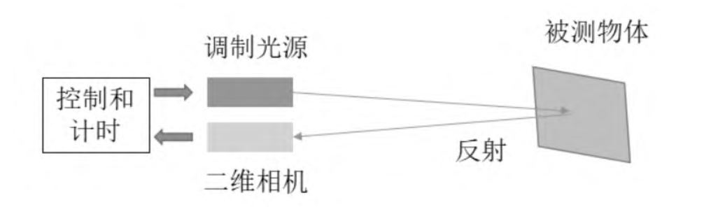
<!-- 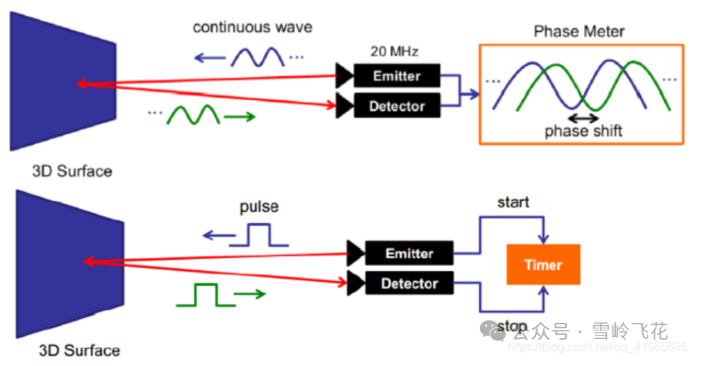 -->
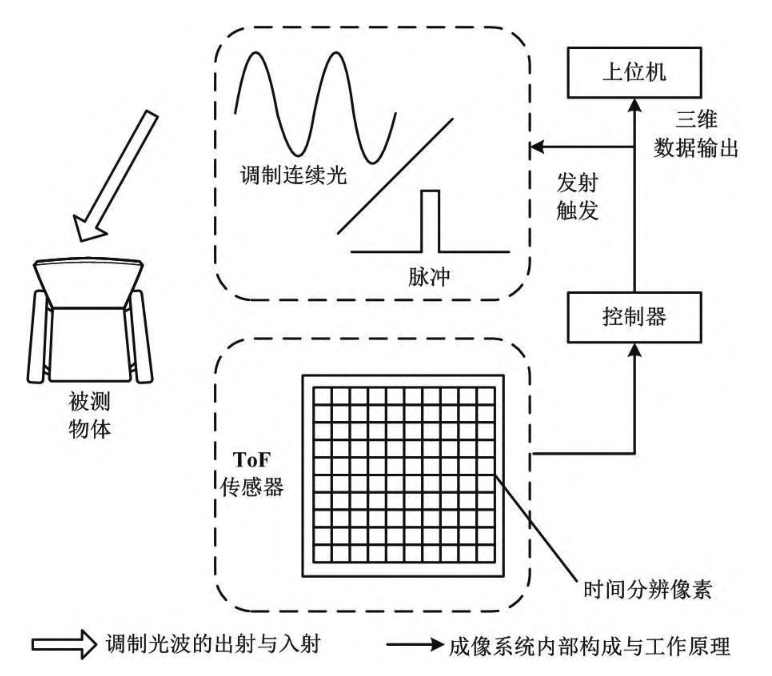

### 4.1 dToF 相机

- 迈尔微视S10
  - tof分辨率：240x160 @Max. 20fps
  - 精度：≤3cm
  - 工作范围：0.3-8m(90%反射率)，0.3-3m(5%反射率)
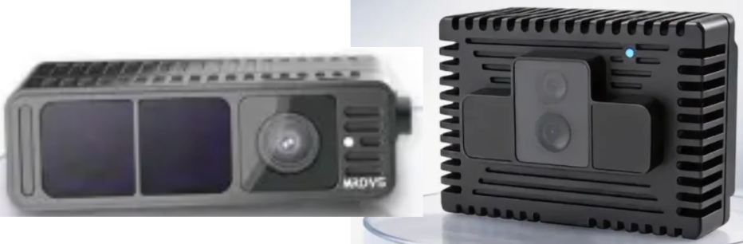

#### 4.1.1 基本探测原理

dToF（direct ToF）直接测量光信号的==往返时间差==，从而量化距离。
常见系统用脉冲激光/VCSEL 发射极短光脉冲，用 SPAD（单光子雪崩二极管）检测回波，再由 TDC（时间数字转换器）或 TCSPC（时间相关单光子计数）记录光子到达时间。
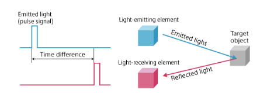
<!-- 单次检测的随机性很强，因此通常对多次脉冲累积，形成时间直方图：
每个时间 bin 对应的单程距离分辨率近似为 $\Delta R=c\Delta t_{bin}/2$。例如 1 ns 对应约 15 cm，100 ps 对应约 1.5 cm；实际精度还取决于脉冲宽度、抖动、光子数、背景光和估计算法，不能只由 bin 宽度决定。 -->

#### 测距公式：
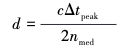
ｃ 为光速；$\Delta t_{peak}$ 为发射时刻$t_0$与有效光子到达时刻$t_1$之间的时间差；$n_{med}$ 为介质折射率.
##### 系统组成：
  - 垂直腔面发射激光器（ＶＣＳＥＬ）
  -  时间数字转换器（TDC）
  - 单光子雪崩二极管（SPAD）

#### 4.1.2 传统深度计算算法

- **首光子/阈值检测**：选择第一个显著到达事件或首个超过阈值的时间 bin，延迟低但对噪声敏感；
- **直方图峰值检测**：背景估计后寻找最大峰，可配合质心、抛物线或高斯拟合提高亚 bin 精度；
- **匹配滤波/相关法**：用已知系统脉冲响应与直方图相关，在低信噪比下估计回波位置；
- **最大似然与贝叶斯估计**：建立泊松光子计数模型，同时估计深度、反射率和背景光；
- **多回波分解**：从多个峰中分离前景、背景或半透明介质回波；
- **系统校正**：暗计数、固定模式噪声、通道延迟、温漂、距离偏置、pile-up（堆积）和串扰校正。

#### 4.1.3 深度学习算法

- **直方图去噪与峰值定位**：1D CNN/Transformer 在每像素时间直方图上抑制背景并回归峰位置；
- **时空联合恢复**：3D CNN 或时空注意力同时利用相邻像素/帧，提高低光子计数下的深度稳定性；
- **多回波与多径分离**：网络估计多个回波分量或直接恢复无多径深度；
- **稀疏 dToF 补全**：将少量 SPAD 测距点与 RGB 图像融合，生成稠密深度；
- **端到端点云/任务推理**：直接从事件流或直方图提取检测、分割所需特征，减少完整深度重建和中间数据搬运。

#### 4.1.4 计算与数据传输瓶颈

- **直方图维度高**：若阵列为 $H\times W$、每像素 $T$ 个时间 bin、每 bin 为 $b$ bit，则单帧原始直方图为 $HWTb$ bit。例如 $640\times480\times1024\times16$ bit 约为 629 MB/帧；30 fps 时理论数据率约 151 Gbit/s，通常无法直接片外传输。
- **片上聚合是必需的**：实际芯片常输出峰值深度、强度和置信度，或只传非零事件/ROI，而不是完整直方图。这样能大幅压缩数据，但会丢失多回波与后处理信息。
- **光子统计带来的积分时间**：远距离、低反射率或强背景光场景需要积累更多脉冲，量程、精度、帧率和激光功率之间存在直接权衡。
- **SPAD 阵列读出压力**：事件时间戳、TDC 数量、仲裁冲突、像素死时间和片上 SRAM 容量会限制有效吞吐。
- **算法访存**：对完整直方图执行卷积、匹配滤波或贝叶斯推断时，数据搬运成本通常远高于简单峰值搜索。
- **pile-up 与背景光**：SPAD 在一个周期内优先记录较早光子，强背景或近距离回波会扭曲直方图；高光子率并不总等于更准确。

### 4.2 iToF 相机

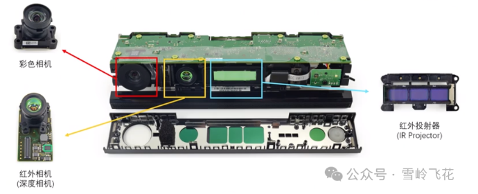

<em>代表产品：Microsoft Azure Kinect DK。其 1 Mpixel 解调型 ToF 深度传感器通过调制与解调回波获得距离，属于 iToF 路线。产品资料：<a href="https://learn.microsoft.com/en-us/azure/kinect-dk/hardware-specification">Microsoft 硬件规格</a>与<a href="https://learn.microsoft.com/en-us/windows/mixed-reality/ISSCC-2018">解调型 ToF 传感器说明</a>；图片：Profkipp，<a href="https://creativecommons.org/licenses/by-sa/4.0/">CC BY-SA 4.0</a>，来源：<a href="https://commons.wikimedia.org/wiki/File:Azure_kinect.jpg">Wikimedia Commons</a>。</em>

#### 4.2.1 基本探测原理

iToF（indirect ToF）通常发射连续波或脉冲调制光，不直接解析单个光子的绝对到达时间，而是测量回波相对于发射参考的==相位延迟(偏移)==，从而间接实现距离量化。
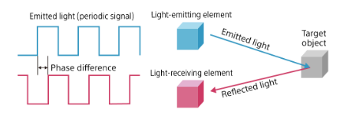
<!-- 对正弦调制，理想条件下：

$$
\phi=2\pi f_m\Delta t, \qquad R=\frac{c\phi}{4\pi f_m}.
$$

常见四相采样在 $0^\circ$、$90^\circ$、$180^\circ$、$270^\circ$ 获得相关值 $C_0,C_1,C_2,C_3$：

$$
\phi=\operatorname{atan2}(C_3-C_1,\ C_0-C_2),
$$

$$
A=\frac{1}{2}\sqrt{(C_3-C_1)^2+(C_0-C_2)^2},
$$

其中 $A$ 表示回波调制度，可用于构造置信度。由于相位按 $2\pi$ 周期重复，单频不模糊距离为：

$$
R_{amb}=\frac{c}{2f_m}.
$$ -->

<!-- 假设光速为C，一个周期的相位偏移为 $\phi$，则从发射端到物体的距离公式可以表示为：
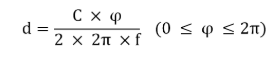 -->

##### 相位差计算公式：
  以单频正弦函数为例，发射波和接收波之间的关系如下图所示：
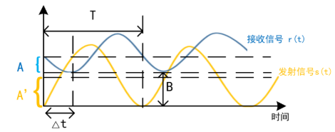
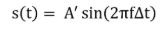
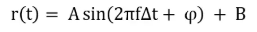

由于存在三个未知数 $\Phi,A,B$,采用四相消元法：
接收端sensor采用四步相移积分法，在每个调制周期内先按照相位 ０、 90 、180、 270 四个偏移依次开启积分窗口，再通过正交解调提取相位偏移量 φ。
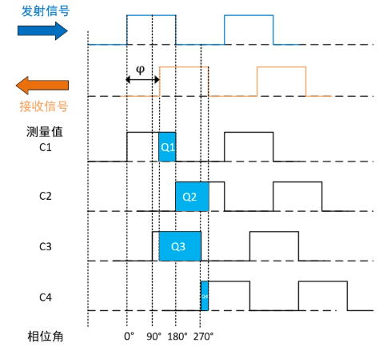
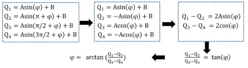
式中：$Ｑ_０ 、Ｑ_１ 、Ｑ_２ 、Ｑ_３$ .
最后距离值d与相位差$\phi$呈线性关系：
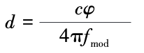

<!-- 调制频率越高，相同相位误差对应的距离误差越小，但不模糊量程越短；工程上常用多频测量进行相位展开。 -->

<!-- #### 4.2.2 传统深度计算算法

- **相关采样与相位求解**：暗电流/环境光扣除、四相或多相相关、`atan2` 相位计算和幅值估计；
- **相位展开**：使用双频/多频拍频、查表、中国剩余定理式组合或时空连续性恢复绝对距离；
- **系统标定**：像素固定模式偏置、温度漂移、调制频率偏差、镜头和照明不均匀校正；
- **多径干扰（MPI）抑制**：多频估计、稀疏回波分解、几何先验、直接/全局光分离；
- **飞点与运动伪影处理**：利用幅值、相位一致性、边缘检测和时域滤波剔除混合像素。

#### 4.2.3 深度学习算法

- **深度去噪与超分辨率**：融合原始相位、幅值、环境光图和 RGB，提高空间分辨率并修复无效区域；
- **MPI 校正**：利用多频原始相关帧预测直接路径深度、全局光分量或深度残差；
- **运动伪影校正**：估计多相采样之间的光流/场景运动，对相关帧对齐后再计算相位；
- **联合重建**：网络同时输出深度、反射率、法向和置信度，以多任务约束提高稳定性。

训练数据必须覆盖真实材料、曝光、温度、镜头和多径几何；仅在仿真数据上训练的模型容易产生域偏移。对网络补出的边界和孔洞，同样需要置信度与安全约束。

#### 4.2.4 计算与数据传输瓶颈

- **多相、多频原始帧**：一个深度帧通常由多个相关子帧组成。若使用 4 相位、3 频率，内部至少处理 12 个相关图；外部若只看到最终深度帧，容易低估传感器内部带宽与功耗。
- **逐像素非线性计算**：`atan2`、平方根、多频相位展开和标定查表适合流水线化，但在高分辨率、高帧率下仍需要大量算力和片上缓存。
- **运动与子帧时序冲突**：多相采样并非严格同一时刻，快速运动会破坏相位关系；提高采样速度又会降低单次曝光的信噪比。
- **MPI 是结构性误差**：墙角、凹槽和高反射物体会使多个传播路径在同一像素叠加。简单滤波只能缓解，可靠分离通常需要多频原始数据和更高计算量。
- **链路取舍**：输出最终 16-bit 深度图的带宽较低；输出所有相位/频率相关图可支持高级校正，却会使链路数据率成倍增加。 -->

#### 4.2.2 iToF相机分类：
目前的 iToF 有两种技术原理，基于连续（正弦）波（Continuous Wave）方法和脉冲波（Pulse）方法
##### （1）发射连续（正弦）波存在的问题：
当光往返的时间大于调制光的周期时，它们产生具有相同的相角，从而距离计算将会出错，无法区分来自远处和近处的信号，从而无法确定目标位于哪个周期。这将产生一种称为<mark>“距离混叠”</mark>的现象。
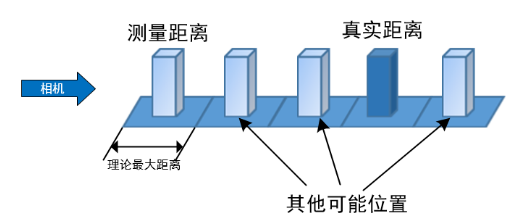
以 120MHZ 为例，常用频率和理论最大值为：
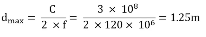

- 常见频率和理论最大值：
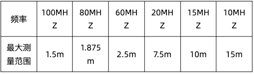
- 解决方案：为了改善这种现象，ToF相机采用双频测量技术，通过在两个不同频率下测量同一物体，并从这两次测量中确定真实距离。

##### （2）发射方波（脉冲波）双频测量技术：
相机需要将激光接收端调制成具有不同时间偏移的两个相位能量图，分别为0°和180°。
在没有光脉冲发射时开启，只收集背景光信号。
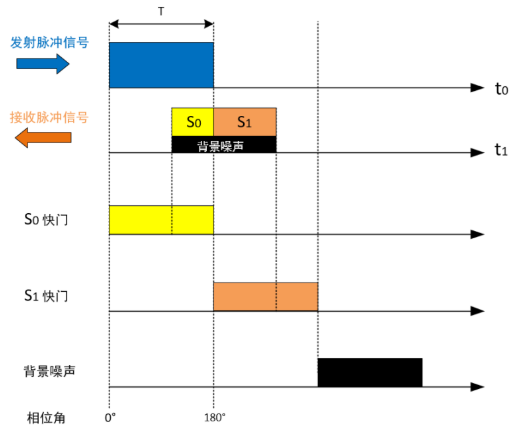

飞行时间 td：
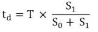
将飞行时间 td带入公式 d 中，可以得到距离：
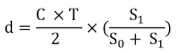
包含背景光信号的距离计算公式如下：：
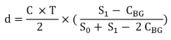
其中$C_{BG}$代表的是背景光的采样值

#### （3）cw-iToF与p-iToF方案对比
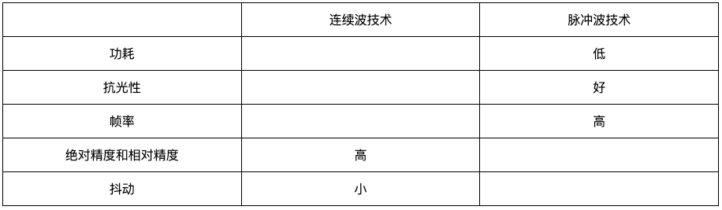

### 4.3 dToF 与 iToF 总结对比

| 对比维度 | dToF（直接飞行时间） | iToF（间接飞行时间） |
|---|---|---|
| 测距原理 | 测量脉冲回波的到达时间：$R=c\Delta t/2$ | 测量调制光与回波的相位差：$R=c\phi/(4\pi f_m)$ |
| 典型结构与数据 | SPAD + TDC/TCSPC；产生光子事件或时间直方图，可用于扫描式或 Flash 面阵 | 解调像素 + 多相/多频采样；产生相关图，常以面阵输出稠密深度 |
| 核心优势 | 时间门控强，适合中远距离；直方图可分辨时间上分离的多回波 | 稠密成像成熟、帧率高、计算规整，深度与强度天然配准 |
| 主要误差 | 光子散粒噪声、时间抖动、暗计数、SPAD 死时间和 pile-up | 相位缠绕、多径干扰（MPI）及多相子帧引起的运动伪影 |
| 量程与环境光 | 量程受重复周期和时间窗限制；时间门控利于室外，但强阳光仍会降低信噪比 | 单频不模糊距离为 $c/(2f_m)$，通常需多频展开；强环境光会降低调制度 |
| 计算与带宽 | 原始直方图数据量大，TDC、片上存储和峰值/多回波处理压力高 | 需相关积分、`atan2`、相位展开和 MPI 校正；输出最终深度时外部带宽较低 |
| 典型应用 | 中远距离 LiDAR、车载/机器人测距、无人机测绘及多回波探测 | 室内近中距离稠密深度、人机交互、机器人导航、三维扫描和 AR/VR |

**结论：两者没有脱离器件与场景的绝对优劣。** dToF 的长距离和多回波潜力依赖发射功率、接收口径、SPAD/TDC 性能、积分时间和眼安全约束；iToF 的稠密高帧率优势依赖调制度、频率组合、原始相关数据和 MPI/运动校正。进行选型时应使用同一目标反射率、环境照度、距离、视场、分辨率和帧率条件下的实测数据，而不能只比较数据手册中的单一“最大量程”或“精度”数字。

依据资料：[Sarbolandi 等脉冲 ToF 综述](docs/04_ToF/dToF/2018_Sarbolandi_Pulse_Based_ToF_Range_Sensing.pdf)；[Tontini 等 SPAD dToF 系统模型](docs/04_ToF/dToF/2020_Tontini_SPAD_dToF_Flash_LiDAR_Model.pdf)；[Foix 等锁相 iToF 综述](docs/04_ToF/iToF/2011_Foix_Lock_in_ToF_Cameras_Survey.pdf)。

### 4.4 激光雷达及其与 ToF 相机的关系

#### 4.4.1 基本原理与组成

激光雷达（LiDAR，Light Detection and Ranging）主动发射激光并接收目标反射光，根据传播时间、相位或频率差估计距离，再结合光束方向生成二维距离扫描或三维点云。典型系统由激光器、发射/接收光学、光束扫描或面阵照明模块、APD/SPAD/SiPM 等探测器、计时/相关/相干接收电路，以及标定、定位和点云处理模块组成。
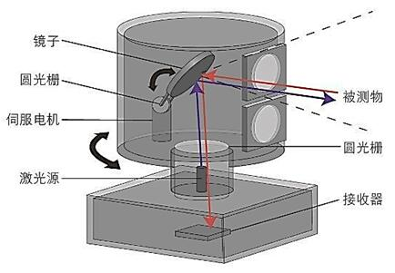
很多激光雷达采用脉冲 dToF，距离关系同样为 $R=c\Delta t/2$；也有激光雷达采用幅度调制连续波 ToF 或 FMCW 相干测距。因此：

- **dToF/iToF/FMCW** 描述如何从回波估计距离；
- **机械式/半固态/固态** 描述如何控制光束方向或覆盖视场；
- 两个维度彼此独立，例如 MEMS 激光雷达既可采用脉冲 dToF，也可采用 FMCW。FMCW 不是与机械式、固态式并列的扫描结构。

#### 4.4.2 机械式、半固态与固态激光雷达

“半固态”也常称为“混合固态”“准固态”。该术语没有完全统一的行业标准：部分资料把 MEMS 归入广义固态，部分资料因微镜仍发生机械运动而把它归入半固态。本文采用更严格、也更便于理解的口径：**存在微型或局部运动光学部件的 MEMS/棱镜方案归为半固态；完全没有机械运动部件的 Flash、OPA 等归为固态。**

**光束控制结构与应用**

| 类型 | 典型光束控制结构 | 典型应用 |
|---|---|---|
| 机械式激光雷达 | 电机带动测量头、宏观反射镜、棱镜或多面镜旋转/摆动；部分产品可形成 $360^\circ$ 水平视场 | 测绘、移动机器人 SLAM、矿山/港口、道路采集、车载环视 |
| 半固态/准固态激光雷达 | MEMS 微镜、振镜、有限角度旋转棱镜/多面镜，或机械与电子扫描混合结构 | 前向车载感知、机器人导航、无人机、工业自动化 |
| 固态 Flash LiDAR | 扩束脉冲一次照亮整个视场，焦平面 APD/SPAD 阵列同时接收 | 近中距离机器人、工业安全、着陆/对接、局部三维感知 |
| 固态电子扫描 LiDAR | OPA、焦平面开关阵列、部分液晶/声光/超表面方案控制光束方向 | 芯片化 LiDAR、下一代车载/机器人传感器、通信感知一体化 |

**主要优劣势**

| 类型 | 主要优势 | 主要局限 |
|---|---|---|
| 机械式激光雷达 | 技术成熟；窄光束能量集中，中远距离能力强；大视场点云适合建图 | 体积、重量和成本较高；运动部件存在磨损与振动；扫描点云有运动畸变 |
| 半固态/准固态激光雷达 | 比旋转式紧凑轻量；扫描轨迹和 ROI 可编程；窄光束利于抗环境光 | 仍含运动部件；镜面口径、扫描角、共振和收发光学存在权衡；视场常为前向区域 |
| 固态 Flash LiDAR | 无扫描运动部件；可近似同时获得整幅深度；运动畸变小、结构紧凑 | 光功率分散；量程、视场、分辨率和功耗相互制约；面阵读出压力大 |
| 固态电子扫描 LiDAR | 无宏观运动部件；快速、随机访问式指向；具有芯片级集成潜力 | 发射孔径、光束发散、旁瓣/栅瓣、扫描范围、热控制和收发集成仍有挑战 |

机械式并不必然比固态式“精度高”，固态式也不必然“成本低”。最终性能由激光功率与眼安全、接收口径、波长、探测器灵敏度、扫描轨迹、角分辨率、积分时间、环境光和算法共同决定。

#### 4.4.3 ToF 相机与激光雷达对比

| 对比维度 | ToF 相机 | 激光雷达 |
|---|---|---|
| 典型形态 | 固定视场的面阵深度相机，主要采用 iToF 或 Flash dToF | 扫描式或 Flash 主动激光测距系统；Flash dToF LiDAR 与 dToF 相机边界重叠 |
| 典型输出 | 规则、稠密的深度图，便于与 RGB 配准和图像算法处理 | 通常输出带坐标、强度和时间戳的点云，扫描式点云较稀疏且不规则 |
| 核心优势 | 近中距离稠密成像，帧率高，数据结构规整 | 窄光束能量集中，更适合中远距离和大范围探测 |
| 主要局限 | 易受强环境光、多径和混合像素影响，量程通常较短 | 扫描点云存在时间差和运动畸变，点云处理及系统复杂度较高 |
| 动态场景 | iToF 的多相子帧可能产生运动伪影；Flash dToF 较轻 | 扫描式需进行时间同步和运动补偿；Flash LiDAR 较轻 |
| 典型应用 | 人机交互、AR/VR、室内机器人、近距离三维扫描 | 自动驾驶、SLAM、无人机、测绘和中远距离环境感知 |

简化地说，ToF 相机更像“每个像素都测一次距离的深度摄像机”，扫描式激光雷达更像“把窄激光束指向不同角度并逐点建立三维点云”。但这一边界正在被 Flash dToF、SPAD 面阵和固态电子扫描技术逐渐模糊，选型时应比较实际量程、视场、角/空间分辨率、帧率、环境光、运动畸变、点云覆盖和原始数据接口，而不是只看产品名称。

参考资料：[MEMS Mirrors for LiDAR: A Review](https://pmc.ncbi.nlm.nih.gov/articles/PMC7281653/)；[An Overview of LiDAR Imaging Systems for Autonomous Vehicles](https://www.mdpi.com/2076-3417/9/19/4093)；[Integrated Optical Phased Array with On-Chip Amplification](https://www.nature.com/articles/s41598-024-60204-5)。

---

## 5. 方案应用对比
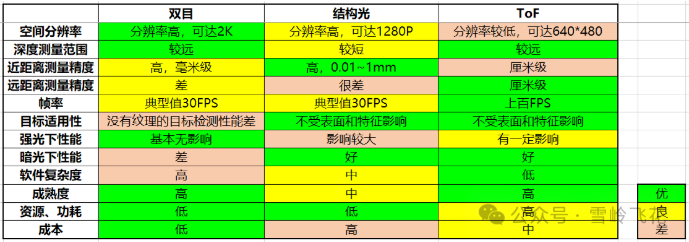

## 6. 选型建议

- **室外、中远距离、自然纹理较丰富**：优先考虑被动双目；若算力受限，可采用 Census + SGM 或轻量级级联网络。
- **室内近距离、高精度测量、目标相对静止**：单目多帧结构光具有较高精度；动态场景更适合单帧散斑或主动双目。
- **弱纹理室内实时感知**：双目结构光兼顾稠密度与实时性，但应评估阳光、投影器串扰和功耗。
- **远距离、低照度、稀疏或扫描式测距**：dToF 更合适，关键在于片上光子统计和直方图压缩。
- **室内面阵高速深度**：iToF 具有成熟的面阵读出和规整计算，但应重点验证 MPI、相位缠绕和运动伪影。

最终选型不能只比较“标称精度”，还应同时考察量程、视场、最小工作距离、环境光、目标反射率、运动速度、激光安全、功耗、标定稳定性、原始数据可访问性，以及主机接口和下游算法能够承受的持续数据率。

---

## 7. 存内计算实现双目深度估计

双目匹配需要为左图像素与右图不同视差位置的候选像素反复计算距离：

$$
C(x,y,d)=D\bigl(F_L(x,y),F_R(x-d,y)\bigr),
$$

其中 $D$ 可取 Census 描述子的 Hamming 距离、SAD 的 Manhattan 距离或特征相关性。图像尺寸为 $H\times W$、视差范围为 $D_{\max}$ 时，代价体规模约为 $O(HWD_{\max})$。大量候选数据在存储器与计算单元之间往返搬运，使访存功耗和带宽成为实时双目系统的主要瓶颈。SRAM 存内计算（Computation-in-Memory, CIM）把逐位逻辑和归约计算移到存储阵列内部或附近，以减少数据搬运并提高候选视差并行度。

### 7.1 加速边界：代价体构建而非完整 SGBM

本节三篇论文主要加速 **匹配代价计算和代价体构建**，即生成 $C(x,y,d)$；它们并未覆盖完整 SGBM 的多方向路径递推、$P_1/P_2$ 平滑约束、WTA 视差选择、左右一致性检查和亚像素优化。因此更准确的表述是“用 CIM 加速双目代价体构建”，不能把论文给出的 TOPS/W 直接视为完整深度相机或完整 SGBM 的端到端能效。

### 7.2 代表论文与实现算子

**发表信息与实现算子**

| 年份与发表 | 论文与技术位置 | 存内/近存实现的主要算子 |
|---|---|---|
| 2022，DAC | [MC-CIM](<docs/存内计算相关/MC-CIM- A Reconfigurable Computation-In-Memory For Efficient Stereo Matching Cost Computation.pdf>)：第一代可重构双目匹配代价 SRAM-CIM | XAC、二值 MAC、ADD、SAC、SAD；Census Hamming 距离采用 XOR + popcount |
| 2023，ISSCC | [CV-CIM](docs/存内计算相关/7.7_CV-CIM_A_28nm_XOR-Derived_Similarity-Aware_Computation-in-Memory_for_Cost-Volume_Construction.pdf)：CV-CIM 芯片首发短文 | XOR-derived compare、add/subtract、absolute difference、MAC，组合支持 L0/L1/L2 |
| 2025，IEEE JSSC | [CV-CIM 完整扩展版](docs/存内计算相关/CV-CIM_A_Hybrid_Domain_Xor-Derived_Similarity-Aware_Computation-in-Memory_Supporting_Cost-Volume_Construction.pdf)：与 ISSCC 2023 为同一技术路线 | L0/Census、L1/SAD、L2/相关或 MC-CNN 特征距离 |

**架构与代表结果**

| 论文 | 主要架构 | 代表结果 |
|---|---|---|
| MC-CIM（2022） | 64 Kb、64 个 compute array；6T SRAM 列侧对称 XOR 单元 + 约 4 bit Flash ADC + HSAT | 28 nm 评估，平均约 277 TOPS/W；比较表中代表延迟 12.12 ms |
| CV-CIM（2023） | 数字 Pixel CIM + 模拟 Vector CIM + DMU；相似性稀疏变换、行列双自由度外围、Canary BIST | 28 nm 流片，0.6-0.9 V、50-286 MHz、0.387 mm²，峰值 1158 TOPS/W |
| CV-CIM（2025） | 4 个 Hybrid XOR-CIM group；每组含 1 个 Pixel CIM 和 8 个 Vector CIM，并配套 DMU、缓冲和 BIST | 补充 KITTI 与 PVT 实测；累加输出降低 4.13 倍，延迟降低约 21%-47% |

> **文献关系：**这三份 PDF 对应两个技术世代。MC-CIM（2022）是前代可重构匹配代价架构；ISSCC 2023 是 CV-CIM 的芯片首发；JSSC 2025 明确说明其为 ISSCC 工作的完整扩展版，不能把后两篇统计为两种不同芯片方案。

### 7.3 不同场景下的算子优势与选择

论文提到 L0、L1、L2，主要是为了说明 **单一匹配代价无法同时兼顾不同场景下的精度、延迟和能效**，从而引出可重构 CIM 的设计动机。它们是三类差异度量，并不是 SGBM 的三个处理层级：

- **L0（Census/Hamming）**：先把邻域编码成二值描述子，再通过 XOR 和 popcount 统计不同 bit 的数量，即判断“==有多少位不同==”；规则性强、适合逐位并行，对一定的亮度变化较稳健。
- **L1（AD/SAD）**：对左右像素或窗口的绝对差求和，即计算“==总共相差多少==”；主要使用比较、减法、绝对值和累加，硬件简单、延迟较低，但更依赖左右图像的亮度一致性。
- **L2（特征距离/相关性）**：利用平方欧氏距离或乘加相关计算比较多维特征，==识别较大的差异==，并能结合 MC-CNN 等学习特征处理困难区域；匹配能力更强，但计算和存储开销也更高。

因此，CV-CIM 使用 XOR-derived 逻辑复用比较、加减、绝对值和 MAC 等基础运算，==在同一硬件上支持三类代价函数==：
- 普通区域优先采用低开销的 L0/L1，
- 困难区域再使用表达能力更强的 L2。

论文中的场景识别与算子选择主要在片外完成，CIM 芯片负责执行写入配置后的代价计算。

对主动双目/SGBM 的直接启示是：可根据纹理、亮度一致性和初始匹配置信度==动态选择== Census、SAD 或特征相关，使简单区域优先保证速度，困难区域按需投入更多算力。

### 7.4 MC-CIM：可重构双目匹配代价计算

MC-CIM 的核心是把 XOR 作为双目距离计算的统一入口。在 6T SRAM 每列加入 5 管对称计算单元，使输入 bit 与存储 bit 的 XOR 结果以电流形式横向累加，再由 Flash ADC 输出部分和。不同 bit-plane 分散到多个阵列，HSAT 按位权执行移位、累加或旁路，从而复用同一宏支持不同位宽和不同代价函数。

  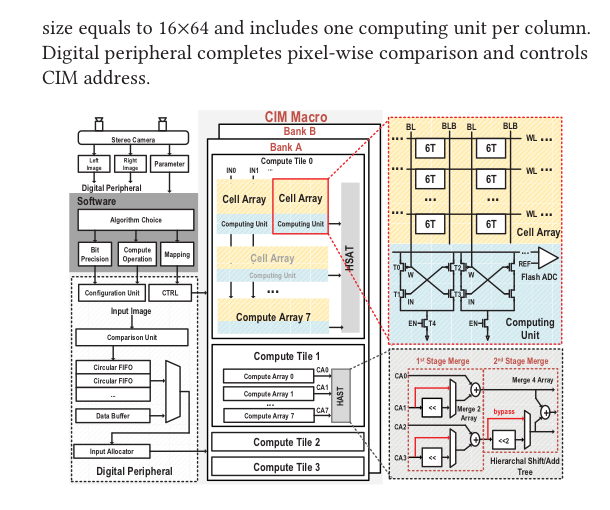

<em>MC-CIM Macro Architecture（DAC 2022，原论文 Fig. 3）。数字外围负责算法、位宽和映射配置；CIM Macro 内含多组 compute tile/array、列侧 XOR 计算单元、Flash ADC 与 HSAT。</em>

主要创新：

- **对称 XOR 计算单元**：平衡不同输入组合的充放电路径，减轻感知裕量重叠；
- **算子可重构**：通过固定输入、取反和数字后处理，把 XOR 扩展为 XAC、MAC、ADD、SAC 和 SAD；
- **位宽可重构**：将多 bit 像素拆成 bit-plane，由 HSAT 按 2/4/8 bit 位权合并；
- **面向算法的数据映射**：Census 把左图描述子作为共享输入、右图候选存于阵列；SAD 则按 bit-plane 与视差方向组织数据；
- **滑动窗口复用**：用简单 2:1 行地址选择支持候选窗口移动，降低复杂地址网络开销。

其局限是仍依赖模拟 ADC 与离线电压调节，部分 SAD 配置的阵列利用率不高，而且评估对象仍是代价计算而非完整 SGBM。

### 7.5 CV-CIM：相似性感知的混合域代价体构建

CV-CIM 将问题概括为三个“3R”：传统 CIM **逻辑受限（Restricted logic）**、大累加值导致 **计算裕量下降（Reduced margin）**、固定行列激活方式造成 **阵列刚性（Rigid array）**。为此，它采用混合数字/模拟架构：Pixel CIM 完成比较、加减和逐元素逻辑；8 个 Vector CIM 共享 Pixel CIM 结果并进行电流域 XOR 归约；DMU 再按位权和算法模式做移位与累加。

  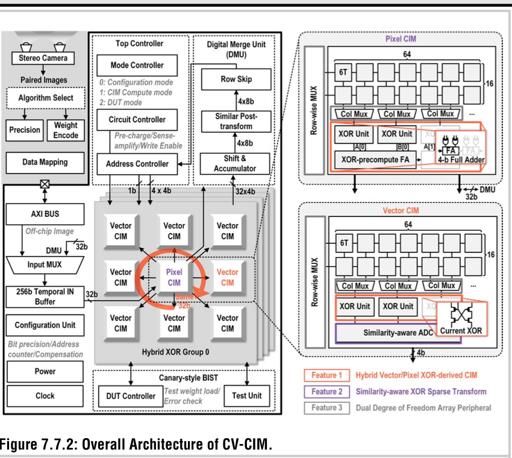

<em>CV-CIM Overall Architecture（ISSCC 2023，原论文 Fig. 7.7.2）。一个 Hybrid XOR group 由中心 Pixel CIM 与 8 个 Vector CIM 组成，并由 Top Controller、DMU、临时输入缓冲和 Canary BIST 协同控制。</em>

ISSCC 2023 首次给出的主要创新包括：

- **Hybrid Pixel/Vector XOR-derived CIM**：数字 Pixel CIM 处理精确的逐元素运算，模拟 Vector CIM 处理高并行归约，避免强行把所有逻辑塞进模拟阵列；
- **L0/L1/L2 统一支持**：以 XOR-derived compare、add/subtract、absolute difference 和 MAC 组合支持 Census、SAD 和相关性距离；
- **相似性感知稀疏变换**：利用相邻像素连续性，将高概率的大 XOR 累加转化为更稀疏的差分/AND 型计算，降低模拟输出范围并扩大感知裕量；
- **行列双自由度外围**：行侧根据 pre-winner 与阈值跳过低价值候选，列侧使一半列计算、另一半列加载，隐藏数据更新延迟；
- **Canary-style BIST**：优先监测最易受字线脉冲与 PVT 变化影响的列，在失效扩散前发现不稳定阵列。

  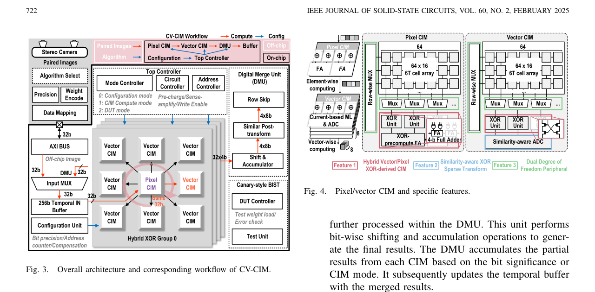

<em>CV-CIM 完整架构（IEEE JSSC 2025，原论文 Fig. 3-4）。期刊版进一步展示 Pixel CIM、Vector CIM、相似性感知 ADC、DMU 与三项核心特征的连接关系。</em>

JSSC 2025 在相同芯片路线基础上补充了完整实验：

- 相似性变换使数据稀疏率由约 55.2% 提高到 75.7%，平均累加输出降低 4.13 倍，归一化计算裕量由 84.1% 提高到 98.7%；
- all-zero bypass 额外减少约 5.2% 延迟；
- 列侧计算/加载重叠分别使 L0、L1、L2 延迟降低约 20.1%、20.7%、26.1%；行列机制合并后总延迟降低约 21%-47%；
- L0/Census、L1/SAD、L2/相关性均可运行，但能效和利用率差异明显：L1/SAD 的数据复用较低，未能达到 L0 的峰值能效；
- 8 颗测试芯片在 0.9 V 下的平均线性拟合 $R^2>0.990$，说明 BIST、激活列限制和相似性变换共同提高了 PVT 鲁棒性。

### 7.6 技术演进与对 FPGA/SGBM 的启示

| 技术演进 | MC-CIM（2022） | CV-CIM（2023/2025） | 可迁移到 FPGA/SGBM 的思想 |
|---|---|---|---|
| 统一算子 | XOR/XAC 为核心，扩展到 SAD 等算术 | XOR-derived 逻辑统一 L0/L1/L2 | 复用 XOR、比较、绝对值和移位归约数据通路，减少多套代价引擎重复资源 |
| 数据表示 | bit-plane 映射和可配置 HSAT | 相邻像素差分与相似性稀疏化 | 用差分编码、零值旁路和低 popcount 早停降低 BRAM 访问与翻转活动 |
| 数据流 | 行地址 MUX 适配滑动窗口 | 行跳过 + 奇偶列加载/计算重叠 | 用 line buffer、ping-pong BRAM/URAM 和 tile 调度重叠加载、代价计算与聚合 |
| 架构边界 | 代价计算 | 代价体构建 | 下一步应研究代价体不落 DDR、直接流向 SGM 路径聚合的 cost-SGM 协同 |

FPGA 的 BRAM/URAM 不能直接复刻 6T SRAM 内的晶体管级电流计算和 ADC，因此 FPGA 原型更准确地应称为 **CIM-inspired 存储近计算架构**。可落地的研究方向是：以 Census/SAD/相关性可配置代价引擎为前端，加入相似性差分、零值跳过、动态视差范围和双缓冲，再将 tile/条带级代价直接送入 SGM 聚合，避免完整 $H\times W\times D$ 代价体反复写入外部 DDR。

此外，论文中的 TOPS/W 是按基本 XOR、加法等 operation 归一化得到，受工艺、电压、位宽、阵列激活率和统计口径影响，不能直接与 FPGA 板级功耗比较。系统验证应统一报告 D1/EPE、完整 SGBM 延迟、FPS、外部存储带宽、BRAM/URAM 访问次数、资源占用和能耗/帧。

更完整的逐篇阅读、指标解释与研究方案见：[存内计算双目匹配论文总结与方案构思](docs/存内计算相关/存内计算双目匹配论文总结与方案构思.md)。
