# 深度相机（三维传感器）原理、算法与系统瓶颈

## 目录

- [深度相机（三维传感器）原理、算法与系统瓶颈](#深度相机三维传感器原理算法与系统瓶颈)
  - [目录](#目录)
  - [1. 分类全景与方法总览](#1-分类全景与方法总览)
  - [2. 被动双目相机](#2-被动双目相机)
    - [2.1 基本探测原理](#21-基本探测原理)
    - [2.2 传统深度计算算法](#22-传统深度计算算法)
    - [2.3 深度学习算法](#23-深度学习算法)
    - [2.4 计算与数据传输瓶颈](#24-计算与数据传输瓶颈)
  - [3. 主动三角测量：结构光与主动双目](#3-主动三角测量结构光与主动双目)
    - [3.1 单目结构光相机](#31-单目结构光相机)
      - [3.1.1 基本探测原理](#311-基本探测原理)
      - [3.1.2 传统深度计算算法](#312-传统深度计算算法)
      - [3.1.3 深度学习算法](#313-深度学习算法)
      - [3.1.4 计算与数据传输瓶颈](#314-计算与数据传输瓶颈)
    - [3.2 双目结构光相机（主动双目）](#32-双目结构光相机主动双目)
      - [3.2.1 基本探测原理](#321-基本探测原理)
      - [3.2.2 常用算法](#322-常用算法)
      - [3.2.3 计算与数据传输瓶颈](#323-计算与数据传输瓶颈)
  - [4. ToF 相机](#4-tof-相机)
    - [4.1 dToF 相机](#41-dtof-相机)
      - [4.1.1 基本探测原理](#411-基本探测原理)
      - [4.1.2 传统深度计算算法](#412-传统深度计算算法)
      - [4.1.3 深度学习算法](#413-深度学习算法)
      - [4.1.4 计算与数据传输瓶颈](#414-计算与数据传输瓶颈)
    - [4.2 iToF 相机](#42-itof-相机)
      - [4.2.1 基本探测原理](#421-基本探测原理)
      - [4.2.2 传统深度计算算法](#422-传统深度计算算法)
      - [4.2.3 深度学习算法](#423-深度学习算法)
      - [4.2.4 计算与数据传输瓶颈](#424-计算与数据传输瓶颈)
  - [5. 跨方案的计算与传输瓶颈对比](#5-跨方案的计算与传输瓶颈对比)
    - [5.1 数据率估算](#51-数据率估算)
    - [5.2 主要瓶颈归纳](#52-主要瓶颈归纳)
    - [5.3 面向感算协同的优化方向](#53-面向感算协同的优化方向)
  - [6. 标定、配准与评价指标](#6-标定配准与评价指标)
    - [6.1 从深度图到点云](#61-从深度图到点云)
    - [6.2 标定与同步](#62-标定与同步)
    - [6.3 评价指标](#63-评价指标)
  - [7. 选型建议](#7-选型建议)
  - [8. 本仓库代表资料](#8-本仓库代表资料)

---

深度相机的输出通常是一幅与图像像素对齐或可配准的深度图（depth map），其中每个有效像素记录场景点到相机的距离。按信息获取方式，可将常用方案概括为：

- **被动三角测量**：双目/多目相机利用不同视点之间的视差恢复深度；
- **主动三角测量**：结构光投影器向场景发射已知图案，再由相机观测图案形变；
- **飞行时间测量**：ToF 相机通过光的往返时间或相位延迟直接估计距离。

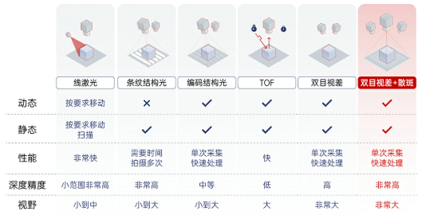

> 本文中的“深度”默认指沿相机光轴方向的坐标 $Z$。部分 ToF 芯片原始输出的是像素到传感器的径向距离 $R$，生成点云时需要结合内参和光线方向换算，不能直接把 $R$ 当作 $Z$。

## 1. 分类全景与方法总览

深度获取技术可以按多个互相独立的轴分类。最重要的轴是**深度来自什么观测量**：对应点视差、投影编码、光子到达时间，还是调制相位。另一个轴是**如何覆盖视场**：面阵一次成像、逐点/逐线扫描或稀疏阵列。因而“dToF / iToF”与“扫描式 / Flash 面阵式”不能互相替代；dToF 既可以扫描，也可以做 Flash LiDAR。

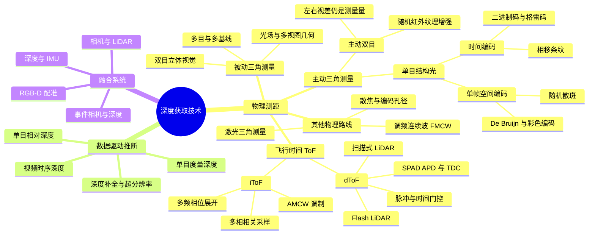

上图中的“单目深度学习”依赖训练数据和场景先验，从 RGB 外观推断深度；它可以输出很有用的相对深度或度量深度，但不等同于直接测得视差、时间或相位。尺寸计量、安全避障等任务应区分“测量值”和“模型补全值”，并保留置信度与无效像素。

| 类别 | 主动光源 | 直接观测量 | 核心深度关系 | 典型优势 | 主要局限 |
|---|---|---|---|---|---|
| 被动双目 | 否 | 左右图像视差 | $Z=fB/d$ | 量程灵活、硬件通用、室外适应性较好 | 弱纹理、重复纹理、遮挡区域难匹配 |
| 单目结构光 | 是 | 编码图案的像素位置/形变 | 投影器—相机三角测量 | 近距离精度高，弱纹理表面也可测 | 强环境光、反光/透明物体、多设备串扰 |
| 双目结构光（主动双目） | 是 | 投影纹理增强后的左右视差 | $Z=fB/d$ | 可沿用双目算法，单帧即可工作 | 功耗与标定负担更高，仍有双目遮挡问题 |
| dToF | 是 | 单光子到达时间或时间直方图 | $R=c\Delta t/2$ | 可远距离工作，时间门控有利于抑制背景光 | SPAD/TCSPC 数据量大，散粒噪声和堆积效应明显 |
| iToF | 是 | 调制光与回波的相位差 | $R=c\phi/(4\pi f_m)$ | 面阵成熟、帧率高、深度计算规整 | 相位缠绕、多径干扰、强环境光和运动伪影 |

其中，$f$ 为焦距（以像素为单位时与视差单位一致），$B$ 为基线长度，$d$ 为视差，$c$ 为光速，$\Delta t$ 为光的往返时间，$f_m$ 为调制频率，$\phi$ 为回波相位延迟。

所有深度相机都可抽象为相近的系统链路：

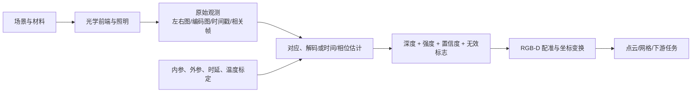

传感器标称“输出深度图”并不意味着原始数据量很小：双目内部仍需处理两路图像，iToF 可能需要多相多频相关帧，dToF 可能需要光子事件或时间直方图。片上是否已经完成深度计算，决定了接口带宽、算法可重配置性和可追溯性。

---

## 2. 被动双目相机


<p align="center">
  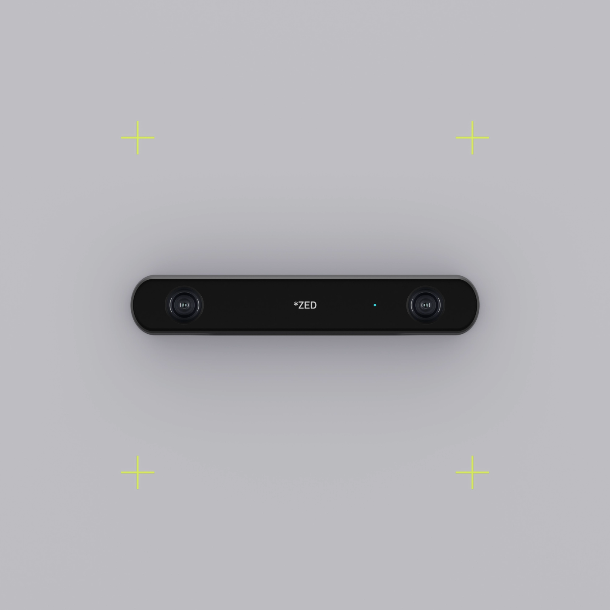
</p>

<p align="center"><em>代表产品：Stereolabs ZED 2i。左右相机构成固定基线，通过双目视差恢复深度，不依赖主动红外投影。图片与产品资料来源：<a href="https://www.stereolabs.com/products/zed-2">Stereolabs 官方产品页</a>。</em></p>

> **代表资料**：[Scharstein 与 Szeliski：双目匹配分类与评测](docs/01_被动双目/2002_Scharstein_Szeliski_Stereo_Taxonomy.pdf)给出经典的四阶段算法框架；[Hirschmüller：Semi-Global Matching](docs/01_被动双目/2008_Hirschmuller_Semi_Global_Matching.pdf)是兼顾精度和工程实现的代表算法。

### 2.1 基本探测原理


双目系统由具有已知相对位姿的左、右相机组成。同一空间点 $P$ 在两幅图像中的投影位置不同；在完成双目标定和极线校正后，对应点通常位于同一图像行，水平坐标差即为视差：

$$
d=x_L-x_R, \qquad Z=\frac{fB}{d}.
$$

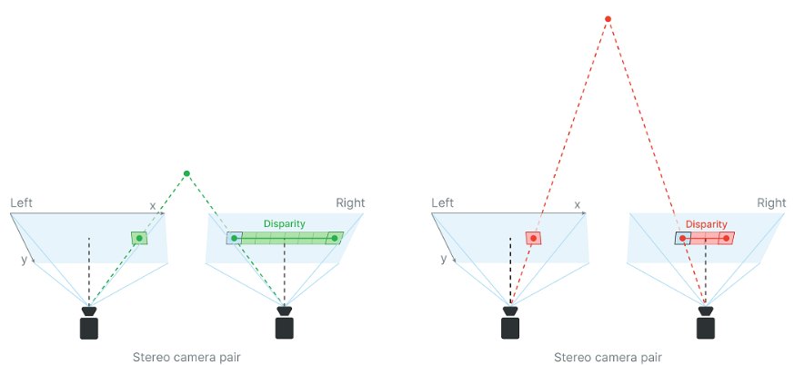

视差与深度成反比，因此远处物体的视差很小。由误差传播可得：

$$
\left|\delta Z\right|\approx\frac{Z^2}{fB}\left|\delta d\right|.
$$

这说明深度误差会近似随距离平方增长。增大焦距、增大基线或提高亚像素视差精度能改善远距离精度，但也会缩小视场、加重遮挡或增加硬件尺寸。

### 2.2 传统深度计算算法

典型流水线为：

1. **标定与极线校正**：估计相机内参、畸变参数和左右外参，将对应点约束到同一行；
2. **匹配代价计算**：使用 SAD/SSD、NCC、Census/Rank transform、互信息或梯度特征衡量候选像素的相似度；
3. **代价聚合与优化**：局部窗口/引导滤波，或使用动态规划、SGM（半全局匹配）、图割、置信传播等方法加入平滑与边缘约束；
4. **视差选择**：常用 winner-takes-all 选择最小代价，并通过抛物线拟合等方式获得亚像素视差；
5. **后处理**：左右一致性检查、遮挡填补、斑点去除、边缘保持滤波和时域滤波；
6. **三角化与点云生成**：由视差恢复 $Z$，再结合内参将像素反投影到三维空间。

工程中最常见的传统方案是 **Census + SGM**：Census 对光照差异较稳健，SGM 在效果、规则性和可实现性之间具有较好平衡，适合 FPGA/ASIC 加速。

### 2.3 深度学习算法

深度学习双目方法通常可分为三类：

- **二维相关/迭代更新类**：提取左右特征，构建相关性表示并迭代更新视差，如 RAFT-Stereo 类方法。内存通常低于完整 3D 代价体，但迭代次数会影响延迟；
- **三维代价体类**：在视差维上拼接或相关左右特征，使用 3D CNN/Transformer 聚合，如 GC-Net、PSMNet、GwcNet 类方法。精度较高，但显存、带宽和 3D 卷积计算量大；
- **轻量化/级联类**：先在低分辨率或小视差范围内粗估，再逐级细化，或使用可分离卷积、稀疏/自适应代价体，以适配嵌入式平台。

监督训练通常需要稠密真值视差；真实场景真值昂贵，因此还常使用合成数据预训练、域自适应、自监督重投影损失和左右一致性约束。网络的主要失败模式包括域偏移、反射/透明表面、细小结构、遮挡边界以及超出训练视差范围。

### 2.4 计算与数据传输瓶颈

- **搜索空间大**：若图像尺寸为 $H\times W$、最大视差为 $D$，稠密代价体的元素数为 $O(HWD)$；若保存 $C$ 通道特征，则存储量为 $O(HWDC)$。3D 代价体往往是深度网络的主要显存和访存瓶颈。
- **高分辨率双路输入**：双目至少传输两路图像。例如两路 $1920\times1080$、60 fps、RAW10 数据的理论有效载荷约为 $2\times1920\times1080\times60\times10\approx2.49$ Gbit/s，尚未计入协议开销和元数据。
- **片外存储访问**：匹配代价、特征图和中间视差需要反复读写；在嵌入式系统中，DRAM 带宽与功耗常比乘加次数更先成为限制。
- **标定和同步敏感**：微小外参漂移、滚动快门、曝光差异或左右不同步都会破坏极线约束。动态场景中，同步误差会直接转化为错误视差。
- **不可观测区域**：弱纹理、重复纹理、遮挡、镜面和透明区域没有可靠对应关系，仅提高算力不能从根本上消除信息缺失。

---

## 3. 主动三角测量：结构光与主动双目

结构光系统由投影器和一个或多个相机组成。投影器通常发射红外散斑、条纹、格雷码或相移图案，使原本缺少纹理的表面获得可识别的空间编码。

### 3.1 单目结构光相机

<p align="center">
  
</p>

<p align="center"><em>代表产品：Xbox 360 Kinect（第一代）。其深度通道由一个红外散斑投影器和一个红外相机构成，是典型的单目结构光方案。图片：James Pfaff / Dancter，<a href="https://creativecommons.org/licenses/by/2.0/">CC BY 2.0</a>，来源：<a href="https://commons.wikimedia.org/wiki/File:Kinect_Sensor_at_E3_2010_(front).jpg">Wikimedia Commons</a>。</em></p>

> **代表资料**：[Geng：Structured-light 3D surface imaging tutorial](docs/02_单目结构光/2011_Geng_Structured_Light_3D_Imaging_Tutorial.pdf)系统梳理时间编码、相移、单帧空间编码、标定和性能指标。

#### 3.1.1 基本探测原理

单目结构光可把投影器视作一台“反向相机”。系统预先标定投影器与相机的内外参；相机识别某个投影编码后，就获得“相机像素—投影器像素”的对应关系，再用三角测量求交得到三维点。


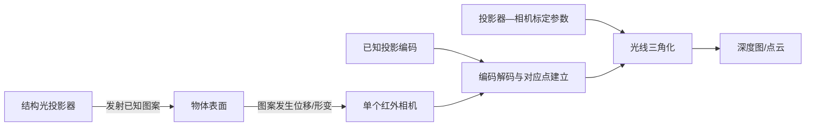

常见编码方式如下：

- **时间编码**：依次投射多幅二进制码、格雷码或相移条纹。对应关系准确、深度分辨率高，但需要多帧，运动会导致编码错位；
- **空间编码**：单帧图案的局部邻域具有唯一结构，可单帧解码，但空间分辨率和抗噪性受限；
- **随机散斑**：投射伪随机红外纹理，将当前散斑与参考图或投影模型匹配，适合实时工作；
- **混合编码**：结合格雷码确定条纹级次、相移法获得亚周期相位，兼顾量程和精度。

#### 3.1.2 传统深度计算算法

- **格雷码/二进制编码解码**：对多帧亮暗状态进行阈值判决，确定投影器列或像素编号，再做三角化；
- **相移法**：由多幅相位偏移条纹计算包裹相位，再进行空间或时间相位展开，获得高精度连续对应坐标；
- **散斑匹配**：使用块匹配、NCC、Census、相位相关或局部特征将观测散斑与参考散斑对齐；
- **后处理**：调制度/对比度阈值、置信度筛选、相位跳变修复、边缘保持滤波和时域融合。

#### 3.1.3 深度学习算法

- **学习式图案解码/匹配**：CNN 或 Transformer 从畸变条纹、散斑图直接回归对应坐标、相位或视差；
- **相位展开与误差修复**：网络预测条纹级次、展开相位或错误区域，对低反射、阴影和局部断裂进行补偿；
- **端到端深度恢复**：从一幅或多幅结构光图直接估计深度，并可联合预测置信度；
- **深度补全/去噪**：融合 RGB、红外强度和稀疏/低质量深度，修复孔洞与飞点。

深度学习能利用数据先验改善缺失区域，但“补全结果”不等同于直接测量；在尺寸检测、安全控制等应用中，应同时输出置信度并保留无效像素标记。

#### 3.1.4 计算与数据传输瓶颈

- 多帧格雷码/相移法需要传输和缓存 $N$ 幅原始图，数据率与存储量随投影帧数线性增长；动态物体还会产生帧间错位。
- 高精度相位计算涉及逐像素三角函数、相位展开和异常检测；高分辨率高速测量时，实时处理压力较大。
- 散斑匹配仍包含二维或一维搜索，本质上存在与双目相似的代价计算和访存开销。
- 环境红外光会降低调制度；深色、镜面、半透明表面会造成低信噪比、饱和或次表面散射。
- 投影器散热、激光安全、相机—投影器标定稳定性和多设备互相干扰是重要系统约束。

### 3.2 双目结构光相机（主动双目）

<p align="center">
  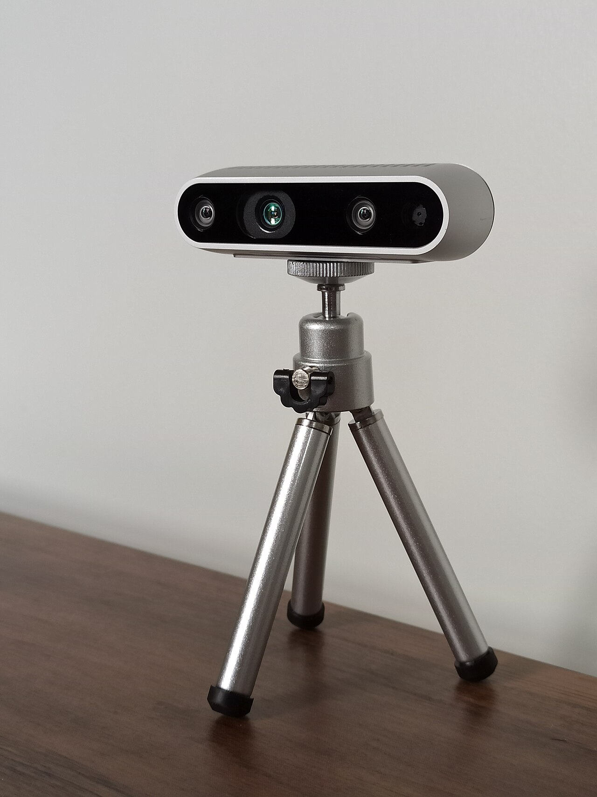
</p>

<p align="center"><em>代表产品：Intel RealSense D435。两个红外相机负责视差测量，红外投影器用于给弱纹理表面增加散斑纹理。产品资料：<a href="https://www.realsenseai.com/products/stereo-depth-camera-d435/">RealSense 官方产品页</a>；图片：Marc Auledas，<a href="https://creativecommons.org/licenses/by-sa/4.0/">CC BY-SA 4.0</a>，来源：<a href="https://commons.wikimedia.org/wiki/File:Intel_Realsense_depth_camera_D435.jpg">Wikimedia Commons</a>。</em></p>

> **代表资料**：[Keselman 等：Intel RealSense Stereoscopic Depth Cameras](docs/03_主动双目/2017_Keselman_RealSense_Stereoscopic_Depth_Cameras.pdf)同时解释视差误差、红外纹理投影、硬件相关器和实际系统噪声。

#### 3.2.1 基本探测原理

双目结构光通常是在普通双目系统中加入红外散斑投影器。投影器的主要作用是给白墙等弱纹理表面“贴上纹理”；深度仍主要由左右两个相机之间的视差计算，而不是必须知道每个散斑的绝对投影编号。

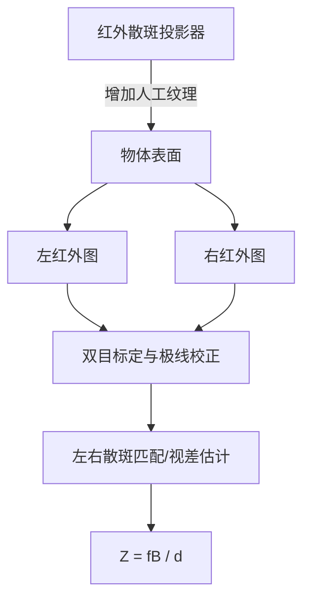

因此，关闭投影器后它可以退化为被动双目；在室外阳光下，投影散斑可能被淹没，也会近似退化为被动模式。需要注意，“两个相机都观察投影图案”和“用相机—投影器构成三角测量对”是两种不同的系统建模方式，具体产品可能组合使用二者。

#### 3.2.2 常用算法

- **传统算法**：局部块匹配、Census + SGM、左右一致性检查、散斑/孔洞滤除；可以根据主动红外强度设计专用匹配代价。
- **深度学习算法**：与被动双目基本一致，可使用 2D 相关、3D 代价体和迭代细化网络；训练时可额外输入红外强度、投影开/关帧或置信图。
- **融合策略**：在自然纹理充分时使用可见光/被动双目，在弱纹理时启用主动散斑；也可融合 RGB、双目视差与结构光解码结果。

#### 3.2.3 计算与数据传输瓶颈

双目结构光同时承担双目系统的双路图像带宽、视差搜索和标定同步成本，以及主动投影系统的功耗、散热、环境光和串扰问题。若同时采集 RGB、左右 IR、深度和置信度，传感器内部与主机接口会出现多流并发；此时在传感器端完成匹配，仅传输深度/置信度，往往能显著降低主机链路带宽，但会牺牲算法可重配置性和原始数据可追溯性。

---

## 4. ToF 相机

ToF（Time of Flight）相机主动发射调制光或短脉冲，并估计光从发射端到目标再返回接收端的往返传播时间。若发射与接收位置非常接近，则目标径向距离近似为：

$$
R=\frac{c\Delta t}{2}.
$$

ToF 是测距原理，LiDAR 更强调光探测与测距系统形态。二者存在交集但并非同义词：扫描式 dToF LiDAR 逐点或逐线覆盖视场；Flash dToF 同时照明并用面阵探测；iToF 相机则常用面阵相关像素并行解调。机械旋转、MEMS、光学相控阵和面阵 Flash 属于视场扫描/覆盖方式，不应与 dToF、iToF 这一时间估计方式混为一谈。

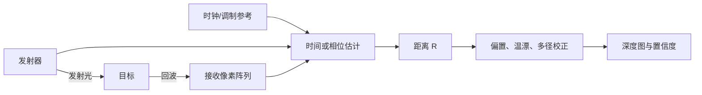

### 4.1 dToF 相机

<p align="center">
  
</p>

<p align="center"><em>代表产品：Intel RealSense L515。该产品属于 MEMS 扫描式固态 LiDAR，通过直接测量激光回波的飞行时间获得深度，是 dToF 产品形态之一。产品资料：<a href="https://dev.realsenseai.com/docs/lidar-camera-l515-datasheet/">L515 数据手册</a>；图片：Marc Auledas，<a href="https://creativecommons.org/licenses/by-sa/4.0/">CC BY-SA 4.0</a>，来源：<a href="https://commons.wikimedia.org/wiki/File:Intel_Realsense_lidar_camera_L515.jpg">Wikimedia Commons</a>。</em></p>

> **代表资料**：[Sarbolandi 等：Pulse Based Time-of-Flight Range Sensing](docs/04_ToF/dToF/2018_Sarbolandi_Pulse_Based_ToF_Range_Sensing.pdf)覆盖脉冲 ToF 原理与系统误差；[Tontini 等：SPAD dToF Flash LiDAR 数值模型](docs/04_ToF/dToF/2020_Tontini_SPAD_dToF_Flash_LiDAR_Model.pdf)给出发射、光学、光子统计、背景光和 pile-up 的系统级模型。两篇均来自本机 Zotero 的开放获取附件。

#### 4.1.1 基本探测原理

dToF（direct ToF）直接估计光子的往返时间。常见系统用脉冲激光/VCSEL 发射极短光脉冲，用 SPAD（单光子雪崩二极管）检测回波，再由 TDC（时间数字转换器）或 TCSPC（时间相关单光子计数）记录光子到达时间。

单次检测的随机性很强，因此通常对多次脉冲累积，形成时间直方图：

```text
光子计数
  ^                    回波峰
  |                   /\
  |  背景光噪声  · · /  \ · ·
  |__·__·__·__·_____/____\____________> 到达时间 bin
                    t_peak

距离 R ≈ c × (t_peak - t_offset) / 2
```

每个时间 bin 对应的单程距离分辨率近似为 $\Delta R=c\Delta t_{bin}/2$。例如 1 ns 对应约 15 cm，100 ps 对应约 1.5 cm；实际精度还取决于脉冲宽度、抖动、光子数、背景光和估计算法，不能只由 bin 宽度决定。

#### 4.1.2 传统深度计算算法

- **首光子/阈值检测**：选择第一个显著到达事件或首个超过阈值的时间 bin，延迟低但对噪声敏感；
- **直方图峰值检测**：背景估计后寻找最大峰，可配合质心、抛物线或高斯拟合提高亚 bin 精度；
- **匹配滤波/相关法**：用已知系统脉冲响应与直方图相关，在低信噪比下估计回波位置；
- **最大似然与贝叶斯估计**：建立泊松光子计数模型，同时估计深度、反射率和背景光；
- **多回波分解**：从多个峰中分离前景、背景或半透明介质回波；
- **系统校正**：暗计数、固定模式噪声、通道延迟、温漂、距离偏置、pile-up（堆积）和串扰校正。

#### 4.1.3 深度学习算法

- **直方图去噪与峰值定位**：1D CNN/Transformer 在每像素时间直方图上抑制背景并回归峰位置；
- **时空联合恢复**：3D CNN 或时空注意力同时利用相邻像素/帧，提高低光子计数下的深度稳定性；
- **多回波与多径分离**：网络估计多个回波分量或直接恢复无多径深度；
- **稀疏 dToF 补全**：将少量 SPAD 测距点与 RGB 图像融合，生成稠密深度；
- **端到端点云/任务推理**：直接从事件流或直方图提取检测、分割所需特征，减少完整深度重建和中间数据搬运。

#### 4.1.4 计算与数据传输瓶颈

- **直方图维度高**：若阵列为 $H\times W$、每像素 $T$ 个时间 bin、每 bin 为 $b$ bit，则单帧原始直方图为 $HWTb$ bit。例如 $640\times480\times1024\times16$ bit 约为 629 MB/帧；30 fps 时理论数据率约 151 Gbit/s，通常无法直接片外传输。
- **片上聚合是必需的**：实际芯片常输出峰值深度、强度和置信度，或只传非零事件/ROI，而不是完整直方图。这样能大幅压缩数据，但会丢失多回波与后处理信息。
- **光子统计带来的积分时间**：远距离、低反射率或强背景光场景需要积累更多脉冲，量程、精度、帧率和激光功率之间存在直接权衡。
- **SPAD 阵列读出压力**：事件时间戳、TDC 数量、仲裁冲突、像素死时间和片上 SRAM 容量会限制有效吞吐。
- **算法访存**：对完整直方图执行卷积、匹配滤波或贝叶斯推断时，数据搬运成本通常远高于简单峰值搜索。
- **pile-up 与背景光**：SPAD 在一个周期内优先记录较早光子，强背景或近距离回波会扭曲直方图；高光子率并不总等于更准确。

### 4.2 iToF 相机

<p align="center">
  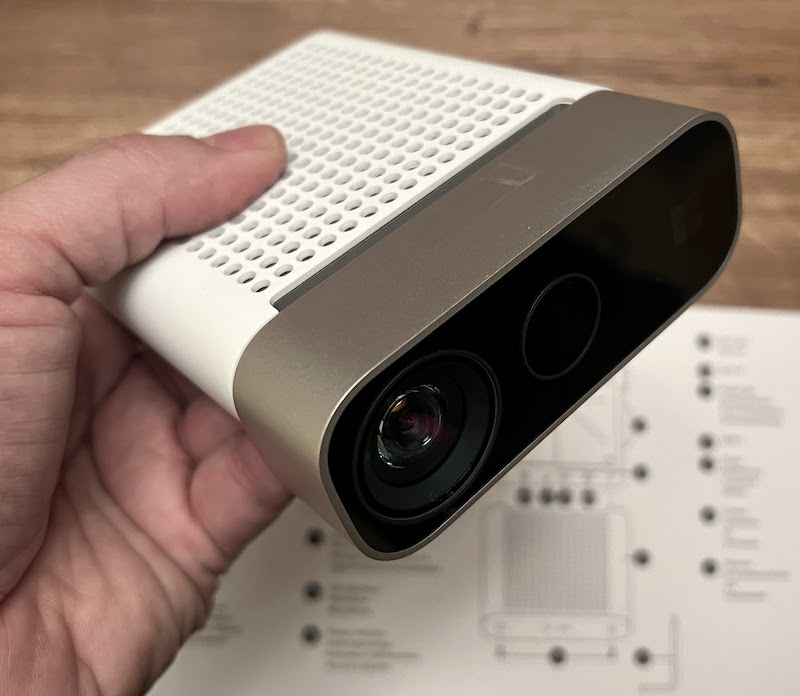
</p>

<p align="center"><em>代表产品：Microsoft Azure Kinect DK。其 1 Megapixel ToF 深度传感器通过调制与解调回波获得距离，属于 iToF 路线。产品资料：<a href="https://learn.microsoft.com/en-us/previous-versions/azure/kinect-dk/hardware-specification">Microsoft 硬件规格</a>；图片：Profkipp，<a href="https://creativecommons.org/licenses/by-sa/4.0/">CC BY-SA 4.0</a>，来源：<a href="https://commons.wikimedia.org/wiki/File:Azure_kinect.jpg">Wikimedia Commons</a>。</em></p>

> **代表资料**：[Foix、Alenyà 与 Torras：Lock-in Time-of-Flight Cameras Survey](docs/04_ToF/iToF/2011_Foix_Lock_in_ToF_Cameras_Survey.pdf)介绍锁相/相关像素、调制测距、标定、系统误差与典型应用。

#### 4.2.1 基本探测原理

iToF（indirect ToF）通常发射连续波或脉冲调制光，不直接解析单个光子的绝对到达时间，而是测量回波相对于发射参考的相位延迟。对正弦调制，理想条件下：

$$
\phi=2\pi f_m\Delta t, \qquad R=\frac{c\phi}{4\pi f_m}.
$$

常见四相采样在 $0^\circ$、$90^\circ$、$180^\circ$、$270^\circ$ 获得相关值 $C_0,C_1,C_2,C_3$：

$$
\phi=\operatorname{atan2}(C_3-C_1,\ C_0-C_2),
$$

$$
A=\frac{1}{2}\sqrt{(C_3-C_1)^2+(C_0-C_2)^2},
$$

其中 $A$ 表示回波调制度，可用于构造置信度。由于相位按 $2\pi$ 周期重复，单频不模糊距离为：

$$
R_{amb}=\frac{c}{2f_m}.
$$

调制频率越高，相同相位误差对应的距离误差越小，但不模糊量程越短；工程上常用多频测量进行相位展开。

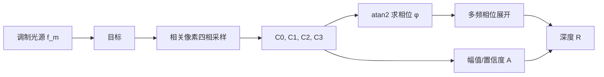

#### 4.2.2 传统深度计算算法

- **相关采样与相位求解**：暗电流/环境光扣除、四相或多相相关、`atan2` 相位计算和幅值估计；
- **相位展开**：使用双频/多频拍频、查表、中国剩余定理式组合或时空连续性恢复绝对距离；
- **系统标定**：像素固定模式偏置、温度漂移、调制频率偏差、镜头和照明不均匀校正；
- **多径干扰（MPI）抑制**：多频估计、稀疏回波分解、几何先验、直接/全局光分离；
- **飞点与运动伪影处理**：利用幅值、相位一致性、边缘检测和时域滤波剔除混合像素。

#### 4.2.3 深度学习算法

- **深度去噪与超分辨率**：融合原始相位、幅值、环境光图和 RGB，提高空间分辨率并修复无效区域；
- **MPI 校正**：利用多频原始相关帧预测直接路径深度、全局光分量或深度残差；
- **运动伪影校正**：估计多相采样之间的光流/场景运动，对相关帧对齐后再计算相位；
- **联合重建**：网络同时输出深度、反射率、法向和置信度，以多任务约束提高稳定性。

训练数据必须覆盖真实材料、曝光、温度、镜头和多径几何；仅在仿真数据上训练的模型容易产生域偏移。对网络补出的边界和孔洞，同样需要置信度与安全约束。

#### 4.2.4 计算与数据传输瓶颈

- **多相、多频原始帧**：一个深度帧通常由多个相关子帧组成。若使用 4 相位、3 频率，内部至少处理 12 个相关图；外部若只看到最终深度帧，容易低估传感器内部带宽与功耗。
- **逐像素非线性计算**：`atan2`、平方根、多频相位展开和标定查表适合流水线化，但在高分辨率、高帧率下仍需要大量算力和片上缓存。
- **运动与子帧时序冲突**：多相采样并非严格同一时刻，快速运动会破坏相位关系；提高采样速度又会降低单次曝光的信噪比。
- **MPI 是结构性误差**：墙角、凹槽和高反射物体会使多个传播路径在同一像素叠加。简单滤波只能缓解，可靠分离通常需要多频原始数据和更高计算量。
- **链路取舍**：输出最终 16-bit 深度图的带宽较低；输出所有相位/频率相关图可支持高级校正，却会使链路数据率成倍增加。

---

## 5. 跨方案的计算与传输瓶颈对比

### 5.1 数据率估算

未压缩数据率可粗略估算为：

$$
\text{Rate}=W\times H\times FPS\times \sum_i(n_i b_i),
$$

其中 $n_i$ 是第 $i$ 类图像/子帧的通道或帧数，$b_i$ 是每像素位宽。实际接口还需考虑行/帧消隐、包头、时间戳、校验和编码开销，因此应预留余量。

| 输出模式（示例） | 理论有效载荷 | 说明 |
|---|---:|---|
| $1280\times720$，30 fps，16-bit 深度 | 0.442 Gbit/s | 仅最终深度，不含置信度/RGB |
| $1280\times720$，30 fps，16-bit 深度 + 8-bit 置信度 | 0.664 Gbit/s | 适合传感器端已完成深度计算 |
| 双路 $1920\times1080$，60 fps，RAW10 | 2.488 Gbit/s | 双目原始输入，不含协议开销 |
| iToF：$640\times480$，30 fps，12 个 16-bit 相关图 | 1.770 Gbit/s | 4 相位 × 3 频率的外传估算 |
| dToF：$640\times480$，30 fps，1024 bin × 16-bit | 150.995 Gbit/s | 完整稠密直方图，通常只能片上压缩 |

### 5.2 主要瓶颈归纳

| 瓶颈 | 双目 | 结构光 | dToF | iToF |
|---|---|---|---|---|
| 最重的中间数据 | 视差代价体/特征图 | 多帧编码图或匹配代价 | 时间直方图/事件时间戳 | 多相、多频相关图 |
| 主要计算 | 匹配与代价聚合 | 编码解码、匹配、相位展开 | 峰值/回波统计估计 | 相位计算、展开与 MPI 校正 |
| 主要物理误差 | 遮挡、弱纹理、远距视差小 | 环境光、反射、运动错码 | 散粒噪声、pile-up、串扰 | 相位缠绕、MPI、运动伪影 |
| 片上处理收益 | 避免外传双路原图/代价体 | 避免外传多幅编码图 | 避免外传完整直方图，收益最大 | 避免外传多相/多频子帧 |
| 片上处理代价 | 算法固化、SRAM/DRAM 压力 | 标定与解码逻辑复杂 | TDC/直方图 SRAM 面积和功耗高 | 多频缓存、非线性运算和校正逻辑 |

### 5.3 面向感算协同的优化方向

1. **靠近传感器做数据约简**：在像素阵列或读出芯片附近完成背景扣除、置信度筛选、直方图峰值提取、稀疏化或 ROI 选择，减少无效数据搬运；
2. **流式与分块处理**：双目匹配、相位计算和滤波尽量采用行缓存/片上 SRAM 流水线，避免完整帧和完整代价体反复访问 DRAM；
3. **自适应采样**：依据纹理、幅值、光子数和运动状态动态调整视差范围、积分时间、时间 bin、调制频率或投影帧数；
4. **压缩中间表示**：使用低比特特征、稀疏代价体、峰值列表、事件流或深度 + 置信度代替完整原始张量；
5. **任务驱动输出**：若下游只需要避障、检测或姿态估计，可在传感器端直接生成稀疏几何特征或任务特征，避免“原始数据 → 稠密深度 → 点云 → 任务网络”的多次搬运；
6. **保留可验证性**：感知端压缩或神经网络补全应同步输出置信度、饱和/遮挡/多径标志，并为关键场景保留触发式原始数据回读能力。

---

## 6. 标定、配准与评价指标

### 6.1 从深度图到点云

如果深度图保存的是光轴深度 $Z$，在忽略畸变或完成去畸变后，像素 $(u,v)$ 可由针孔模型反投影为：

$$
X=\frac{(u-c_x)Z}{f_x},\qquad
Y=\frac{(v-c_y)Z}{f_y},\qquad
P_c=(X,Y,Z)^T.
$$

如果 ToF 芯片输出的是沿像素视线的径向距离 $R$，则应先构造相机坐标系中的单位光线：

$$
q=K^{-1}[u,v,1]^T,\qquad P_c=R\frac{q}{\lVert q\rVert}.
$$

将径向距离直接当作 $Z$ 会使图像边缘的点云产生系统性形变。RGB-D 配准还需要深度相机到彩色相机的外参 $(R_{dc},t_{dc})$，先把深度点变换到彩色相机坐标系，再投影到彩色图像；遮挡、视场差异和多个深度点落入同一彩色像素时，应使用可见性或 z-buffer 规则。

### 6.2 标定与同步

一个可用的深度系统通常至少包含以下标定层级：

1. **单相机内参**：焦距、主点和径向/切向畸变；
2. **几何外参**：双目左右相机、相机—投影器、深度—RGB 之间的刚体变换；
3. **深度尺度与偏置**：双目基线/焦距误差、ToF 固定延迟、像素固定模式偏置和距离相关非线性；
4. **辐射与温度**：暗电流、响应不均匀、激光/LED 功率、温漂和预热时间；
5. **时间同步**：左右曝光、投影序列、ToF 子帧、RGB 与 IMU 的时间戳和触发关系。

标定精度不只取决于重投影误差。双目系统即使单相机重投影误差很小，只要基线外参或同步存在微小漂移，远距离深度仍会明显恶化；iToF 的多相子帧、滚动快门与运动叠加时，会出现无法通过静态几何标定消除的运动伪影。

### 6.3 评价指标

| 指标 | 关注的问题 | 建议报告方式 |
|---|---|---|
| 绝对误差/偏置 | 平均测得是否准确 | MAE、RMSE、中位数误差，按距离和反射率分组 |
| 重复性/精密度 | 静态目标是否稳定 | 多帧标准差、MAD、平面拟合残差 |
| 完整率 | 有多少像素输出有效深度 | 有效像素比例，按边缘、暗物体、强光分区 |
| 空间分辨率 | 能否分开相邻表面 | 深度边缘 MTF、细杆/台阶测试、飞点宽度 |
| 时间性能 | 动态场景是否可靠 | 帧率、端到端延迟、时间抖动、运动边缘误差 |
| 环境鲁棒性 | 光照和材料变化影响多大 | 不同照度、入射角、颜色、反射率和温度下曲线 |
| 量程与盲区 | 近端和远端何时失效 | 最小距离、95% 完整率量程、不模糊距离 |
| 系统代价 | 是否能在目标平台持续运行 | 功耗、温升、原始/输出带宽、算力和内存峰值 |

评价时应同时给出**系统性偏置**和**随机噪声**。只报告平面中心区域的平均误差会掩盖边缘混合像素、遮挡、MPI、阳光和深色材料造成的失效；只报告厂商最大量程也不能代表该距离仍有足够的完整率和精度。

---

## 7. 选型建议

- **室外、中远距离、自然纹理较丰富**：优先考虑被动双目；若算力受限，可采用 Census + SGM 或轻量级级联网络。
- **室内近距离、高精度测量、目标相对静止**：单目多帧结构光具有较高精度；动态场景更适合单帧散斑或主动双目。
- **弱纹理室内实时感知**：双目结构光兼顾稠密度与实时性，但应评估阳光、投影器串扰和功耗。
- **远距离、低照度、稀疏或扫描式测距**：dToF 更合适，关键在于片上光子统计和直方图压缩。
- **室内面阵高速深度**：iToF 具有成熟的面阵读出和规整计算，但应重点验证 MPI、相位缠绕和运动伪影。

最终选型不能只比较“标称精度”，还应同时考察量程、视场、最小工作距离、环境光、目标反射率、运动速度、激光安全、功耗、标定稳定性、原始数据可访问性，以及主机接口和下游算法能够承受的持续数据率。

## 8. 本仓库代表资料

| 路线 | 资料 | 重点 |
|---|---|---|
| 被动双目 | [Scharstein & Szeliski, 2002](docs/01_被动双目/2002_Scharstein_Szeliski_Stereo_Taxonomy.pdf) | 匹配代价、代价聚合、视差优化和细化的经典分类框架 |
| 被动双目 | [Hirschmüller, 2008](docs/01_被动双目/2008_Hirschmuller_Semi_Global_Matching.pdf) | SGM 能量模型、路径聚合与互信息代价 |
| 单目结构光 | [Geng, 2011](docs/02_单目结构光/2011_Geng_Structured_Light_3D_Imaging_Tutorial.pdf) | 编码体系、相移、标定和三维表面测量 |
| 主动双目 | [Keselman et al., 2017](docs/03_主动双目/2017_Keselman_RealSense_Stereoscopic_Depth_Cameras.pdf) | 红外纹理增强、硬件相关器、误差与产品级实现 |
| dToF | [Sarbolandi et al., 2018](docs/04_ToF/dToF/2018_Sarbolandi_Pulse_Based_ToF_Range_Sensing.pdf) | 脉冲 ToF 测量和系统误差评估 |
| dToF | [Tontini et al., 2020](docs/04_ToF/dToF/2020_Tontini_SPAD_dToF_Flash_LiDAR_Model.pdf) | SPAD Flash LiDAR 的光子统计与系统建模 |
| iToF | [Foix et al., 2011](docs/04_ToF/iToF/2011_Foix_Lock_in_ToF_Cameras_Survey.pdf) | 锁相 iToF 原理、标定、误差与应用 |

完整元数据、来源、许可说明、SHA-256 和收录理由见 [资料索引](references/资料索引.md)。
